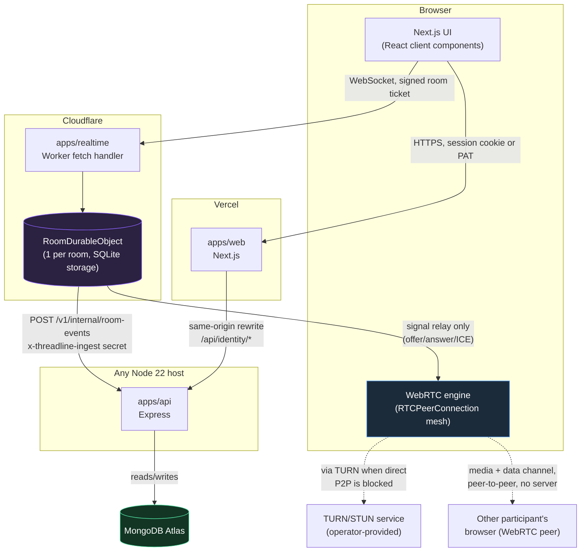
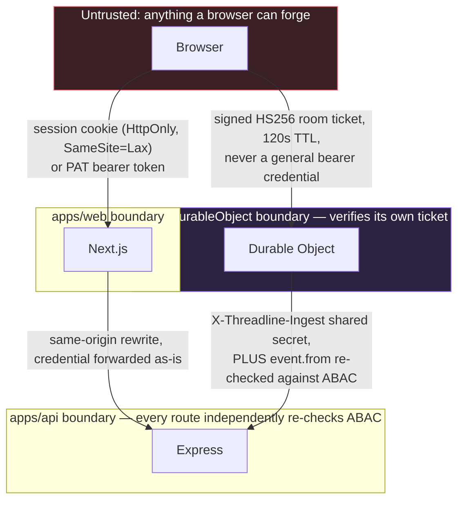
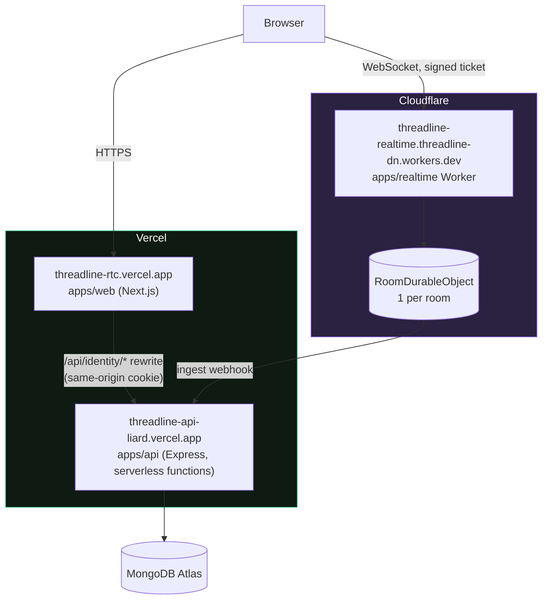

# Architecture

Root-level architecture reference for Threadline. [`docs/architecture.md`](docs/architecture.md) covers the same ground topic-by-topic with the full ER diagram and detailed sequence diagrams; this document is the single-file overview — deep enough to actually explain every trust boundary and major flow, not just list them.

## Table of contents

- [Why three services instead of one](#why-three-services-instead-of-one)
- [Monorepo layout](#monorepo-layout)
- [System topology](#system-topology)
- [Trust model](#trust-model)
- [Engineering principles behind the design](#engineering-principles-behind-the-design)
- [Data model](#data-model)
- [Request lifecycle: opening a room](#request-lifecycle-opening-a-room)
- [Request lifecycle: sending a chat message](#request-lifecycle-sending-a-chat-message)
- [Failure modes and resilience](#failure-modes-and-resilience)
- [Live deployment topology](#live-deployment-topology)
- [Why each decision was made this way](#why-each-decision-was-made-this-way)
- [Known limitations](#known-limitations)
- [Where to go next](#where-to-go-next)

## Why three services instead of one

Threadline is three independently deployable services, not one application. Each owns a different kind of responsibility and a different kind of state:

- **`apps/web`** — renders the UI and runs the browser-side WebRTC logic.
  - Deployed to Vercel as a Next.js app.
  - Needs to be fast and stateless — a normal frontend.
  - Every authenticated page is a client component that calls the API directly; there is no server-side data fetching for authenticated content, so `apps/web` itself never holds a session server-side.
- **`apps/api`** — the durable source of truth for everything not happening live right now.
  - Users, sessions, organizations, rooms, membership, calendar, the durable room-event timeline, personal access tokens, and the first-party OIDC provider.
  - Express, backed by MongoDB Atlas. Can run on Vercel, Docker, bare Node, or Kubernetes — same code, because `createApp()` is a pure function of its options and never imports the MongoDB driver outside the `Repository` implementation.
- **`apps/realtime`** — coordinates what's happening in a room _right now_, while people are connected.
  - Who's present, WebRTC signaling relay, ephemeral room state.
  - Needs exactly one authoritative, low-latency, in-memory owner per room — two servers each holding half a room's participant list is a correctness bug, not a scaling feature.
  - One Cloudflare Durable Object per room. The one piece that couldn't just be "more instances of the same stateless server."

This split wasn't done for its own sake — the three responsibilities have genuinely different requirements, and satisfying all three inside one conventional server would mean compromising at least one of them. A single Express process could hold WebSocket connections and an in-memory participant map, but the moment it runs as more than one instance (which any serverless or horizontally scaled deployment does), that map either has to be replicated through something like Redis with its own consistency story, or the correctness guarantee simply breaks — a participant connected to instance A never learns about someone who joined via instance B. Durable Objects sidestep that problem entirely by giving each room exactly one instance, globally, without Threadline having to build or operate the coordination layer that would otherwise require.

## Monorepo layout

```text
Threadline/
├── apps/
│   ├── web/                  Next.js App Router UI
│   │   ├── app/                routes: landing, auth screens, /app/** workspace
│   │   ├── components/         React client components (WorkspaceGate, room-workspace, settings, ...)
│   │   ├── lib/                 apiFetch() HTTP client, PeerMesh WebRTC client
│   │   └── public/             static assets
│   ├── api/                    Express REST API
│   │   └── src/
│   │       ├── domain.ts        entity types
│   │       ├── repository.ts    Repository interface + MemoryRepository + MongoRepository
│   │       ├── policy.ts        ABAC decision logic (canOrganization, canRoom)
│   │       ├── application.ts   createApp() factory, routes, middleware, rate limiting
│   │       ├── security.ts      password hashing, token generation, cookie handling
│   │       ├── openapi.ts       OpenAPI 3.1 document
│   │       ├── api-docs.ts      Swagger UI / ReDoc serving, scoped CSP
│   │       └── index.ts         boot-time env validation, HTTP server entry point
│   └── realtime/                Cloudflare Worker + Durable Object
│       └── src/index.ts         fetch handler + RoomDurableObject
├── docs/                       Deep-dive documentation
│   ├── decisions/                Architecture Decision Records
│   └── screenshots/               Curated UI screenshots referenced from the docs
├── infra/
│   ├── docker/                   Dockerfiles and docker-compose.yml
│   └── kubernetes/                Kustomize base + overlays (one or more clusters)
└── .github/workflows/           CI pipeline (format, lint, typecheck, test, build)
```

- Each `apps/*` directory is its own npm workspace with its own `package.json`, but they share one root `npm install` and one root `tsconfig`/lint/format configuration.
- `apps/api/src/domain.ts` has no dependency on Express or MongoDB — it's plain TypeScript interfaces, which is what lets `repository.ts` implement the same shapes against either an in-memory `Map` or a real MongoDB collection without the rest of the app knowing the difference.
- Full breakdown of every file's responsibility inside each workspace: [`docs/architecture.md`](docs/architecture.md#monorepo-layout), [`docs/frontend.md`](docs/frontend.md), [`docs/api.md`](docs/api.md), [`docs/realtime.md`](docs/realtime.md).

## System topology



- **The Durable Object never talks to MongoDB.** Its only link to durable records is one outbound webhook to the API. If that call fails, it queues and retries rather than blocking the room or dropping the event.
- **WebRTC media never touches a server.** Once signaling completes, the Worker only ever sees SDP offers/answers and ICE candidates — never a media byte.
- **The web app can proxy the API through itself.** A same-origin rewrite (`/api/identity/*`) keeps the browser's session cookie first-party to the web app's own domain, even when the API is a genuinely separate Vercel project. This is exactly how this project's own live deployment is configured.
- **Every arrow crosses a trust boundary, and every boundary is independently checked** — see [Trust model](#trust-model) below for what specifically gets verified at each one.

## Trust model

No plane trusts another plane's enforcement. Every one independently re-verifies who's allowed to do what, using its own credential:

- **The Durable Object** verifies the signature on a short-lived, single-purpose room ticket before accepting a WebSocket, and separately checks the ticket's room ID matches the room being connected to.
- **The API**, when the Durable Object hands off a durable event over its webhook, does not trust the shared secret alone. That secret proves the request came from a genuinely trusted Worker — it says nothing about whether the specific user named as the event's author may actually write to that room. The API re-runs the full ABAC check against that user regardless.
- **The API**, on every direct request (session cookie, PAT, or none), re-derives the caller's permissions from scratch every time — organization role, delegated attributes, room visibility/classification — rather than caching a decision or trusting what the UI happened to already show.



- Full secrets inventory — which secret crosses which boundary and what it authorizes: [`docs/security.md`](docs/security.md#secrets-inventory).
- The two secrets shared between platforms have **nothing enforcing they match**. Wrong on either side fails silently at runtime, not at deploy time. This has genuinely happened, twice — full incident writeups: [`docs/operations.md`](docs/operations.md#incidents).
- Client-side permission checks in `apps/web` (deciding whether to render a button) are a UX convenience only, mirrored by hand from the server's ABAC logic — they grant nothing, and the server re-derives every decision independently regardless of what the UI happened to show. See [`docs/frontend.md`](docs/frontend.md#client-side-abac-is-ux-only).

## Engineering principles behind the design

These are the recurring rules that show up, applied consistently, across all three services — worth stating explicitly because they explain _why_ the code looks the way it does in places that might otherwise look like unnecessary caution:

- **Fail closed, at boot, not at request time.** `apps/api/src/index.ts` refuses to start in production with weak secrets, non-HTTPS origins, or a missing signing key. There is deliberately no "start anyway with insecure defaults" path once `NODE_ENV=production`.
- **A credential authorizes exactly what it says and nothing more.** A room ticket opens one WebSocket to one room for one identity, for 120 seconds, and cannot be reused for anything else. A PAT, however broadly scoped, cannot create another PAT or list someone's browser sessions. Scope creep in what a credential can do is treated as a bug class, not a convenience to allow later.
- **Never infer authorization from an ID.** Owning a room ID, a room-ticket claim, or a webhook secret is never treated as proof of permission by itself — every check re-derives the caller's actual role and the resource's actual state.
- **Prefer an atomic, shared source of truth over process-local state whenever more than one instance of a service can be running.** This is why rate limiting is an atomic MongoDB `$inc` pipeline rather than an in-process counter — Vercel's serverless functions don't share memory between cold starts, so a local counter silently resets and the limit becomes inconsistent. The same reasoning is why Durable Objects, not a pool of stateless Worker instances, own room presence.
- **A retry queue beats a dropped event.** When the Durable Object's webhook call to the API fails, it schedules a Cloudflare alarm and tries again rather than discarding the event — durable history should not silently lose data because of a transient network blip.
- **Write down what's actually true, including the parts that aren't finished.** [Known limitations](#known-limitations) below and [`docs/roadmap.md`](docs/roadmap.md) are kept current on purpose — an inaccurate architecture document is worse than a short one.

## Data model

- Everything durable — users, sessions, organizations, rooms, membership, calendar events, PATs, OIDC clients/tokens, room event timeline — lives in MongoDB Atlas in production.
- Local dev and the automated test suite use an in-memory implementation of the same interface instead — the application code cannot tell the difference.
- Both are implementations of one `Repository` interface (`apps/api/src/repository.ts`). Route handlers only ever call that interface, never the MongoDB driver directly.
  - This is what lets the real HTTP-level test suite run with zero database connection.
  - This is what lets the same `createApp()` boot identically on Vercel, Docker, Kubernetes, or a test runner.
- **The fifteen durable entities, briefly:**

  | Entity                | Owns                                                                                                                                         |
  | --------------------- | -------------------------------------------------------------------------------------------------------------------------------------------- |
  | `User`                | Identity: email, username, display name                                                                                                      |
  | `Credential`          | Password hash — kept in a separate table from `User` so a user object can be logged/returned with zero risk of a hash traveling alongside it |
  | `Session`             | Browser session state: hashed refresh token, sliding 30-day expiry, last-used timestamp                                                      |
  | `Organization`        | The top-level tenant; every user's first org is created automatically at registration                                                        |
  | `Membership`          | A user's role (`owner`/`admin`/`member`) and delegated attributes within one organization                                                    |
  | `Room`                | A collaboration room: name, visibility, classification, owning organization                                                                  |
  | `RoomMembership`      | A user's _explicit_ role in one specific room, required only for restricted or confidential rooms                                            |
  | `CalendarEvent`       | A scheduled session on an organization's calendar                                                                                            |
  | `PersonalAccessToken` | A scoped, revocable automation credential — only its hash and display prefix are stored                                                      |
  | `OAuthClient`         | A registered first-party OIDC client and its allowed redirect URIs/scopes                                                                    |
  | `AuthorizationCode`   | A single-use, PKCE-bound OIDC authorization code, 5-minute expiry                                                                            |
  | `RefreshToken`        | A rotated OIDC refresh token, stored as a hash, invalidated the moment it's used                                                             |
  | `AccountActionToken`  | A single-use, hashed token backing password reset and email verification links                                                               |
  | `AuditLog`            | An immutable record of every sensitive mutation (actor, action, target, metadata — never secrets)                                            |
  | `RoomEvent`           | A durably persisted, timestamped record of something that happened in a room                                                                 |
  | `RateLimitEntry`      | An atomic counter bucket keyed by route and hashed IP, with a Mongo TTL index for automatic expiry                                           |

- Full ER diagram with every field and relationship: [`docs/architecture.md`](docs/architecture.md#data-model). Rationale for the interface split: [ADR-0003](docs/decisions/0003-repository-interface.md).
- **One subtlety in the room-event timeline:** the API writes to it directly exactly once — when a room is created. Every other event (join/leave, chat, document edits, screen-share toggles) is written by the Durable Object via its webhook. Cursor movement, WebRTC signaling, and individual whiteboard strokes are broadcast live but deliberately **never** persisted — too high-frequency to be a meaningful record.

## Request lifecycle: opening a room

- Browser navigates to the room page → web app checks session with the API first. Nothing about the room renders until this resolves.
- Web app requests the room from the API → API independently re-derives whether this caller may read this room (org membership, explicit room membership, room visibility/classification).
- Browser requests a room ticket → API checks the caller may specifically join the _live_ session, then issues a signed, 120-second, single-purpose ticket.
- Browser opens a WebSocket directly to the Cloudflare Worker, presenting the ticket → the room's Durable Object verifies the signature and room ID match before accepting.
- Durable Object accepts the (hibernatable) connection → tells the new browser who's already present, and broadcasts that same join to everyone already there.
- Full sequence diagram, every message in order: [`docs/architecture.md`](docs/architecture.md#request-lifecycle-opening-a-room).

## Request lifecycle: sending a chat message

A second full trip through the system, chosen because it's the one flow that touches all three services and both the live and durable planes in a single action:

- Participant types a message and sends it → the browser writes a `chat` event directly onto its already-open WebSocket to the room's Durable Object. No HTTP round trip to `apps/api` happens on the send path at all.
- The Durable Object broadcasts that event to every other currently-connected socket in the room immediately — this is what every other participant sees appear in their chat panel in real time.
- Independently, the same Durable Object appends the event to its own hand-off queue and calls the API's internal ingest webhook with it, authenticated by the shared ingest secret.
- The API receives the webhook call and, before writing anything, independently re-runs ABAC for the event's `from` user against the room — a forged event naming a user without write access is rejected even with a valid ingest secret.
- Only after that check passes does the API persist the event to the durable `RoomEvent` timeline in MongoDB, where it becomes visible later in the room's activity timeline and the org-wide activity feed, and durable across reconnects, reloads, and returning to the room days later.
- If the webhook call fails (network blip, transient API error), the Durable Object does not drop the message — the live broadcast already succeeded, so no connected participant notices anything, and the event is retried via a scheduled alarm until the durable write succeeds.

## Failure modes and resilience

What happens, specifically, when each plane is unavailable or misbehaving — because "what breaks and how" is as much a part of this architecture as the happy path:

- **`apps/api` is down or unreachable:** the live WebRTC call and the Durable Object's live broadcast (chat, presence, whiteboard, cursor) keep working completely unaffected, since none of that path touches the API. New room creation, login, and fetching the durable event history all fail. Any durable events generated while the API is down queue in the Durable Object and are delivered once it recovers.
- **`apps/realtime` (the Worker or a specific room's Durable Object) is down or unreachable:** the API, calendar, organization/room management, and authentication are all completely unaffected. Nobody can open a _new_ live session, and anyone already connected to that room loses live presence/signaling — but nothing durable is lost, because durable writes for anything already delivered had already landed in MongoDB.
- **MongoDB Atlas is unreachable:** `apps/api` fails closed on anything that needs durable storage — registration, login, room/org management, durable event reads. It does not silently fall back to `MemoryRepository` in production; that fallback only exists when `MONGODB_URI` is absent entirely, which boot-time validation does not allow in a production environment.
- **The Durable Object → API webhook fails once:** invisible to every connected participant, because the live broadcast already succeeded independently. The event is queued and retried via a Cloudflare alarm roughly 30 seconds later.
- **The shared `ROOM_TICKET_SECRET` or ingest secret is wrong on one side:** fails closed, not open — every ticket is rejected, or every ingest webhook call is rejected — but fails _silently_ from a monitoring perspective, since nothing crashes and no plane's own `/health` check can see a cross-plane value mismatch. This is why [`docs/operations.md`](docs/operations.md#monitoring-and-health-checks) treats a real end-to-end probe (register, connect, send, re-fetch) as the only test that actually proves the system works, not three independent `/health` checks.
- **A participant's browser loses its WebSocket mid-session:** `apps/web`'s reconnect logic retries with exponential backoff (capped at 15 seconds) and resumes the same room automatically; an intentional "Leave" click or navigating away is distinguished from an unexpected drop so the client doesn't keep reconnecting to a room the user has actually left. See [`docs/frontend.md`](docs/frontend.md#room-workspace-connection-lifecycle-and-reconnection).

## Live deployment topology



- `apps/web` and `apps/api` are both on Vercel, as two separate projects. `apps/realtime` is on Cloudflare Workers.
- The API runs as **serverless functions**, not a long-lived process — no in-process state survives between requests.
- This is exactly why rate limiting is an atomic MongoDB operation, not an in-process counter — a counter would silently reset on every cold-started instance, making the limit inconsistent.
- Full production deployment guide, plus running this same architecture on an always-on Node host or self-hosted Kubernetes: [`docs/deployment.md`](docs/deployment.md), [`docs/containers-and-kubernetes.md`](docs/containers-and-kubernetes.md).

## Why each decision was made this way

Full alternatives-considered reasoning for each: [`docs/decisions/`](docs/decisions/README.md).

| Decision                                              | Why                                                                                                                                                    | ADR                                                               |
| ----------------------------------------------------- | ------------------------------------------------------------------------------------------------------------------------------------------------------ | ----------------------------------------------------------------- |
| One Durable Object per room, not a shared server pool | Single-instance, globally coordinated state for free — exactly what presence/signaling need, with no Redis, no leader election, no sticky sessions     | [0001](docs/decisions/0001-durable-objects-for-realtime.md)       |
| Full-mesh WebRTC, not an SFU                          | At this product's target room sizes (small, focused sessions), a mesh needs no media server at all — cheaper and one less thing that can fail          | [0002](docs/decisions/0002-webrtc-mesh-not-sfu.md)                |
| One `Repository` interface, two implementations       | Real test suite + local dev run against a fast in-memory implementation; production runs against Atlas; route handlers never import MongoDB directly   | [0003](docs/decisions/0003-repository-interface.md)               |
| Three separate auth surfaces (session, PAT, OIDC)     | Three genuinely different callers — a human in a browser, trusted automation, other first-party surfaces — each needs different security properties    | [0004](docs/decisions/0004-three-auth-surfaces.md)                |
| SQLite-backed, hibernatable Durable Object storage    | Hibernation makes an idle-but-connected room cost near-nothing; SQLite gives transactional guarantees for the undelivered-event queue during an outage | [0005](docs/decisions/0005-sqlite-hibernatable-durable-object.md) |

Each of these was chosen over at least one credible alternative, not by default:

- **Durable Objects vs. a Redis-backed presence server.** A Redis-backed pool of stateless Worker/Node instances was the main alternative considered for presence and signaling. It would have worked, but it means operating and paying for a separate coordination service, plus writing and testing the leader-election/consistency logic Durable Objects give for free at the platform level.
- **Full mesh vs. an SFU.** An SFU (Selective Forwarding Unit) media server would remove the per-participant bandwidth ceiling a mesh has, at the cost of running, scaling, and securing a media relay — infrastructure this product's target room sizes don't currently need.
- **One `Repository` interface vs. mocking MongoDB in tests.** Mocking the MongoDB driver directly was rejected specifically because a mock can silently drift from what MongoDB actually does; a second real implementation of the same interface (`MemoryRepository`) can't drift from its own contract in the same way, and it happens to make the test suite fast as a side effect.
- **Three auth surfaces vs. one bearer token for everything.** A single token type shared between a human's browser and automation would either be too powerful for automation (a leaked PAT that can also enumerate someone's browser sessions) or too weak for a human session (no sliding expiry, no per-device revocation) — splitting them let each be shaped for what actually uses it.

## Known limitations

- No way to revoke an individual person's access to a restricted room — only removing them from the whole organization.
- TURN relay isn't wired into the browser client yet — real-world networks behind symmetric NATs or locked-down firewalls may fail to connect at all.
- Full-mesh WebRTC cost per participant scales with the number of _other_ participants — a real, known ceiling at this product's target room sizes, not an oversight.
- No automated test suite for the Next.js frontend. Every UI bug found in this project, including subtle realtime-sync bugs, was found through live manual testing against the running app.
- No shared client-side identity cache — `WorkspaceSidebar`, `WorkspaceTopbar`, and each page body independently call `GET /v1/auth/me` on the same page load, which works but is redundant.
- No UI surface for reading the audit log back, despite every sensitive mutation writing one — it's written for future incident-response tooling, not yet exposed to end users.
- Full, honestly maintained list: [`docs/roadmap.md`](docs/roadmap.md).

## Where to go next

- [`docs/architecture.md`](docs/architecture.md) — same ground, more structured, full ER diagram and sequence diagrams.
- [`docs/frontend.md`](docs/frontend.md), [`docs/api.md`](docs/api.md), [`docs/realtime.md`](docs/realtime.md) — one deep dive per service.
- [`docs/security.md`](docs/security.md) — complete trust and secrets model.
- [`docs/operations.md`](docs/operations.md) — every real incident this project has actually experienced, written up in full.
