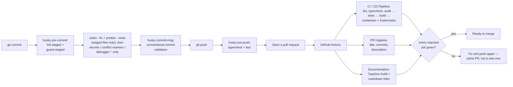

# Contributing to Threadline

## Table of contents

- [Getting set up](#getting-set-up)
- [Before you open a PR](#before-you-open-a-pr)
- [Coding conventions](#coding-conventions)
- [Commit messages and branches](#commit-messages-and-branches)
- [Opening the PR](#opening-the-pr)
- [Working with a coding agent](#working-with-a-coding-agent)
- [Reporting a security issue](#reporting-a-security-issue)

## Getting set up

```bash
make setup    # or: ./scripts/bootstrap.sh
npm run dev
```

`make setup` checks your toolchain, installs dependencies from the lockfile, wires the git hooks, seeds `apps/web/.env.local` and `apps/realtime/.dev.vars` from their committed examples (never overwriting an existing one), and verifies the result with a typecheck. It is idempotent — re-run it after pulling, after switching branches, or whenever something feels stale.

The manual equivalent, if you'd rather see each step:

```bash
npm install
cp apps/web/.env.example apps/web/.env.local
cp apps/realtime/.dev.vars.example apps/realtime/.dev.vars
npm run dev
```

Prefer a container? [`.devcontainer/`](.devcontainer/) provides the full toolchain plus a MongoDB sidecar, with `MONGODB_URI` already pointed at it — so the API persists by default in there, unlike on the host.

Nothing above needs Redis. `apps/api` uses it only when `REDIS_URL` is set, and without it the rate limiter and session bookkeeping go straight to the repository exactly as before — so the default local loop is unchanged. `npm run docker:up` does start a Redis alongside MongoDB if you want to exercise that path; stop that one container and the API keeps working, which is the behaviour [ADR-0009](docs/decisions/0009-redis-for-ephemeral-counters.md) exists to guarantee.

See the [root README](README.md#running-it-locally) for what each of the three services needs and where they run. `npm install` also installs the `husky` hooks (below) — no separate setup step for them.

When something doesn't work, run `npm run doctor` before assuming it's a code defect. It checks Node against `engines`, dependency consistency, the git hooks, your local env files, and whether ports 3000/4000/8787/27017 are free — and prints the remedy for anything it finds, not just the finding.

`make help` lists every available task.

## Before you open a PR



Three hooks, tiered by how much they cost you:

| Hook | Runs | Bypass |
| --- | --- | --- |
| `pre-commit` | `lint-staged` (eslint `--fix` + prettier on staged files), then `scripts/guard-staged.mjs` — secrets, `.env` files, merge conflict markers, `debugger`, focused tests | `git commit --no-verify` |
| `commit-msg` | `scripts/verify-commit-message.mjs` | `git commit --no-verify` |
| `pre-push` | `typecheck` + `test` | `THREADLINE_SKIP_PREPUSH=1 git push` |

Bypassing is intentional — the hooks are a safety net, not a cage — but say so in the PR description when you do.

The pre-commit hook is deliberately fast and therefore incomplete: it never runs the typecheck, the tests, or the build. Run the full check before pushing — the same five steps CI's `lint-format`, `typecheck`, `test`, and `build` jobs run:

```bash
make check          # every step runs even after a failure, then prints a summary
make check-fix      # fixes formatting and lint first, then runs the gate
npm run check       # the same five steps, stopping at the first failure
```

See [`docs/testing.md`](docs/testing.md#full-local-check-mirrors-what-should-gate-a-merge) for what each of those five steps actually verifies, and [`docs/testing.md`](docs/testing.md#api-integration-tests) / [`docs/testing.md`](docs/testing.md#durable-object-tests) for how to write a new test in `apps/api` or `apps/realtime` respectively. `apps/web` has [unit and layout coverage](docs/testing.md#web-unit-and-layout-tests) but no component- or page-level suite — see [`docs/testing.md`](docs/testing.md#everything-the-automated-suites-dont-cover) for why that gap exists and what it has cost, and verify UI changes by hand against a locally-running app before opening a PR. Changes to `compose.yaml`, any Dockerfile, or `infra/kubernetes/**` also need the `containers`/`kubernetes` CI jobs above to pass — `docker compose build` and `npm run k8s:validate` reproduce both locally. Changes to a doc heading need `npm run docs:links`, which the Documentation workflow runs. On a push to `main`, three additional jobs (`docker-web`, `docker-api`, `docker-realtime`) build and publish images to the GitHub Container Registry, and the generated TypeDoc reference is published to [GitHub Pages](https://hoangsonww.github.io/Threadline-RealTime-Collab/) — none of those run on pull requests or gate merging one.

## Coding conventions

- **TypeScript everywhere**, strict mode, no `any` used to route around a real type error — if the type is genuinely hard to express, that's worth a comment explaining why, not a silent escape hatch.
- **No new abstractions for a single call site.** This codebase already has an internal style: `createApp()` as a pure function of its options ([ADR](docs/decisions/0003-repository-interface.md)), a `Repository` interface rather than importing MongoDB in route handlers, ABAC checks that always go through `policy.ts` rather than being re-implemented inline. Match the existing pattern for the layer you're touching rather than introducing a new one for one feature.
- **Comment the why, not the what.** See the [ADR conventions](docs/decisions/README.md) this repo follows — a comment earns its place by explaining a non-obvious constraint or a workaround for a specific bug, not by restating the line below it.
- **Every ABAC-relevant route change gets re-verified against `policy.ts`, not just the route handler.** If a new endpoint reads or writes a room/organization resource, it should call `canRoom`/`canOrganization` rather than inventing its own check — see [`docs/api.md`](docs/api.md#attribute-based-access-control-abac).
- **Secrets stay out of `NEXT_PUBLIC_*` variables and out of git.** `apps/web/.env.local` and `apps/realtime/.dev.vars` are both gitignored for exactly this reason — see [`docs/security.md`](docs/security.md#secrets-inventory) for what's sensitive and why.

## Commit messages and branches

- Branch names: `type/short-description` (`fix/rate-limit-key`, `feat/room-membership-revoke`, `docs/operations-runbook`) — matches the types below.
- Commit messages follow [Conventional Commits](https://www.conventionalcommits.org): a type, an optional scope, then a lowercase imperative subject with no trailing period.

  ```
  feat(web): make the call shortcuts discoverable
  fix(api): stop leaking Mongo's internal _id through new org responses
  perf(api): bound room event history in the database instead of in memory
  docs: record the bounded history contract and where its guarantee is asserted
  ```

  **Types:** `feat` `fix` `perf` `refactor` `docs` `test` `build` `ci` `style` `chore` `revert`.
  **Scopes:** `api` `realtime` `web` `infra` `docker` `k8s` `ci` `build` `deps` `docs` `security` `seo` `dx` `agents` `test` `release`. The scope is optional; an unfamiliar one warns rather than blocks, since a genuinely new area is more likely than a typo.

- Imperative mood, always — `add`, not `added` or `adds`. Read the subject as _"this commit will …"_.
- Keep the first line under 72 characters, then a blank line, then _why_ in the body if it isn't obvious from the diff alone. The diff already shows _what_ changed.
- Prefer a few focused commits over one enormous one, but don't feel obligated to split a single logical change (e.g. a bug fix plus its regression test) across commits just for the sake of it.

The `commit-msg` hook enforces all of this. To check a message before committing:

```bash
make verify-commit MSG="feat(api): add a room export endpoint"
```

CI re-checks both the pull request title and every commit the PR introduces. The title matters independently because a squash merge takes its subject from it.

## Opening the PR

- Keep the PR description focused on _why_, with a short test plan — what you ran, what you observed. If the change fixes a bug, describe the symptom before the fix, the way the incidents in [`docs/operations.md`](docs/operations.md#incidents) are written up.
- Reference the doc(s) you updated alongside the code change. A behavior change without a doc update is treated as incomplete, not as a follow-up — undocumented decisions get silently re-litigated later.
- If the change is a genuine architectural decision (a new dependency, a new data model relationship, a new trust boundary) rather than an incremental fix, it likely deserves its own ADR in [`docs/decisions/`](docs/decisions/README.md), numbered after the highest existing record — currently [0008](docs/decisions/0008-recovery-codes-not-knowledge-based-reset.md).

## Working with a coding agent

Claude Code, Codex, Cursor, Copilot, and anything else that reads a repository convention file are supported here, and the conventions they follow are checked into the repository rather than left to each contributor's local config:

| File | For |
| --- | --- |
| [`AGENTS.md`](AGENTS.md) | Every agent. The repository map, the commands, the invariants, and the conventions. This is the authoritative one. |
| [`CLAUDE.md`](CLAUDE.md) | Claude Code specifically — points at `AGENTS.md`, then adds the project skills below. |
| [`.claude/skills/`](.claude/skills/) | Task-specific workflows: adding an API endpoint, changing the realtime protocol, reviewing a trust-boundary change, writing an ADR, running the local stack, shipping. |
| [`.github/copilot-instructions.md`](.github/copilot-instructions.md) | Copilot's inline and chat surfaces. |

If you change a convention, change it in `AGENTS.md` — the others defer to it rather than restating it, precisely so there is only one copy to keep true.

A pull request produced with an agent is held to exactly the same standard as any other, and the standard that matters most here is the last one: **state what you actually ran and what you observed.** "The types should be fine" is not a test plan. The most common failure mode we see is an agent removing a check in one service because another service appears to perform it — that duplication is the architecture (see [`docs/security.md`](docs/security.md)), and removing it is a defect however confidently it is explained.

## Reporting a security issue

Don't open a public issue for a security vulnerability. [`SECURITY.md`](SECURITY.md) covers the private disclosure process, what is in scope, the response timeline, and the safe-harbor terms; [`docs/security.md`](docs/security.md#reporting-a-vulnerability) covers the trust model the report will be assessed against.
