# Contributing to Threadline

## Table of contents

- [Getting set up](#getting-set-up)
- [Before you open a PR](#before-you-open-a-pr)
- [Coding conventions](#coding-conventions)
- [Commit messages and branches](#commit-messages-and-branches)
- [Opening the PR](#opening-the-pr)
- [Reporting a security issue](#reporting-a-security-issue)

## Getting set up

```bash
npm install
cp apps/realtime/.dev.vars.example apps/realtime/.dev.vars
npm run dev
```

See the [root README](README.md#running-it-locally) for what each of the three services needs and where they run. `npm install` also installs a `husky` pre-commit hook (below) — no separate setup step for it.

## Before you open a PR

```mermaid
flowchart LR
    Commit["git commit"] --> Hook["husky pre-commit:<br/>lint-staged"]
    Hook --> Fix["eslint --fix +<br/>prettier --write<br/>(staged files only)"]
    Fix --> Push["git push"]
    Push --> PR["Open a pull request"]
    PR --> CI["GitHub Actions:<br/>CI / CD Pipeline workflow"]
    CI --> Static["Lint & Format + Typecheck<br/>+ Security Audit (parallel)"]
    Static --> Test["Test Suites job:<br/>apps/api + apps/realtime"]
    Test --> Build["Build job:<br/>npm run build"]
    Build --> Targets["Validate Container Images +<br/>Validate Kubernetes Overlays (parallel)"]
    Targets --> Gate{"every required<br/>job green?"}
    Gate -- yes --> Merge["Ready to merge"]
    Gate -- no --> Fail["Fix and push again —<br/>same commit, not a new PR"]
```



The pre-commit hook only touches files you've staged, and only fixes formatting/lint-autofixable issues — it does not run tests, typecheck, or the build, so passing it is necessary but not sufficient. Run the full local check before pushing, the same sequence of steps CI's `lint-format`, `typecheck`, `test`, and `build` jobs run:

```bash
npm run format:check && npm run lint && npm run typecheck && npm test && npm run build
```

See [`docs/testing.md`](docs/testing.md#full-local-check-mirrors-what-should-gate-a-merge) for what each of those five steps actually verifies, and [`docs/testing.md`](docs/testing.md#api-integration-tests) / [`docs/testing.md`](docs/testing.md#durable-object-tests) for how to write a new test in `apps/api` or `apps/realtime` respectively. `apps/web` has no automated suite yet — see [`docs/testing.md`](docs/testing.md#everything-the-automated-suites-dont-cover) for why, and verify UI changes by hand against a locally-running app before opening a PR. Changes to `docker-compose.yml`, either Dockerfile, or `infra/kubernetes/**` also need the `containers`/`kubernetes` CI jobs above to pass — `docker compose build` and `npm run k8s:validate` reproduce both locally. On a push to `main`, three additional jobs (`docker-web`, `docker-api`, `docker-realtime`) build and publish images to the GitHub Container Registry — they don't run on pull requests and don't gate merging a PR.

## Coding conventions

- **TypeScript everywhere**, strict mode, no `any` used to route around a real type error — if the type is genuinely hard to express, that's worth a comment explaining why, not a silent escape hatch.
- **No new abstractions for a single call site.** This codebase already has an internal style: `createApp()` as a pure function of its options ([ADR](docs/decisions/0003-repository-interface.md)), a `Repository` interface rather than importing MongoDB in route handlers, ABAC checks that always go through `policy.ts` rather than being re-implemented inline. Match the existing pattern for the layer you're touching rather than introducing a new one for one feature.
- **Comment the why, not the what.** See the [ADR conventions](docs/decisions/README.md) this repo follows — a comment earns its place by explaining a non-obvious constraint or a workaround for a specific bug, not by restating the line below it.
- **Every ABAC-relevant route change gets re-verified against `policy.ts`, not just the route handler.** If a new endpoint reads or writes a room/organization resource, it should call `canRoom`/`canOrganization` rather than inventing its own check — see [`docs/api.md`](docs/api.md#attribute-based-access-control-abac).
- **Secrets stay out of `NEXT_PUBLIC_*` variables and out of git.** `apps/web/.env.local` and `apps/realtime/.dev.vars` are both gitignored for exactly this reason — see [`docs/security.md`](docs/security.md#secrets-inventory) for what's sensitive and why.

## Commit messages and branches

- Branch names: `type/short-description` (`fix/rate-limit-key`, `feat/room-membership-revoke`, `docs/operations-runbook`) — matches the categories below.
- Commit messages: imperative mood, first line under ~70 characters (`Fix rate limiter key derivation`, not `Fixed` or `Fixes`), a blank line, then _why_ in the body if it isn't obvious from the diff alone — the diff already shows _what_ changed.
- Prefer a few focused commits over one enormous one, but don't feel obligated to split a single logical change (e.g. a bug fix plus its regression test) across commits just for the sake of it.

## Opening the PR

- Keep the PR description focused on _why_, with a short test plan — what you ran, what you observed. If the change fixes a bug, describe the symptom before the fix, the way the incidents in [`docs/operations.md`](docs/operations.md#incidents) are written up.
- Reference the doc(s) you updated alongside the code change. A behavior change without a doc update is treated as incomplete, not as a follow-up — undocumented decisions get silently re-litigated later.
- If the change is a genuine architectural decision (a new dependency, a new data model relationship, a new trust boundary) rather than an incremental fix, it likely deserves its own ADR in [`docs/decisions/`](docs/decisions/README.md), numbered after [0006](docs/decisions/0006-self-service-workspace-membership.md).

## Reporting a security issue

Don't open a public issue for a security vulnerability — see [`docs/security.md`](docs/security.md#reporting-a-vulnerability).
