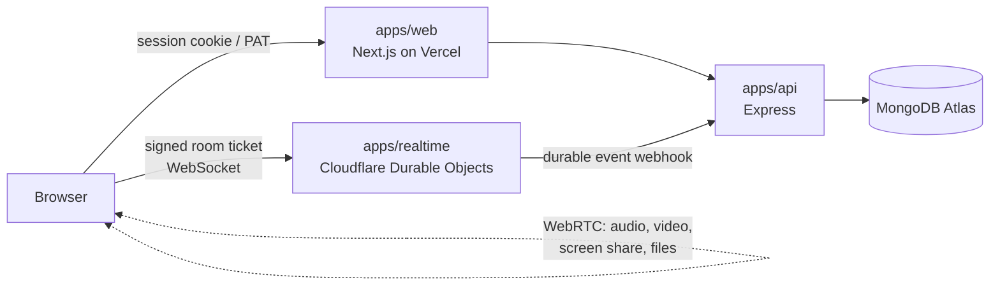
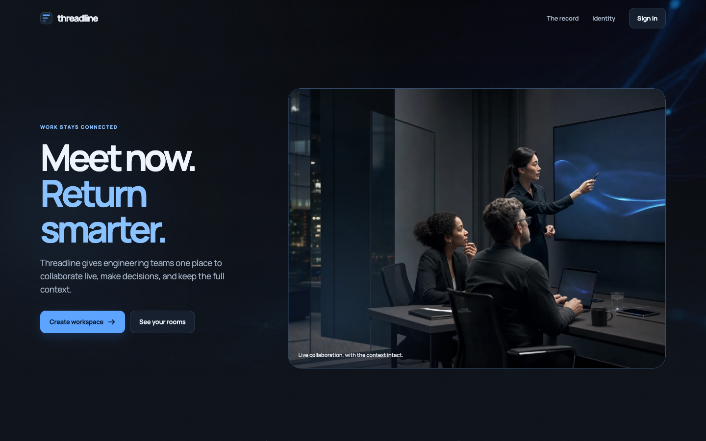
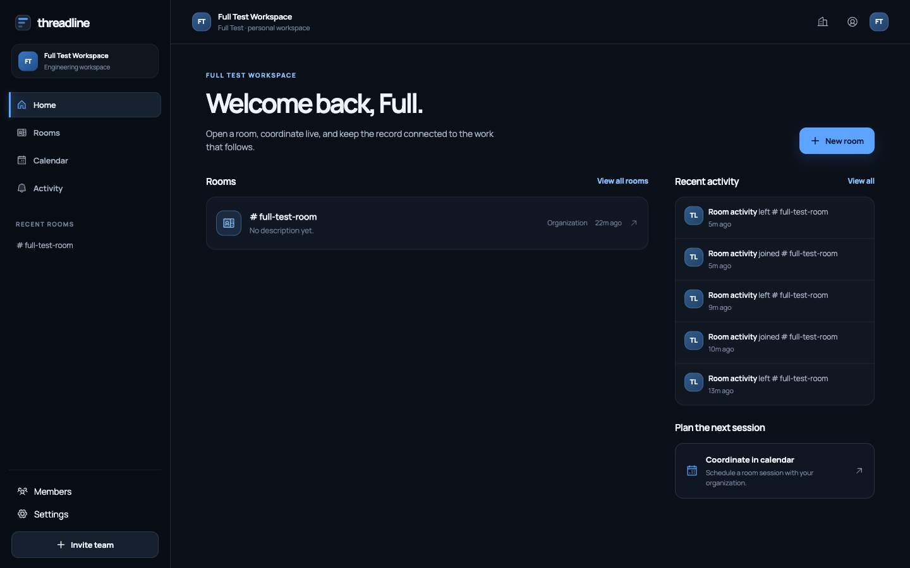
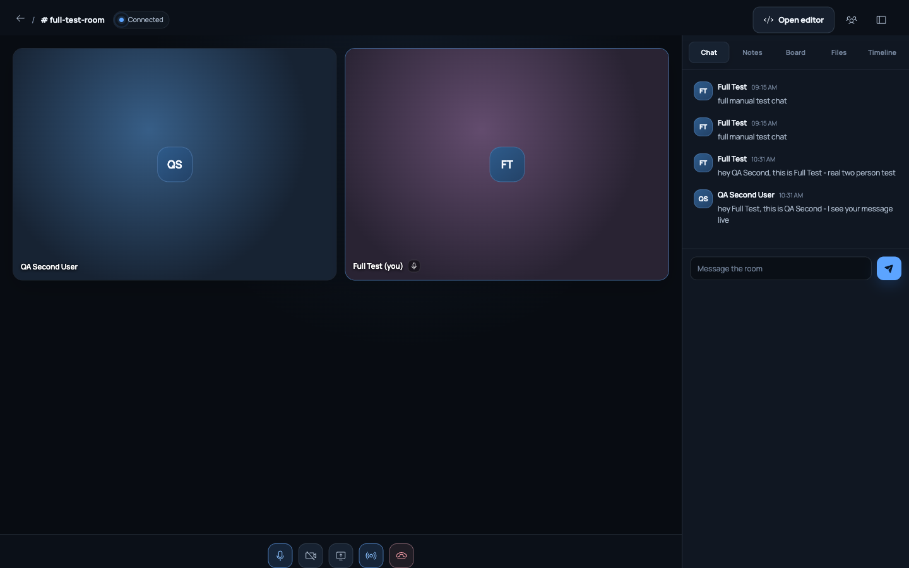
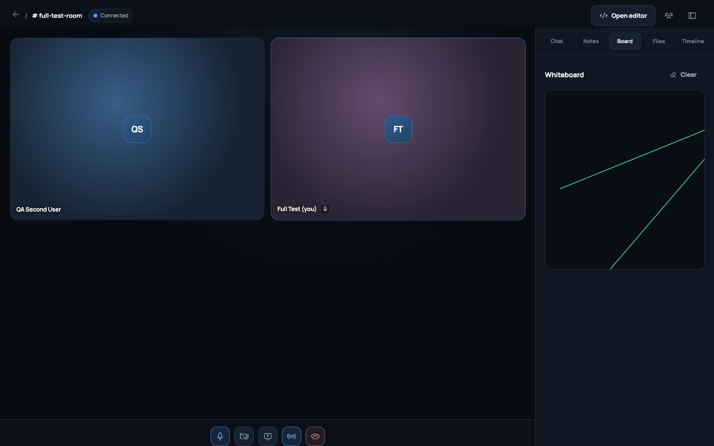
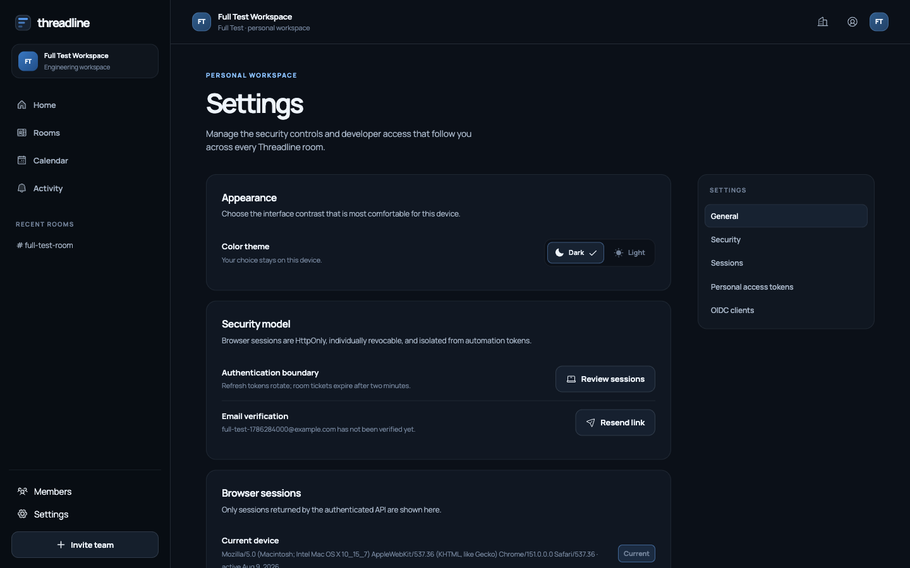
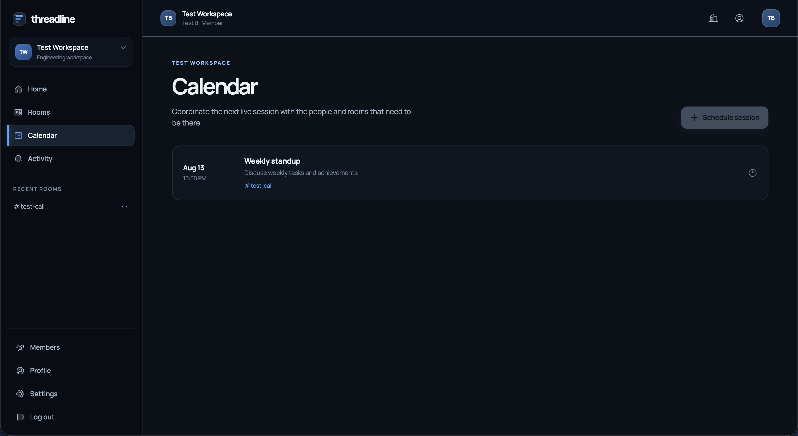

# Threadline — A Real-Time Collaboration Platform


Threadline is a room-centered collaboration workspace for engineering teams. A room is both a live session (video, audio, screen share, whiteboard, chat, shared editor) and a durable record of what happened in it — nothing is thrown away when the call ends. The whole system is three independently deployable services, each with a single job, none of them trusting the others' enforcement — that split, and what it costs and buys, is the actual subject of this repository.

## Table of contents

- [Overview](#overview)
- [Why Threadline exists](#why-threadline-exists)
- [Live deployment](#live-deployment)
- [What's included](#whats-included)
- [Technology stack](#technology-stack)
- [How the three services fit together](#how-the-three-services-fit-together)
- [Trust model](#trust-model)
- [Onboarding and workspace roles](#onboarding-and-workspace-roles)
- [Interface sound](#interface-sound)
- [Email delivery](#email-delivery)
- [Engineering principles](#engineering-principles)
- [Performance and scaling characteristics](#performance-and-scaling-characteristics)
- [Real incidents found operating this](#real-incidents-found-operating-this)
- [Testing and quality gates](#testing-and-quality-gates)
- [Observability](#observability)
- [What the interface looks like](#what-the-interface-looks-like)
- [Project structure](#project-structure)
- [Running it locally](#running-it-locally)
- [Environment variables](#environment-variables)
- [Commands](#commands)
- [Deploying it yourself](#deploying-it-yourself)
- [FAQ](#faq)
- [Documentation index](#documentation-index)
- [License](#license)

## Overview

Threadline provides a single, unified workspace for a live call and its durable record, with three independent services each owning exactly one responsibility. The system is designed to demonstrate how to structure a realtime product across a serverless web tier, a serverless API tier, and a genuinely stateful coordination tier, with independent authorization checks at every boundary rather than a single shared trust domain.

- **What a room is:** a live WebRTC call (video, audio, screen share) plus a shared whiteboard, shared notes, a shared code editor, direct peer-to-peer file transfer, and chat — all synced in real time across every connected participant.
- **What persists:** chat messages, document edits, whiteboard updates, and who joined/left are written into a durable, permission-filtered timeline you can revisit after the call ends. Live-only signals (cursor position, WebRTC offers/answers/ICE candidates, individual whiteboard strokes) are deliberately never persisted — they're too high-frequency to be a meaningful record.
- **What it's built to demonstrate:** a production-quality realtime collaboration app split across three independent, mostly-serverless runtimes, each owning exactly one responsibility, with independent authorization checks at every boundary rather than a single shared trust domain.
- **Three services, three jobs:**
  - `apps/web` — Next.js UI and the browser-side WebRTC mesh, deployed to Vercel.
  - `apps/api` — Express API owning identity, attribute-based access control, rooms, calendar, and the durable event record, backed by MongoDB Atlas.
  - `apps/realtime` — one Cloudflare Durable Object per room, owning live presence and WebRTC signaling relay.
- **Who this is for:** engineers evaluating how to structure a realtime product across a serverless web tier, a serverless API tier, and a genuinely stateful coordination tier, and wanting to see the actual trade-offs (not just the happy path) written down.

## Why Threadline exists

- **The product problem it solves:** most teams run a live call in one tool (a video conferencing app) and keep the record of what happened in a completely different one (a wiki page, a chat thread, a shared doc someone remembers to update afterward). Threadline treats the room itself as the unit that owns both — the live session and its durable history are the same object, not two things a human has to reconcile by hand.
- **The engineering problem it's built to explore:** a single conventional server handles "many stateless requests" well and "one coordinator per active room, globally consistent, cheap when idle" poorly. Threadline exists to work through that specific mismatch honestly — one plane (`apps/realtime`) is intentionally not stateless, and the rest of the system is designed around that fact rather than around pretending everything can be a normal REST service.
- **Why it's a real, running deployment rather than a diagram:** every claim in this repository's documentation — the trust boundaries, the failure modes, the incidents — is backed by a system you can actually open, register an account on, and break in the same ways it was broken during development. [Real incidents found operating this](#real-incidents-found-operating-this) and [`docs/operations.md`](docs/operations.md) exist because this was operated, not just designed.
- **What it deliberately does not try to be:** a broadcast/streaming platform (no SFU, no one-to-many fan-out — see [Architectural trade-offs and current limitations](ARCHITECTURE.md#architectural-trade-offs-and-current-limitations)), a general-purpose project management tool, or a fully managed multi-tenant SaaS with billing. It is scoped to small, focused working sessions for a single organization at a time.

## Live deployment

- **Web app:** [threadline-rtc.vercel.app](https://threadline-rtc.vercel.app) — create a real account and try it.
- **Swagger UI:** [threadline-app-api.vercel.app/api-docs](https://threadline-app-api.vercel.app/api-docs) — interactive, try-it-out against the live API.
- **ReDoc:** [threadline-app-api.vercel.app/api-docs/redoc](https://threadline-app-api.vercel.app/api-docs/redoc) — three-pane reference.
- **Realtime:** [threadline-realtime.threadline-dn.workers.dev](https://threadline-realtime.threadline-dn.workers.dev) — the Cloudflare Worker that hosts `RoomDurableObject`. There's nothing to browse here: it's a WebSocket/signaling endpoint the web app connects to with a signed room ticket, not a page meant to be opened directly.
- **What's actually running there:** the same code in this repository, deployed with `apps/web` and `apps/api` both on Vercel (as two separate projects) and `apps/realtime` on Cloudflare Workers — the exact topology diagrammed in [Browser-facing topology](ARCHITECTURE.md#browser-facing-topology) and detailed in [`docs/deployment.md`](docs/deployment.md#live-reference-deployment).

## What's included

- **Web app (`apps/web`):**
  - Registration, login, and password recovery. Signing up no longer locks an account into any one workspace — see [Onboarding and workspace roles](#onboarding-and-workspace-roles). There is no email-verification flow, deliberately — see [Email delivery](#email-delivery).
  - A full-screen onboarding step, shown whenever an account has zero workspaces, offering two card-based paths: create a new workspace (becoming its owner) or join an existing one via invite code.
  - A real workspace switcher in the sidebar — accounts can belong to more than one workspace, switch between them from a dropdown, and the last-used workspace is remembered (`localStorage`) and restored on the next visit.
  - Organization dashboard: recent rooms, recent activity, a room-creation modal.
  - A dedicated rooms directory listing every room the caller can see.
  - A live room view with five panels — chat, shared notes, a drawable whiteboard, direct peer-to-peer file transfer, and a durable event timeline — plus a separate shared code editor mode and camera/mic/screen-share controls.
  - An organization-wide calendar for scheduling sessions, and an org-wide activity feed aggregating durable events across every visible room.
  - Organization membership management: a shareable, regenerable invite code (owner/admin-controlled, optionally delegable to members), per-member role changes (owner/admin/member) with a last-admin self-demotion guard, and per-room membership management (granting explicit access to restricted rooms).
  - Loading skeletons across every list-driven page (rooms, members, activity, calendar, sessions/tokens/clients) so a still-loading list is never mistaken for a genuinely empty one.
  - A dedicated profile page reached from the topbar avatar: identity summary, editable display name and username, and every workspace the account belongs to with its role. A rename updates the workspace chrome immediately rather than waiting for a reload.
  - Account settings: appearance/theme, interface sounds, active browser sessions (list and revoke), personal access tokens (create, scope, revoke), and first-party OIDC clients.
  - Interface sound feedback for joining, leaving, muting, camera, screen share, chat, and peer presence — synthesised with the Web Audio API rather than shipped as audio files, and switchable off in settings. See [Interface sound](#interface-sound).
  - A custom, branded 404 page rather than a framework default.
- **API (`apps/api`):**
  - Identity and session management, with three independent authentication surfaces: browser session cookies, personal access tokens, and first-party OIDC.
  - Organizations, rooms, room membership, and a calendar resource, all protected by attribute-based access control re-derived on every request.
  - Self-service workspace creation and invite-code-based joining (`POST /v1/orgs`, `POST /v1/join`), decoupled from registration — see [Onboarding and workspace roles](#onboarding-and-workspace-roles).
  - Personal access token issuance, scoping, listing, and revocation.
  - A first-party OpenID Connect provider implementing Authorization Code + PKCE — no implicit grant, no password grant, no public third-party client registration.
  - An internal ingest endpoint that accepts durable events forwarded by the Durable Object, independently re-checking authorization for the event's acting user rather than trusting the forwarding secret alone.
  - Error and performance monitoring via Sentry, inert by default (no-ops with no `SENTRY_DSN` configured) — see [Observability](#observability).
  - Fully documented as an OpenAPI 3.1 specification, served live at `/api-docs` (Swagger UI) and `/api-docs/redoc` (ReDoc).
- **Realtime (`apps/realtime`):**
  - One Cloudflare Durable Object per room, created on demand and addressed deterministically from the room's ID.
  - Presence tracking and WebRTC signaling relay (SDP offers/answers, ICE candidates) over hibernatable WebSockets, so an idle-but-connected room costs no ongoing compute.
  - SQLite-backed storage for the retry queue behind the durable-event hand-off.
  - Retried, alarm-scheduled delivery of durable events back to the API — a failed hand-off doesn't drop the event, it queues and tries again.
- **WebRTC client (`apps/web/lib/peer-mesh.ts`):**
  - A hand-rolled full-mesh client — one `RTCPeerConnection` and one data channel per remote participant, with no third-party WebRTC SDK.
  - Camera and microphone streaming, screen sharing, and peer-to-peer chunked file transfer over the data channel.
  - No media server anywhere in the stack — once signaling completes, audio/video/screen/file bytes never touch a Threadline-operated server again.

## Technology stack

| Technology           | Role in this project                                                                                                                                                       |
| -------------------- | -------------------------------------------------------------------------------------------------------------------------------------------------------------------------- |
| Next.js (App Router) | `apps/web` framework — client components for every authenticated page, no server-side data fetching for authenticated content                                              |
| React                | UI library underneath `apps/web`                                                                                                                                           |
| TypeScript           | Strict typing across all three workspaces (`apps/web`, `apps/api`, `apps/realtime`)                                                                                        |
| Node.js              | Runtime for `apps/api`; also the local dev runtime for tooling                                                                                                             |
| Express              | REST framework for `apps/api`, wrapped in a pure `createApp()` factory so the same code boots identically in tests, Docker, Kubernetes, and Vercel                         |
| MongoDB (Atlas)      | Durable datastore in production, behind the `Repository` interface — never imported directly by route handlers                                                             |
| Cloudflare Workers   | Hosts `apps/realtime`'s fetch handler, which routes WebSocket upgrades to the right Durable Object                                                                         |
| Durable Objects      | One authoritative, in-memory instance per room for presence and signaling — the one piece of state that can't just be "more instances of a stateless server"               |
| Vercel               | Hosts `apps/web`, and in this project's own live deployment, `apps/api` as well                                                                                            |
| WebRTC               | Peer-to-peer audio, video, screen share, and file transfer, mesh topology, no media server                                                                                 |
| WebSocket            | Transport for presence and signaling, using Cloudflare's hibernatable WebSocket API                                                                                        |
| OAuth2 / OIDC        | Threadline's first-party identity provider, Authorization Code + PKCE only                                                                                                 |
| JWT                  | Signs room tickets (HS256, 120-second single-purpose tokens) and OIDC access tokens (RS256, 15-minute expiry)                                                              |
| Zod                  | Request validation throughout `apps/api`                                                                                                                                   |
| Swagger / OpenAPI    | Live, interactive API documentation generated from `apps/api/src/openapi.ts`                                                                                               |
| Sentry               | Error and performance monitoring for `apps/api` and `apps/web`, inert by default — see [Observability](#observability)                                                     |
| Argon2               | Password hashing (`argon2id`) for stored credentials in `apps/api`                                                                                                         |
| Helmet               | Security response headers on every `apps/api` route                                                                                                                        |
| Pino                 | Structured, redacting HTTP request logging for `apps/api` (`pino-http`), auth/cookie headers stripped before anything is logged                                            |
| Framer Motion        | Modal, transition, and onboarding-flow animation across `apps/web`                                                                                                         |
| GSAP                 | Landing-page scroll and motion effects in `apps/web`                                                                                                                       |
| Docker               | Local Compose stack (web, API, MongoDB, Wrangler's local Worker emulation) and production container images                                                                 |
| Kubernetes           | Self-hosted production alternative to Vercel/Render for the stateless web and API tier — see [`docs/containers-and-kubernetes.md`](docs/containers-and-kubernetes.md)      |
| GitHub Actions       | Multi-stage CI/CD pipeline: format check, lint, typecheck, test, build, and container/Kubernetes validation on every PR, plus image builds published to GHCR on `main`     |
| GHCR                 | Container registry for published `web`/`api`/`realtime` images, built on `main` after every check passes                                                                   |
| Trivy                | Vulnerability scan of every built container image in CI, before publish                                                                                                    |
| Vitest               | Test runner for both `apps/api` (Node environment, `supertest`) and `apps/realtime` (real Workers runtime via `@cloudflare/vitest-pool-workers`)                           |
| Playwright           | Browser automation used throughout development for live, two-independent-browser-context manual verification — see [Testing and quality gates](#testing-and-quality-gates) |
| ESLint               | Lint gate across all three workspaces, zero warnings allowed                                                                                                               |
| Prettier             | Formatting gate, enforced in CI and via a pre-commit hook                                                                                                                  |

## How the three services fit together



- The browser talks to `apps/web` over HTTPS with a session cookie or PAT.
- `apps/web` proxies the API through a same-origin rewrite, so the session cookie stays first-party even though the API is a separate Vercel project.
- The browser opens a WebSocket **directly** to the Cloudflare Worker, authenticated by a short-lived, single-purpose signed ticket — not the session cookie.
- The Durable Object never talks to MongoDB. It only hands events to the API over an authenticated webhook, retrying if that fails.
- WebRTC media (audio/video/screen/files) flows peer-to-peer once signaling completes — never through a server.
- Full breakdown: [`ARCHITECTURE.md`](ARCHITECTURE.md) and [`docs/architecture.md`](docs/architecture.md).

## Trust model

- No plane trusts another plane's enforcement — every one independently re-verifies who's allowed to do what, using its own credential, on every request.
- The Durable Object verifies its own signed room ticket (signature and room ID) before accepting a WebSocket upgrade.
- The API re-checks attribute-based access control on every request, including events forwarded by the Durable Object over its internal webhook — a valid shared ingest secret proves the request came from the trusted Worker, not that the acting user embedded in the event may actually write to that room.
- Session cookies, personal access tokens, and OIDC tokens are three genuinely different credential types with different lifetimes and capabilities — a PAT, even one scoped `admin:*`, is explicitly barred from session-only routes such as creating another PAT or listing browser sessions.
- Two secrets are shared across two different platforms (Vercel and Cloudflare) with nothing in the code enforcing they match: `ROOM_TICKET_SECRET` and the `INTERNAL_INGEST_SECRET`/`PERSISTENCE_SECRET` pair. Getting either wrong fails silently at runtime — every ticket rejected, or every durable event silently never persisted — not at deploy time.
- Full secrets inventory, with a diagram of exactly which secret crosses which boundary and what it authorizes: [`docs/security.md`](docs/security.md#secrets-inventory).

## Onboarding and workspace roles

Registration does not create or join a workspace. A brand-new account has zero organizations until it explicitly does one of two things, both reachable from a full-screen onboarding step (mandatory when an account has no workspace, optional and reachable from the sidebar switcher afterward, for adding another one):

- **Create a workspace** (`POST /v1/orgs`) — the caller becomes its `owner`, and a fresh, unique, regenerable join code is generated for it.
- **Join a workspace** (`POST /v1/join`) — redeems another workspace's join code and creates a `member` membership. Rate limited the same as a password check (10/15min/IP), since it's a caller-supplied secret checked against every organization in the system.

Three roles exist per membership — `owner`, `admin`, `member` — enforced the same way as every other permission in the system: re-derived from the database on every request, never cached or inferred from an ID.

- **Only an owner may grant `admin`.** An admin (or a member with the delegated `canManageMembers` attribute) can manage members and change roles, but cannot escalate anyone to admin.
- **An admin can self-demote to member only if another admin already exists** in the organization; otherwise the API rejects it (`400 last_admin`) rather than leaving the workspace with no one able to manage it. This guard only applies to a caller changing their own role — an owner-directed demotion of someone else is exempt, since the owner remains a fallback administrator regardless.
- **The join code is a genuine secret**, never included in any general-purpose response (`GET /v1/auth/me`, `GET /v1/orgs`) — only the dedicated, permission-gated `GET /v1/orgs/:orgId/invite` endpoint returns it. Viewing or regenerating it is available to owners/admins always, and to plain members only when the organization has opted in via `allowMemberInvites`.
- **A non-member gets an identical `403` whether the organization they're asking about is real or doesn't exist** — the invite endpoints deliberately never leak organization existence through a status-code difference.

Room and call access was already, and remains, gated on organization membership: `effectiveRoomRole()` returns nothing for a caller with no membership row at all, so an account with zero workspaces has no route into any room regardless of how it got there.

Full design and endpoint-by-endpoint detail: [`docs/api.md`](docs/api.md#organizations--rooms) and [`docs/glossary.md`](docs/glossary.md#j).

## Interface sound

Short cues mark the events you can't see happen: joining and leaving a room, muting, camera on/off, starting and
stopping a screen share, sending and receiving a message, and someone else arriving or leaving.

They are **synthesised at runtime through the Web Audio API**, not shipped as audio files. A dozen cues as WAVs would be
a few hundred KB of binaries carrying their own licences, and each would need a network round trip before the first mute
click could be heard. As synthesis the whole palette is a table of frequencies in
[`apps/web/lib/sound.ts`](apps/web/lib/sound.ts), it costs nothing until something happens, and a cue's character is
tuned by editing a number instead of re-cutting a file.

The palette is one interval set (D major pentatonic) so cues sound related rather than arbitrary, and every cue is
paired — whatever rises to turn something on falls to turn it back off. Levels were not guessed: the module was rendered
through an `OfflineAudioContext` and measured.

| Property                         | Measured                                       |
| -------------------------------- | ---------------------------------------------- |
| Loudest cue (`join`) peak        | −14.8 dBFS, 378 ms                             |
| Realistic 3-cue overlap          | −10.5 dBFS, no clipping                        |
| All 14 cues fired simultaneously | −0.4 dBFS, still no clipping                   |
| Max sample-to-sample jump        | 0.0238 — every envelope is ramped, so no click |
| Sound switched off               | no `AudioContext` is constructed at all        |

Repeats of the same cue inside 90 ms are dropped, so a burst of arrivals does not machine-gun. Off is one click in
**Settings → Appearance → Interface sounds**, and the preference persists per device.

## Email delivery

**Threadline has no built-in transactional email provider, and that is worth understanding before deploying it.**

Anything that would send mail is handed to the webhook named in `AUTH_DELIVERY_WEBHOOK` — a service you supply. When
that variable is unset, the delivery callback is never constructed and no mail leaves the system.

Two consequences follow, both stated plainly rather than discovered later:

- **There is no email-verification flow.** It previously existed and silently did nothing: the request endpoint wrote a
  token and answered `202 Accepted` for mail that was never sent. Reporting success for work not done is worse than not
  offering the feature, so both endpoints and every piece of "Verified / Unverified / Resend link" UI were removed.
  `Credential.emailVerifiedAt` and the OIDC `email_verified` claim remain, because the claim is part of the OIDC
  contract and reporting it as `false` is accurate.
- **Password recovery does not complete end to end without that webhook.** `POST /v1/auth/password-reset/request` still
  answers `202` — answering anything else would leak whether an account exists — but the `202` means "recorded", not
  "sent". Configure `AUTH_DELIVERY_WEBHOOK` and `AUTH_DELIVERY_SECRET` before relying on account recovery in production.

## Engineering principles

- **Independent re-verification, not shared trust.** Every plane re-derives authorization from scratch on every request rather than caching a decision or trusting what an upstream plane already claims to have checked.
- **One `Repository` interface, two implementations.** `MemoryRepository` backs local dev and the real HTTP-level test suite with zero database connection; `MongoRepository` backs production. Route handlers in `apps/api/src/application.ts` only ever call the interface — this is what lets `createApp()` boot identically on a test runner, Docker, Kubernetes, or Vercel. Rationale: [ADR-0003](docs/decisions/0003-repository-interface.md).
- **Attribute-based access control, computed fresh every time.** Every permission decision is derived from the caller's organization role, explicitly delegated attributes, and — for rooms — the room's own visibility and classification, re-evaluated on every request rather than inferred from an ID or cached from a previous check.
- **Fail closed on misconfiguration, at boot, not at request time.** `apps/api/src/index.ts` refuses to start in production with an insecure or incomplete configuration — short secrets, non-HTTPS origins, a missing signing key — rather than starting with a silently weaker default. See [Boot-time validation](docs/security.md#boot-time-validation).
- **Secrets are single-purpose and never reused across trust boundaries.** The value that authorizes a WebSocket connection is not the value that authorizes a durable-event webhook call, which is not the value that signs an OIDC access token. A leak of one does not compromise what the others protect.
- **No media server, by design.** WebRTC media takes the shortest path available — peer-to-peer — rather than routing through infrastructure Threadline would have to run, secure, and pay for per minute of call time. The cost of that choice (mesh bandwidth scales with participant count) is written down, not hidden: [ADR-0002](docs/decisions/0002-webrtc-mesh-not-sfu.md).
- **Explicit field whitelists over blacklists when serializing anything from a database driver.** `const { secretField, ...rest } = doc` looks safe but silently includes whatever else the driver happened to attach to that object — the MongoDB driver mutates an inserted document by adding its own `_id`, which leaked into two responses this exact way before being replaced with an explicit `publicOrganization()` whitelist. The identical, still-unfixed pattern elsewhere in the codebase is tracked, not hidden: [`docs/roadmap.md`](docs/roadmap.md).
- **A unique index on a field added to an already-populated collection is a migration, not just a schema change.** It needs a backfill pass before (or atomically with) rollout, or it can take the whole service down at boot — this one did, in production, for real. See [the incident that taught this](docs/operations.md#incident-a-unique-index-on-a-pre-existing-collection-took-down-every-request).
- **Honesty over polish in the documentation itself.** The incidents, known limitations, and roadmap gaps below are real and current, not a marketing summary — see [Real incidents found operating this](#real-incidents-found-operating-this) and [`docs/roadmap.md`](docs/roadmap.md).

## Performance and scaling characteristics

Concrete numbers, not marketing — what actually happens as usage grows, and where the real ceilings are.

| Dimension                             | Behavior                                                                                                                                                                                                                                                                                                                                                                                                                                              |
| ------------------------------------- | ----------------------------------------------------------------------------------------------------------------------------------------------------------------------------------------------------------------------------------------------------------------------------------------------------------------------------------------------------------------------------------------------------------------------------------------------------- |
| WebRTC mesh bandwidth per participant | O(n − 1) upload connections for a room of _n_ people — a 6-person room means 5 simultaneous outbound video/audio streams from each participant's browser. Fine at the small-team scale this product targets; a 20-person room would mean 19 outbound streams per participant, which most consumer upload bandwidth can't sustain. See [ADR-0002](docs/decisions/0002-webrtc-mesh-not-sfu.md) for the SFU alternative and why it wasn't chosen.        |
| Durable Object idle cost              | Zero ongoing compute for a room with no active WebSocket connections — Cloudflare hibernates the object between messages (`state.acceptWebSocket()`), so an idle-but-connected room costs nothing until the next message arrives. A brand-new room's Durable Object is created lazily, on the first request that names its ID.                                                                                                                        |
| API request latency                   | Serverless cold start on Vercel for `apps/api` (a few hundred ms on a cold instance, low single-digit ms once warm) plus one MongoDB Atlas round trip per request that touches the database — every ABAC check re-queries membership rather than caching it, which is a deliberate correctness trade-off (see [Engineering principles](#engineering-principles)), not an oversight.                                                                   |
| Rate limits                           | Login/register/password-reset: 5–12 requests per window per hashed IP. `POST /v1/join` (a caller-supplied secret checked against every organization in the system): 10 per 15 minutes. All backed by an atomic Mongo counter, not process-local memory, so the limit holds across every serverless instance handling that IP — see [`docs/security.md`](docs/security.md#rate-limits).                                             |
| Horizontal scaling (Kubernetes)       | The stateless web/API tier autoscales 2–10 replicas via HPA on CPU, with a PodDisruptionBudget and a soft topology-spread preference so replicas don't collapse onto one node. `apps/realtime` doesn't scale this way at all — it isn't stateless, and Cloudflare's Durable Object placement (one instance per room, globally) is the scaling model, not replica count. See [`docs/containers-and-kubernetes.md`](docs/containers-and-kubernetes.md). |
| Room-event history                    | The in-memory timeline broadcast to connected clients keeps the most recent 200 events per room session; the durable `RoomEvent` collection in MongoDB is unbounded and is what the activity feed and timeline actually read from after a reload.                                                                                                                                                                                                     |

## Real incidents found operating this

This deployment has broken for real, more than once. Every incident — what broke, why, how it was found, how it was fixed — is written up in full in [`docs/operations.md`](docs/operations.md#incidents). Twelve so far, briefly:

- A WebRTC negotiation bug where two participants could join the same room and simply never connect, because neither side happened to offer first.
- A Durable Object hibernation quirk where a participant who'd just disconnected kept appearing "present" to everyone else, indefinitely, because the departing socket still counted itself present in the same broadcast that announced its own departure.
- A rate limiter silently sharing one counter across four different endpoints, because of how Express rebases request paths inside route mounts — hammering `/login` measurably ate into `/register`'s budget.
- Durable events (chat, joins, document edits) never persisting at all, because `apps/realtime/wrangler.toml` was missing its `[vars]` block entirely, so the persistence webhook URL was `undefined` and delivery was silently never attempted.
- A room-ticket signing mismatch between `apps/api` and `apps/realtime`, causing every WebSocket connection to be rejected with no visible error beyond "bad response from the server."
- A persistence-secret mismatch on the same webhook, after the URL itself was fixed — the two independently configured platform secrets simply didn't match.
- A production web app deployed with **zero environment variables**, meaning registration and login were completely broken for every real user despite the build succeeding and the site returning `200`.
- `WEB_ORIGIN` pointed at `localhost:3000` in a production deployment, silently rejecting every real cross-origin request as a CSRF violation.
- `OIDC_ISSUER` set to a URL that included a path, which crashed the _entire_ API at boot — every route, not just the OIDC ones — because `parseOrigin()` rejects any value that isn't a bare origin.
- A seeded first-party OIDC client whose redirect URI never updated when the web app's domain changed, breaking login through that specific flow until the seed logic was made self-healing.
- Deploying the workspace/role rework's new unique index on organizations' join codes crashed **every** API request in production, because ~22 pre-existing organizations had no `joinCode` at all and the index build failed on duplicate `null`s — fixed with a one-off backfill, not a rollback.
- Deploying an unrelated feature branch that happened to be based on an older `main` silently reverted the live API to a previous, still-superseded registration schema for several minutes, because the deploy source was the wrong branch rather than the one actually intended.

## Testing and quality gates

- **Every automated suite runs against the actual runtime it targets rather than a mock of it:** `apps/api`'s HTTP-level integration suite (`supertest` against a real `createApp()` and a real `MemoryRepository`, zero mocking of Express or the repository), `apps/realtime`'s Durable Object suite (real hibernatable WebSocket handlers and SQLite storage inside an actual Workers runtime via `@cloudflare/vitest-pool-workers`), and a small `apps/web` layer covering the WebRTC mesh, the sound engine, and CSS-level layout guards run in real Chromium via Playwright (`npm run test:browser`, also gated in CI).
- **`apps/web` still has no component or page-level test suite.** What exists there is unit and layout coverage, not rendering coverage: no page is mounted, no fetch-driven state is asserted. Every UI bug found in this project — the WebRTC mesh initiator bug, the stale-presence-after-disconnect race, the whiteboard off-tab stroke loss — was found through live manual testing against the running app, including genuine two-independent-browser-context sessions (two separate cookie jars, two separately registered real users). This remains the largest testing gap in the repository, written down honestly rather than glossed over: [`docs/testing.md`](docs/testing.md#everything-the-automated-suites-dont-cover).
- **Layout regressions are asserted numerically, not by screenshot.** `control-centering.spec.ts` measures how far a control's contents sit from the centre of its own content box and fails past half a pixel — the check that would have caught the off-centre tab labels and icon buttons, and one verified to fail when the old CSS is restored rather than merely passing against the new.
- **The full local check, mirroring what gates a merge in CI:**
  ```bash
  npm run format:check && npm run lint && npm run typecheck && npm test && npm run build
  ```
- Full test-suite structure, exactly what's covered, and every known coverage gap: [`docs/testing.md`](docs/testing.md).

## Observability

Both `apps/api` (`@sentry/node`) and `apps/web` (`@sentry/nextjs`) are instrumented for error and performance monitoring, and both are fully inert with no configured DSN — every `Sentry.*` call safely no-ops, so nothing about running the app locally or in CI depends on having a Sentry account.

- `apps/api`: `src/instrument.ts` runs as the literal first import of `src/index.ts`, ahead of everything else, so Sentry can instrument what loads after it. The final Express error handler reports only its genuinely-unexpected branch — validation errors (`z.ZodError`) are expected user-input noise and are never sent.
- `apps/web`: standard App Router instrumentation (`instrumentation.ts` for server/edge, `instrumentation-client.ts` for the browser), plus `next.config.ts` wrapped with `withSentryConfig` for optional source-map upload (skipped, not failed, without an org/auth token — see [Environment variables](#environment-variables)).
- Enable it by setting `SENTRY_DSN` (API) and `NEXT_PUBLIC_SENTRY_DSN` (web) as environment variables in each deployment target and redeploying — no code changes required.

## What the interface looks like

All screenshots below are taken directly against the live deployment. The chat and whiteboard screenshots use two independently authenticated browser sessions connected to the same room at the same time — real, live two-person sync, not a mockup.

<p align="center">
  
  <br />
  <sub>Landing page</sub>
</p>

<p align="center">
  
  <br />
  <sub>Workspace dashboard</sub>
</p>

<p align="center">
  
  <br />
  <sub>Room chat — two participants, live</sub>
</p>

<p align="center">
  
  <br />
  <sub>Whiteboard — synced live between participants</sub>
</p>

<p align="center">
  
  <br />
  <sub>Account settings</sub>
</p>

<p align="center">
  
  <br />
  <sub>Organization calendar</sub>
</p>

- Full surface-by-surface set (notes, code editor, file transfer, timeline, membership, every settings page, 404): [`docs/frontend.md`](docs/frontend.md#screens).
- Swagger UI / ReDoc screenshots: [`docs/api.md`](docs/api.md#interactive-documentation).

## Project structure

```text
Threadline/
├── apps/
│   ├── web/                  Next.js App Router UI (Vercel)
│   │   ├── app/               routes: landing, auth screens, /app/** workspace
│   │   ├── components/        React client components
│   │   ├── lib/                apiFetch() HTTP client, PeerMesh WebRTC client
│   │   └── public/            static assets
│   ├── api/                   Express REST API (Vercel / any Node 22 host)
│   │   ├── Dockerfile
│   │   └── src/
│   │       ├── domain.ts       entity types (User, Room, Session, PAT, ...)
│   │       ├── repository.ts   Repository interface + Memory/Mongo implementations
│   │       ├── policy.ts       ABAC decision logic
│   │       ├── application.ts  createApp() factory, routes, middleware
│   │       ├── security.ts     hashing, tokens, cookies
│   │       ├── instrument.ts   Sentry.init(), imported first in src/index.ts
│   │       └── openapi.ts      OpenAPI 3.1 document
│   └── realtime/               Cloudflare Worker + Durable Object
│       ├── Dockerfile           local Wrangler emulation, not the Cloudflare deploy path
│       └── src/index.ts        RoomDurableObject
├── docs/                      Deep-dive documentation
│   ├── decisions/               Architecture Decision Records
│   └── screenshots/             Curated UI screenshots used across the docs
├── infra/
│   ├── docker/                  Fixtures consumed by apps/realtime/Dockerfile (dev-only secrets)
│   └── kubernetes/               Kustomize base + overlays
├── compose.yaml               Local Docker Compose stack (web + API + realtime + MongoDB)
├── ARCHITECTURE.md            Root-level architecture reference (this repo's single-file overview)
└── .github/workflows/         CI pipeline (format, lint, typecheck, test, build)
```

- Full monorepo layout, one level deeper, with what each file is responsible for: [`docs/architecture.md`](docs/architecture.md#monorepo-layout).

## Running it locally

**Prerequisites:** Node.js 22 or newer, and `npm` (this is an npm-workspaces monorepo — one `npm install` at the root installs all three workspaces).

```bash
npm install
cp apps/realtime/.dev.vars.example apps/realtime/.dev.vars
npm run dev
```

Open `http://localhost:3000`. `npm run dev` starts all three services, wired to talk to each other correctly:

| Service  | URL                     | What's running there                                                    |
| -------- | ----------------------- | ----------------------------------------------------------------------- |
| Web      | `http://localhost:3000` | Next.js UI, connected to the local API and Worker                       |
| API      | `http://localhost:4000` | Express API, using an in-memory development database                    |
| Realtime | `http://localhost:8787` | Wrangler's local emulation of the Worker and its Durable Object runtime |

- The local Worker reads its dev secrets from `apps/realtime/.dev.vars` (gitignored).
- Without `MONGODB_URI` set, `apps/api` uses an in-memory repository — zero database setup needed to run locally, but every restart of the API process (including `tsx watch` restarts on save) clears it.
- Stop everything with `Ctrl+C`.
- Run one service alone: `npm run dev:api:local`, `npm run dev:realtime:local`, or `npm run dev:web:local`.
- Prefer containers? `npm run docker:up` starts web + API + a real local MongoDB + the local Durable Object runtime together, so state survives restarts. Full guide: [`docs/containers-and-kubernetes.md`](docs/containers-and-kubernetes.md).

## Environment variables

The three services need different configuration, summarized here — the full table with every variable, its purpose, and production requirements lives in [`docs/deployment.md`](docs/deployment.md).

| Service         | Needs                                                                                                                                                                                                 |
| --------------- | ----------------------------------------------------------------------------------------------------------------------------------------------------------------------------------------------------- |
| `apps/web`      | `NEXT_PUBLIC_API_ORIGIN`, `NEXT_PUBLIC_REALTIME_ORIGIN` (public, baked in at build time); optionally `NEXT_PUBLIC_SENTRY_DSN`, `SENTRY_ORG`, `SENTRY_AUTH_TOKEN` (build-time only, source-map upload) |
| `apps/api`      | `MONGODB_URI`, `OIDC_ISSUER`, `WEB_ORIGIN`, `OIDC_PRIVATE_JWK`, `ROOM_TICKET_SECRET`, `INTERNAL_INGEST_SECRET`, `AUTH_DELIVERY_WEBHOOK`, `AUTH_DELIVERY_SECRET`; optionally `SENTRY_DSN`, `TURN_KEY_ID`, `TURN_KEY_API_TOKEN` |
| `apps/realtime` | `ROOM_TICKET_SECRET`, `PERSISTENCE_WEBHOOK`, `PERSISTENCE_SECRET`                                                                                                                                     |

- `ROOM_TICKET_SECRET` must be identical on `apps/api` and `apps/realtime`. `PERSISTENCE_SECRET` (Worker) must be identical to `INTERNAL_INGEST_SECRET` (API) — different names, same value. Nothing in the code enforces either match; getting one wrong is exactly what caused two of the [real incidents](#real-incidents-found-operating-this) above.
- Every Sentry variable is optional and additive — omitting all of them leaves both SDKs inert (no-op), never a startup or build failure. See [Observability](#observability).
- Never put MongoDB, OIDC, room-ticket, email-delivery, or TURN credentials in `NEXT_PUBLIC_*` variables — those are shipped to every browser that loads the page.
- Local defaults exist for everything except `MONGODB_URI`, so local dev needs no secrets configured at all beyond copying `.dev.vars.example`. Production has no such fallback — see [Boot-time validation](docs/security.md#boot-time-validation).

## Commands

| Command                             | Description                                                                     |
| ----------------------------------- | ------------------------------------------------------------------------------- |
| `npm run dev`                       | Web + API + realtime together, wired for local development                      |
| `npm test`                          | API's HTTP-level integration suite + realtime worker's Durable Object suite     |
| `npm run typecheck`                 | `tsc --noEmit` across all three workspaces                                      |
| `npm run lint`                      | ESLint, zero warnings allowed                                                   |
| `npm run format` / `format:check`   | Prettier write / check                                                          |
| `npm run build`                     | Production build (`apps/web` only — API and Worker have no separate build step) |
| `npm run docker:up` / `docker:down` | Full Docker Compose stack, including a real local MongoDB                       |
| `npm run k8s:validate`              | Renders both Kustomize overlays without a live cluster                          |

- Before opening a PR: `npm run format:check && npm run lint && npm run typecheck && npm test && npm run build` — the same chain CI runs. Details: [`docs/testing.md`](docs/testing.md).
- Contributing a change? Start with [`CONTRIBUTING.md`](CONTRIBUTING.md).

## Deploying it yourself

- The API validates every mandatory production setting **at boot** — Atlas connection, HTTPS-only origins, a stable RSA signing key, separate room-ticket/ingest secrets, an authenticated email-delivery webhook. It refuses to boot half-configured.
- Generate the OIDC signing key once: `npm run generate:oidc-key --workspace=@threadline/api`. Rotating it invalidates every OIDC token issued under the old key, so it isn't done casually.
- `apps/web` and `apps/api` can both run on Vercel, as this project's own deployment does, or `apps/api` can run on any always-on Node 22 host (Render, Docker, Kubernetes) — the same `createApp()` boots identically either way.
- `apps/realtime` deploys to Cloudflare Workers with `wrangler deploy`; its two shared secrets are set with `wrangler secret put` and must match the corresponding API values exactly.
- Zero-cost preview path (free tiers of Vercel + MongoDB Atlas + Cloudflare, no domain purchase): see [`docs/deployment.md`](docs/deployment.md#zero-cost-public-preview).
- Self-hosting the stateless web/API tier on Kubernetes instead of Vercel/Render, while Cloudflare remains the production owner of room Durable Objects: [`docs/containers-and-kubernetes.md`](docs/containers-and-kubernetes.md).
- Exactly which URLs this project's own live deployment runs at, and how that maps onto the general deployment guide: [`docs/deployment.md`](docs/deployment.md#live-reference-deployment).

## FAQ

**Is this used by real teams, or is it a demo?**
It's a real, running deployment — not a multi-tenant SaaS with paying customers, but not a static demo either. Registering a real account on the [live deployment](#live-deployment) creates a real workspace, backed by the same production database and the same code in this repository. "Production-ready" here means correctly designed and genuinely operated (real incidents, real trust boundaries, real test coverage where it exists), not "battle-tested at scale with a support team."

**Why MongoDB instead of a relational database?**
The data model — users, rooms, memberships, a growing durable event timeline — is document-shaped, and every read is already scoped by a single indexed ID (organization, room, or user), not a cross-table join. The `Repository` interface ([ADR-0003](docs/decisions/0003-repository-interface.md)) means this choice isn't load-bearing either way — swapping the datastore touches one file, not the route handlers.

**Why a first-party OIDC provider instead of Auth0, Clerk, or NextAuth?**
Partly to build the actual flow (Authorization Code + PKCE, JWKS, token rotation) rather than configure someone else's, and partly because a third-party auth platform is one more service in the exact trust model this repository is about being honest regarding — see [Trust model](#trust-model).

**Why Cloudflare Durable Objects instead of Redis/Ably/Pusher for presence?**
Those solve "many stateless servers agree on shared state" by adding a coordination service Threadline would have to run, operate, and pay for. A Durable Object gives one authoritative, in-memory instance per room natively, with no separate service and no consistency protocol to write by hand. [ADR-0001](docs/decisions/0001-durable-objects-for-realtime.md) has the full tradeoff against that alternative.

**Can I run this without Vercel or Cloudflare?**
`apps/web` and `apps/api` can run anywhere Node 22 runs — Docker, Kubernetes, bare metal — see [`docs/containers-and-kubernetes.md`](docs/containers-and-kubernetes.md). `apps/realtime` genuinely cannot: it's written against the Durable Objects API, which is Cloudflare-specific, and there's no portable equivalent without rewriting the presence/signaling layer against a different coordination primitive entirely.

**What happens to an in-progress call if `apps/api` goes down?**
Nothing, live — chat, presence, and WebRTC signaling all keep working, since none of that path touches the API. New room creation, login, and durable-event history reads fail. Full breakdown: [Failure behavior](ARCHITECTURE.md#failure-behavior).

**How much does this cost to run?**
The [zero-cost public preview](docs/deployment.md#zero-cost-public-preview) path runs on free tiers of Vercel, MongoDB Atlas, and Cloudflare Workers, no domain purchase — real limits apply (cold starts, free-tier caps), but genuinely $0. This project's own [live deployment](#live-deployment) runs this way.

**Why is there no automated test suite for the frontend?**
Named honestly as the single largest testing gap in the repository rather than hidden — see [Testing and quality gates](#testing-and-quality-gates) for exactly what that means and what catches bugs instead.

## Documentation index

| Document                                                                 | Covers                                                                                                    |
| ------------------------------------------------------------------------ | --------------------------------------------------------------------------------------------------------- |
| [`ARCHITECTURE.md`](ARCHITECTURE.md)                                     | Root-level architecture reference — every plane, every trust boundary, every major flow                   |
| [`docs/architecture.md`](docs/architecture.md)                           | System topology, monorepo layout, full ER diagram, request-lifecycle and event hand-off sequence diagrams |
| [`docs/frontend.md`](docs/frontend.md)                                   | `apps/web` route tree, `WorkspaceGate`, shell composition, theme system, HTTP client, component inventory |
| [`docs/api.md`](docs/api.md)                                             | REST endpoint reference, the three auth surfaces, ABAC policy, OIDC Authorization Code + PKCE flow        |
| [`docs/realtime.md`](docs/realtime.md)                                   | Durable Object internals, WebSocket protocol, WebRTC mesh negotiation, screen sharing, known limitations  |
| [`docs/security.md`](docs/security.md)                                   | Trust boundaries, secrets inventory, session/PAT/OIDC token lifecycle, rate limits, CSRF                  |
| [`docs/testing.md`](docs/testing.md)                                     | Test suite structure, what's actually covered, known coverage gaps                                        |
| [`docs/glossary.md`](docs/glossary.md)                                   | Alphabetical reference for every domain term used across these docs                                       |
| [`docs/troubleshooting.md`](docs/troubleshooting.md)                     | Real problems hit building and operating this, with fixes                                                 |
| [`docs/roadmap.md`](docs/roadmap.md)                                     | Known gaps, honestly — what's not done and why                                                            |
| [`docs/decisions/`](docs/decisions/README.md)                            | ADRs for the major decisions behind this design                                                           |
| [`docs/deployment.md`](docs/deployment.md)                               | Production deployment across Vercel, Cloudflare, and Atlas; zero-cost preview setup                       |
| [`docs/containers-and-kubernetes.md`](docs/containers-and-kubernetes.md) | Docker Compose local stack and Kubernetes production deployment                                           |
| [`docs/operations.md`](docs/operations.md)                               | Runbook: health checks, incident triage, full record of every real incident                               |
| [`CONTRIBUTING.md`](CONTRIBUTING.md)                                     | PR process, coding conventions, what gates a merge                                                        |

## License

MIT. See [LICENSE](LICENSE) for details.
