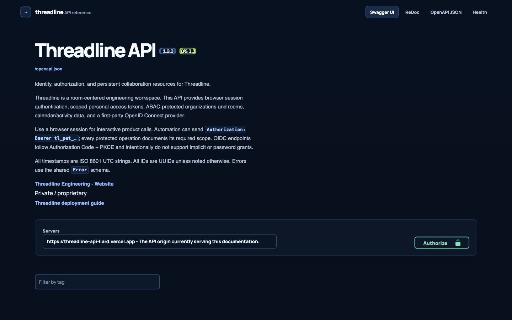
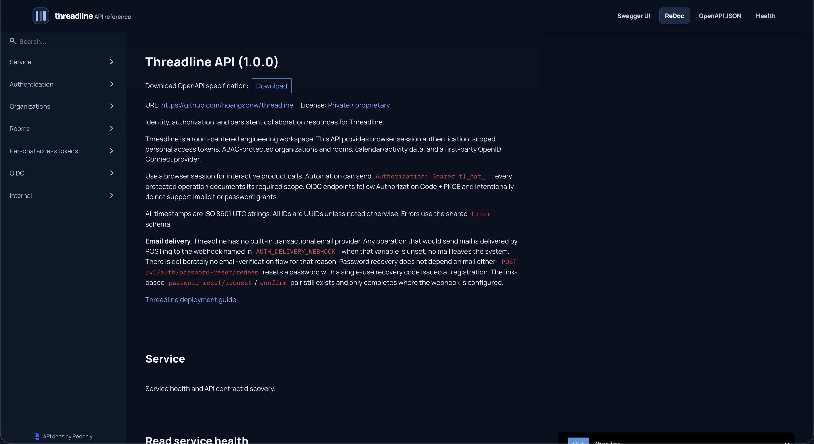
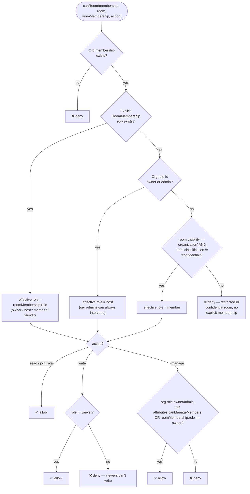
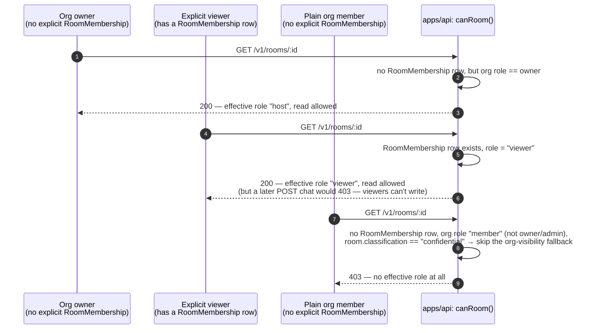
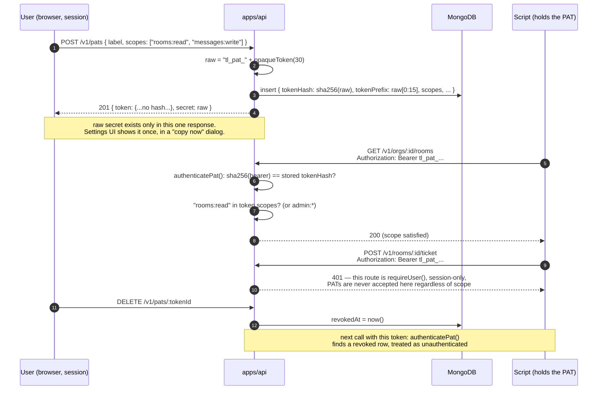
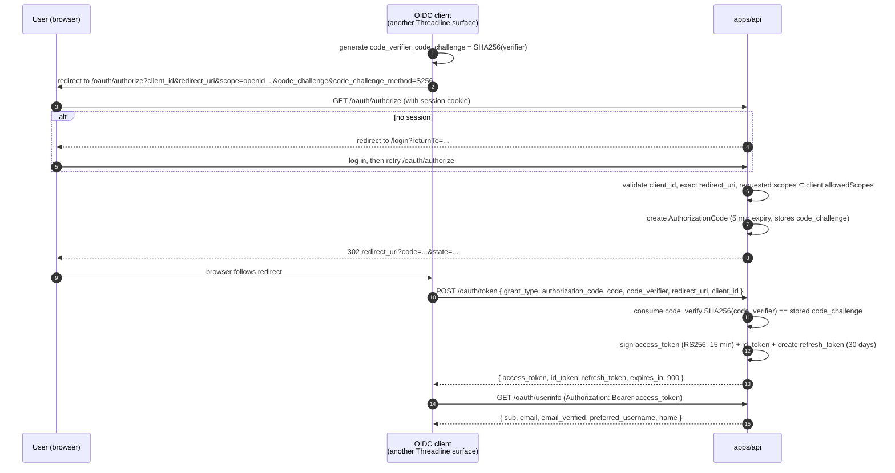

# API Reference

`apps/api` is a single Express application (`createApp()` in `application.ts`) exposing four families of routes: password authentication, organization/room resources, personal access tokens, and a first-party OpenID Connect provider. Every route is also described as a machine-readable OpenAPI 3.1 document — this file explains the _shape_ of the API; the live document is the source of truth for exact request/response schemas.

- Interactive Swagger UI: `GET /api-docs`
- ReDoc: `GET /api-docs/redoc`
- Raw OpenAPI document: `GET /openapi.json`

All three are generated from `apps/api/src/openapi.ts`, which is kept in sync with `application.ts` by hand (there's a test in `app.test.ts` that asserts the documented path set matches what's actually mounted) — not derived from route decorators, so it's safe to read as an accurate contract.

## Table of contents

- [Interactive documentation](#interactive-documentation)
- [Three ways to authenticate](#three-ways-to-authenticate)
- [Attribute-based access control (ABAC)](#attribute-based-access-control-abac)
- [Endpoints](#endpoints)
- [OIDC Authorization Code + PKCE, end to end](#oidc-authorization-code--pkce-end-to-end)

## Interactive documentation

Live on the deployed API: [Swagger UI](https://threadline-app-api.vercel.app/api-docs) &middot; [ReDoc](https://threadline-app-api.vercel.app/api-docs/redoc) &middot; [raw OpenAPI document](https://threadline-app-api.vercel.app/openapi.json).

<table>
<tr>
<td width="50%"><br/><sub>Swagger UI &mdash; try-it-out against the live API</sub></td>
<td width="50%"><br/><sub>ReDoc &mdash; three-pane reference</sub></td>
</tr>
</table>

## Three ways to authenticate

```mermaid
flowchart TD
    Start(["Who's calling?"]) --> Browser{"Browser with a<br/>Threadline session?"}
    Browser -- yes --> Cookie["HttpOnly session cookie<br/>threadline_session"]
    Browser -- no --> Script{"Trusted automation<br/>/ CLI / script?"}
    Script -- yes --> PAT["Personal access token<br/>Authorization: Bearer tl_pat_..."]
    Script -- no --> ThirdParty{"Another first-party<br/>Threadline surface needs<br/>a standard identity token?"}
    ThirdParty -- yes --> OIDC["OIDC access token<br/>Authorization: Bearer (JWT)"]

    Cookie --> CookieUse["Full interactive access.<br/>Required for /v1/rooms/:id/ticket,<br/>/v1/pats, /v1/sessions, /v1/oidc/clients<br/>(session-only, never PAT)"]
    PAT --> PATUse["Scoped REST access only.<br/>Every route checks the PAT's<br/>scopes array, or admin:*"]
    OIDC --> OIDCUse["/oauth/userinfo only.<br/>Short-lived (15 min), RS256-signed,<br/>audience-bound to one client"]
```



| Surface                     | Where it's sent                                                                   | Lifetime                                                              | Revocable                                                            | Can call                                                                   |
| --------------------------- | --------------------------------------------------------------------------------- | --------------------------------------------------------------------- | -------------------------------------------------------------------- | -------------------------------------------------------------------------- |
| Session cookie              | `Cookie: threadline_session=…` (HttpOnly, `SameSite=Lax`, `Secure` in production) | 30 days, sliding (`lastUsedAt` bumped per use)                        | Yes — `DELETE /v1/sessions/:id`, or automatically on password change | Every endpoint, including session-only ones                                |
| Personal access token (PAT) | `Authorization: Bearer tl_pat_…`                                                  | Optional expiry set at creation; otherwise indefinite until revoked   | Yes — `DELETE /v1/pats/:id`                                          | Every scope-gated endpoint whose required scope is in the token's `scopes` |
| OIDC access token           | `Authorization: Bearer (RS256 JWT)`                                               | 15 minutes, not revocable (short enough that revocation isn't needed) | No (by design)                                                       | `GET /oauth/userinfo` only                                                 |

A handful of routes are **session-only and reject PATs even with `admin:*`**: creating/listing/revoking PATs, listing sessions, and listing OIDC clients. A stolen PAT should never be able to mint more PATs or enumerate a user's browser sessions.

### Scopes

```
rooms:read   rooms:write   messages:read   messages:write
artifacts:read   artifacts:write   orgs:read   orgs:write   admin:*
```

`admin:*` satisfies any scope check. `messages:*` and `artifacts:*` are defined and selectable when creating a PAT (see Settings → Personal access tokens) but no current route checks them yet — they're reserved for chat/artifact REST endpoints that don't exist today (live chat currently flows only through the Durable Object, not the REST API). Don't assume they grant anything beyond what's listed in the endpoint table below.

## Attribute-based access control (ABAC)

Nothing in Threadline infers access from an ID alone. Every room/organization read or write re-derives the caller's permission from their organization role, any explicitly delegated attributes, and — for rooms — the room's own visibility and classification. This logic lives in one file, `apps/api/src/policy.ts`, and every route calls into it rather than re-implementing checks inline.



`canOrganization(membership, action)` is the simpler sibling: any member can `read`; `create_room`, `manage_members`, and `schedule` each require the org role to be `owner`/`admin` **or** the matching delegated attribute (`canCreateRooms`, `canManageMembers`, `canSchedule`) on that member's `Membership` row. Those attributes are exactly what's exposed in the "Add member" modal in Settings — the UI can't grant anything the API wouldn't also accept.

**This check runs on every request, not just at the UI layer.** The realtime ingest endpoint (`POST /v1/internal/room-events`) re-runs `canRoom(..., "write")` for the _acting user_ on every event a Durable Object forwards, even though the Durable Object itself already validated a signed room ticket before accepting the WebSocket. A room ticket proves "this identity may join the live session"; it does not by itself prove "this identity may persist a written event," and the API never assumes otherwise.

**Worked example** — three different callers hitting `GET /v1/rooms/:roomId` for the same restricted, confidential room, showing how the same function produces three different outcomes purely from each caller's own membership state:



Same room, same endpoint, same code path — the only input that changed is each caller's own membership rows. Nothing about the room itself is mutated or duplicated per caller.

## Endpoints

### Authentication

| Method & path                              | Auth          | Notes                                                                                                  |
| ------------------------------------------ | ------------- | ------------------------------------------------------------------------------------------------------ |
| `POST /v1/auth/register`                   | none          | Creates user + owner `Membership` on a new org + session. Rate limited 8/hour/IP.                      |
| `POST /v1/auth/login`                      | none          | Rate limited 12/15min/IP.                                                                              |
| `POST /v1/auth/logout`                     | session       | Revokes the current session only.                                                                      |
| `POST /v1/auth/password`                   | session       | Revokes every _other_ active session on success.                                                       |
| `POST /v1/auth/password-reset/request`     | none          | Always `202`, regardless of whether the email exists (no account enumeration). Rate limited 5/hour/IP. |
| `POST /v1/auth/password-reset/confirm`     | token in body | One-time token, revokes all sessions on success.                                                       |
| `POST /v1/auth/email-verification/request` | session       | Rate limited 5/hour/IP.                                                                                |
| `POST /v1/auth/email-verification/confirm` | token in body | One-time token.                                                                                        |
| `GET /v1/auth/me`                          | session       | Returns `{ user, organizations }`; `user.emailVerified` reflects `Credential.emailVerifiedAt`.         |

### Sessions

| Method & path                    | Auth         | Notes                                              |
| -------------------------------- | ------------ | -------------------------------------------------- |
| `GET /v1/sessions`               | session only | Refresh-token hash and IP hash are never returned. |
| `DELETE /v1/sessions/:sessionId` | session only | Only the owning user may revoke their own session. |

### Organizations & rooms

| Method & path                    | Auth           | Scope         | Notes                                                                                                                                   |
| -------------------------------- | -------------- | ------------- | --------------------------------------------------------------------------------------------------------------------------------------- |
| `GET /v1/orgs`                   | session or PAT | `orgs:read`   | Orgs the caller belongs to, with their role/attributes attached.                                                                        |
| `GET /v1/orgs/:orgId/rooms`      | session or PAT | `rooms:read`  | Filtered through `canRoom(..., "read")` per room — restricted rooms without membership are silently excluded, not `403`'d individually. |
| `POST /v1/orgs/:orgId/rooms`     | session or PAT | `rooms:write` | Requires `canOrganization(..., "create_room")`. Creator becomes room `owner`.                                                           |
| `GET /v1/rooms/:roomId`          | session or PAT | `rooms:read`  | Returns the caller's effective role alongside the room.                                                                                 |
| `POST /v1/rooms/:roomId/ticket`  | session only   | —             | Issues the 120-second signed WebSocket ticket. Never available to PATs — live sessions are an interactive-browser concept.              |
| `GET /v1/rooms/:roomId/events`   | session or PAT | `rooms:read`  | Durable timeline only (see [`architecture.md`](architecture.md#data-model) for what does/doesn't get persisted).                        |
| `GET /v1/rooms/:roomId/members`  | session or PAT | `rooms:read`  | Explicit `RoomMembership` rows only.                                                                                                    |
| `POST /v1/rooms/:roomId/members` | session or PAT | `rooms:write` | Requires `canRoom(..., "manage")`. Target must already be an org member. Grantable roles: `host`, `member`, `viewer` (not `owner`).     |
| `GET /v1/orgs/:orgId/members`    | session or PAT | `orgs:read`   |                                                                                                                                         |
| `POST /v1/orgs/:orgId/members`   | session or PAT | `orgs:write`  | Requires `canOrganization(..., "manage_members")`. Only an existing `owner` may assign the `admin` role.                                |
| `GET /v1/orgs/:orgId/calendar`   | session or PAT | `orgs:read`   | Room-attached events filtered through the same room read policy. Supports `?from=` / `?to=` ISO bounds.                                 |
| `POST /v1/orgs/:orgId/calendar`  | session or PAT | `orgs:write`  | Requires `canOrganization(..., "schedule")`. `endsAt` must be after `startsAt`.                                                         |
| `GET /v1/orgs/:orgId/activity`   | session or PAT | `rooms:read`  | Last 100 durable events across every room visible to the caller.                                                                        |

### Personal access tokens

| Method & path              | Auth         | Notes                                                                 |
| -------------------------- | ------------ | --------------------------------------------------------------------- |
| `GET /v1/pats`             | session only | Token hash never returned.                                            |
| `POST /v1/pats`            | session only | Secret (`tl_pat_…`) returned exactly once, in the response body only. |
| `DELETE /v1/pats/:tokenId` | session only | Revoke; the token's `id` (not the secret) is the path parameter.      |

**Lifecycle**, start to finish:



Two things that trip people up: a PAT with `admin:*` still can't call session-only routes (PAT vs. session is a different axis than scope), and revocation is immediate — there's no cached "still valid for N more minutes" grace period, because every call re-reads the token row.

### OpenID Connect provider

| Method & path                           | Auth                                                      | Notes                                                                                                                            |
| --------------------------------------- | --------------------------------------------------------- | -------------------------------------------------------------------------------------------------------------------------------- |
| `GET /.well-known/openid-configuration` | none                                                      | Discovery document.                                                                                                              |
| `GET /oauth/jwks.json`                  | none                                                      | Public RSA signing key only.                                                                                                     |
| `GET /oauth/authorize`                  | session (redirects to login if absent)                    | Authorization Code + PKCE (S256) only — no implicit, no password grant. First-party clients and exact redirect-URI matches only. |
| `POST /oauth/token`                     | none (code/verifier or refresh token _is_ the credential) | `grant_type=authorization_code` or `grant_type=refresh_token`, form-encoded. Refresh rotates the token.                          |
| `POST /oauth/revoke`                    | none                                                      | Always `200`, even for an unknown token (standard OAuth revocation behavior).                                                    |
| `POST /oauth/introspect`                | none                                                      | Returns `{ active: false }` for anything invalid/expired rather than an error.                                                   |
| `GET /oauth/userinfo`                   | OIDC access token                                         | Subject claims for the signed-in user.                                                                                           |
| `GET /v1/oidc/clients`                  | session only                                              | Lists registered first-party clients (never third-party — public client registration is not enabled).                            |

## OIDC Authorization Code + PKCE, end to end



Authorization codes and refresh tokens are stored only as hashes (`codeHash`, `tokenHash`); the raw values exist solely in the redirect URL and the token response. Refresh rotation means presenting a refresh token once invalidates it — the _new_ token returned in the response is the only one that still works, which limits the blast radius of a leaked (but not yet used) refresh token to a single exchange.
