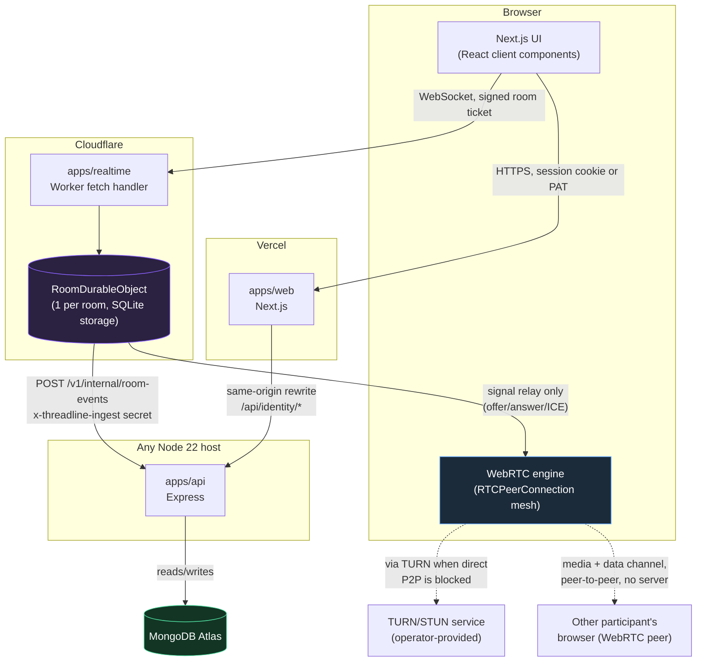
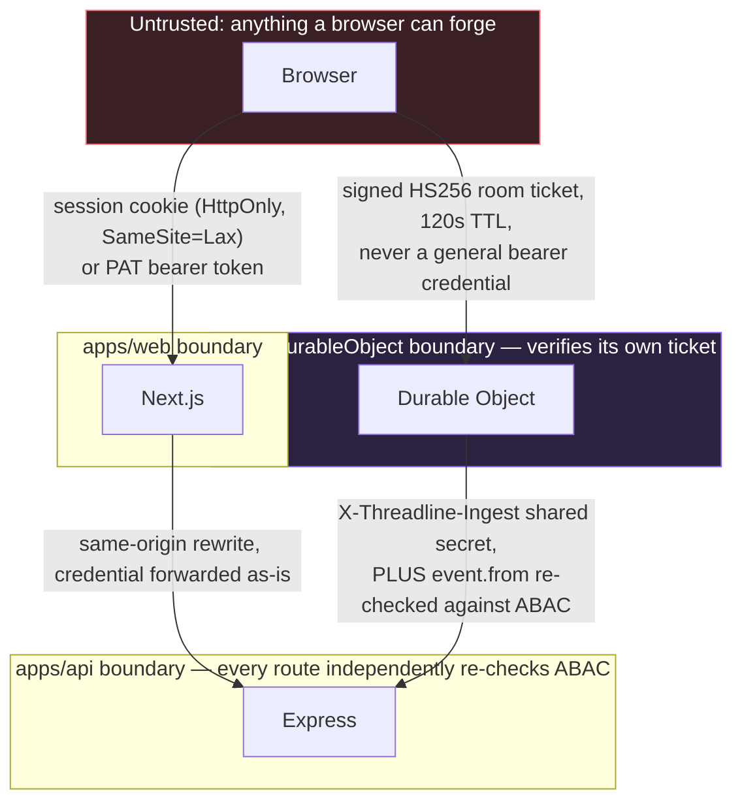
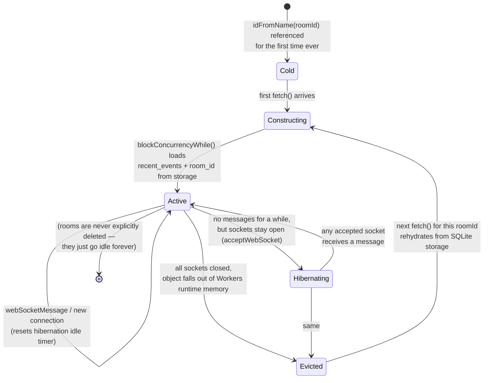
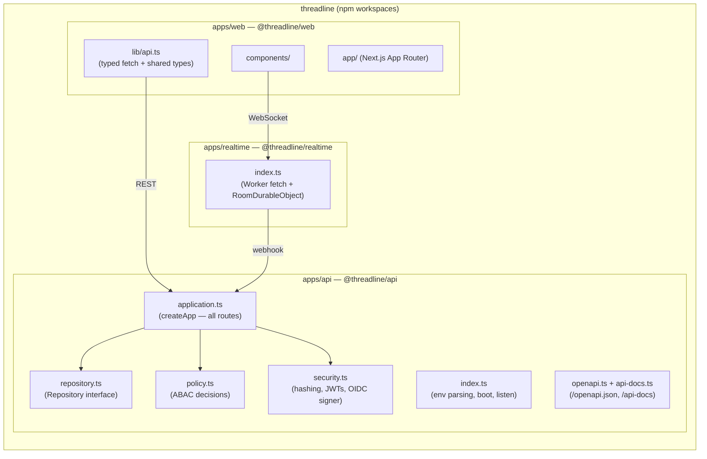
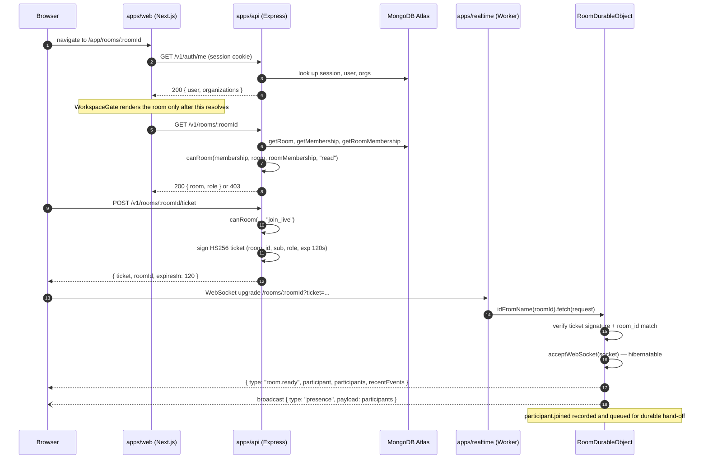
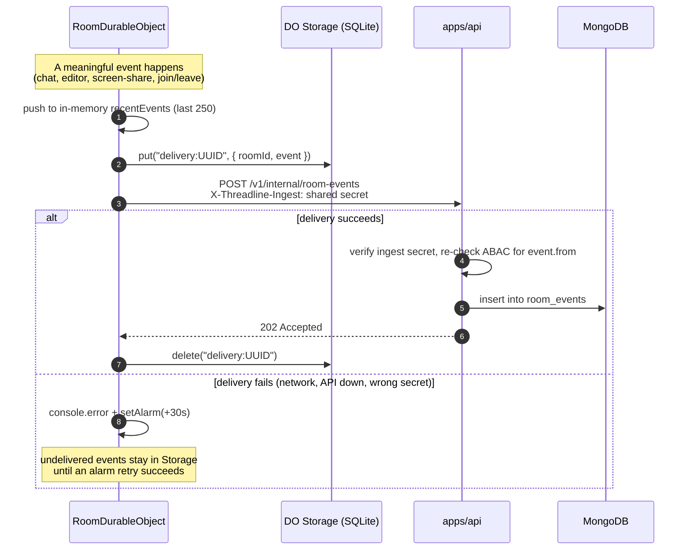
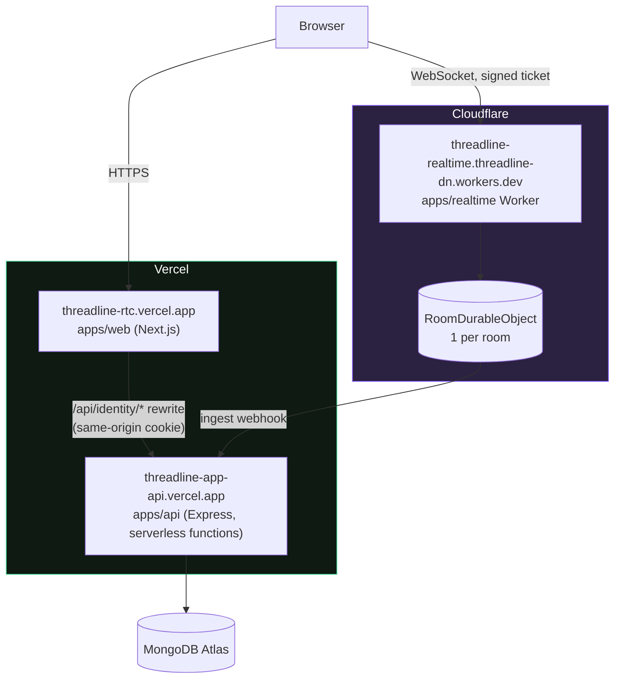

# Architecture

Threadline runs on three independent runtimes by design, not by accident. Each plane owns a different kind of state, and each is replaceable without touching the other two.

| Plane              | Runtime                                                                        | Owns                                                                                                       |
| ------------------ | ------------------------------------------------------------------------------ | ---------------------------------------------------------------------------------------------------------- |
| UI                 | Next.js on Vercel                                                              | Session-aware rendering, browser media/WebRTC, client-side ABAC gating (mirrors server policy for UX only) |
| Identity & records | Express on Node (Vercel Functions / Render / any Node 22 host) + MongoDB Atlas | Users, sessions, PATs, OIDC provider, organizations, rooms, calendar, durable room-event timeline          |
| Live coordination  | Cloudflare Workers + one Durable Object per room                               | Presence, WebRTC signaling relay, ephemeral room state, batched hand-off of durable events to the API      |

No plane trusts another's enforcement. The Durable Object independently verifies a signed room ticket before accepting a WebSocket; the API independently re-checks ABAC on every request regardless of what the UI already hid. See [`security.md`](security.md) for the full trust model.

## Table of contents

- [System topology](#system-topology)
- [Trust boundaries at a glance](#trust-boundaries-at-a-glance)
- [Durable Object lifecycle](#durable-object-lifecycle)
- [Monorepo layout](#monorepo-layout)
- [Data model](#data-model)
- [Request lifecycle: opening a room](#request-lifecycle-opening-a-room)
- [Durable event hand-off](#durable-event-hand-off)
- [Why it's split this way](#why-its-split-this-way)
- [Live deployment topology](#live-deployment-topology)
- [Where to go next](#where-to-go-next)

## System topology

Three things to notice:

1. **The Durable Object never talks to MongoDB.** It only knows how to relay signals, hold ~100 recent events in its own storage for fast reconnects, and forward every event to the API over HTTP. If that webhook is unreachable, it retries via a Durable Object alarm rather than blocking the room.
2. **WebRTC media never touches a server.** Camera, mic, screen share, and file transfer all flow peer-to-peer once signaling completes. The Worker only ever sees SDP offers/answers and ICE candidates — never a media byte.
3. **The web app can proxy the API through itself.** `THREADLINE_API_ORIGIN` + the `/api/identity/*` rewrite let the browser's session cookie stay first-party to the Vercel domain even when the API is deployed to a different host (Render, a second Vercel project, etc.). See [`deployment.md`](deployment.md) for when to use this.

## Trust boundaries at a glance

"No plane trusts another's enforcement" (above) is a claim; this is what backs it up. Every arrow that crosses a boundary carries its own independent credential, and the receiving side verifies it itself — nothing is trusted just because a request arrived from an internal-looking network path.

The subtle one is the DO→API arrow: a valid ingest secret proves the request came from _a_ trusted Worker, not that the _acting user_ embedded in the event is allowed to write to that room. `application.ts`'s ingest handler re-runs `canRoom(..., "write")` for `event.from` on every delivery — a compromised or buggy Worker still can't forge writes on a user's behalf into a room they don't have access to. See [Durable event hand-off](#durable-event-hand-off) below.

## Durable Object lifecycle

A room's `RoomDurableObject` is not a server that's either "up" or "down" — Cloudflare creates it lazily by name, hibernates it when idle, and evicts it from memory (not from existence) between bursts of activity. State that must survive eviction lives in its SQLite storage, not in JS heap.

The distinction that matters operationally: **hibernating keeps WebSocket connections alive with near-zero billed compute**; **eviction throws away the in-memory `participants` Map and `this.events` cache**, but not the underlying SQLite-backed storage — `restoreParticipants()` and the constructor's `blockConcurrencyWhile()` rebuild both from `state.getWebSockets()` and `storage.get("recent_events")` respectively on the next `fetch()`. A room with zero recent activity costs nothing; a room with an open tab in the background costs nothing either, as long as nothing is actually being sent.

## Monorepo layout

- `apps/web` is a single Next.js app. Nothing under `app/app/**` renders without first passing through `WorkspaceGate`, which blocks on `GET /v1/auth/me` before showing any authenticated route.
- `apps/api` deliberately keeps `createApp()` (in `application.ts`) separate from `index.ts`. `createApp` takes plain options and returns a configured Express instance with no listener — that's what makes it possible to boot the exact same app in-process for tests (`supertest`) and hand it to Vercel's Node runtime, Docker, or a bare `app.listen()`.
- `apps/realtime` is one file. `RoomDurableObject` is the entire live-coordination plane; see [`realtime.md`](realtime.md) for its internals.

## Data model

Everything below lives in MongoDB in production and in an equivalent in-memory `Map`-backed repository for local development and tests — both implement the same `Repository` interface in `apps/api/src/repository.ts`, so route handlers never know which one is running.

```mermaid
erDiagram
    USER ||--o| CREDENTIAL : "has one"
    USER ||--o{ SESSION : "has many"
    USER ||--o{ PERSONAL_ACCESS_TOKEN : "has many"
    USER ||--o{ MEMBERSHIP : "belongs to orgs via"
    USER ||--o{ ROOM_MEMBERSHIP : "belongs to rooms via"
    ORGANIZATION ||--o{ MEMBERSHIP : "has members via"
    ORGANIZATION ||--o{ ROOM : "owns"
    ORGANIZATION ||--o{ CALENDAR_EVENT : "scopes"
    ROOM ||--o{ ROOM_MEMBERSHIP : "has explicit members via"
    ROOM ||--o{ ROOM_EVENT : "has durable timeline of"
    ROOM |o--o{ CALENDAR_EVENT : "optionally attached to"
    OAUTH_CLIENT ||--o{ AUTHORIZATION_CODE : "issues"
    OAUTH_CLIENT ||--o{ REFRESH_TOKEN : "issues"
    USER ||--o{ AUTHORIZATION_CODE : "authorizes"
    USER ||--o{ REFRESH_TOKEN : "holds"
    USER ||--o{ ACCOUNT_ACTION_TOKEN : "requests"

    USER {
        string id PK
        string email UK
        string username
        string displayName
        string avatar
        date createdAt
        date updatedAt
    }
    CREDENTIAL {
        string userId PK
        string passwordHash
        date passwordUpdatedAt
        date emailVerifiedAt "nullable"
    }
    SESSION {
        string id PK
        string userId FK
        string refreshTokenHash UK
        string userAgent
        string ipHash
        date expiresAt
        date lastUsedAt
        date revokedAt "nullable"
    }
    ORGANIZATION {
        string id PK
        string name
        string slug
        date createdAt
    }
    MEMBERSHIP {
        string id PK
        string orgId FK
        string userId FK
        string role "owner | admin | member"
        object attributes "canCreateRooms, canManageMembers, canSchedule"
    }
    ROOM {
        string id PK
        string orgId FK
        string name
        string visibility "organization | restricted"
        string classification "internal | confidential"
        string createdBy FK
    }
    ROOM_MEMBERSHIP {
        string id PK
        string roomId FK
        string userId FK
        string role "owner | host | member | viewer"
        date joinedAt
    }
    ROOM_EVENT {
        string id PK
        string roomId FK
        string type
        any payload
        string actorId FK "nullable"
        date createdAt
    }
    CALENDAR_EVENT {
        string id PK
        string orgId FK
        string roomId FK "nullable"
        string title
        date startsAt
        date endsAt
        string createdBy FK
    }
    PERSONAL_ACCESS_TOKEN {
        string id PK
        string userId FK
        string tokenHash UK
        string tokenPrefix
        array scopes
        date expiresAt "nullable"
        date revokedAt "nullable"
    }
    OAUTH_CLIENT {
        string id PK
        array redirectUris
        array allowedScopes
        bool isFirstParty
    }
    AUTHORIZATION_CODE {
        string codeHash PK
        string clientId FK
        string userId FK
        string codeChallenge
        date expiresAt
    }
    REFRESH_TOKEN {
        string tokenHash PK
        string clientId FK
        string userId FK
        date expiresAt
        date revokedAt "nullable"
    }
    ACCOUNT_ACTION_TOKEN {
        string tokenHash PK
        string userId FK
        string type "password_reset | email_verification"
        date expiresAt
    }
```

`RoomEvent` is the one table that two different systems write to: the API writes `room.created` directly (from `POST /v1/orgs/:orgId/rooms`), and the Durable Object writes everything that happens live (`participant.joined`, `chat`, `editor`, `screen-share`, `participant.left`) via the ingest webhook. `cursor`, `signal`, and `whiteboard` events are intentionally **not** persisted — they're too high-frequency and not meaningful as a durable record.

## Request lifecycle: opening a room

This is the sequence that touches all three planes at once — a good end-to-end reference for how the pieces actually fit together.

The room ticket is deliberately short-lived (120 seconds) and single-purpose: it authorizes exactly one WebSocket connection to exactly one room for the identity encoded inside it. It is never reused as a general bearer credential.

## Durable event hand-off

Two things worth calling out because they're easy to get wrong when reading the code casually:

- **The ingest endpoint re-checks authorization**, using `event.from` (the acting user) against the room's ABAC policy. The shared secret alone only proves the request came from the trusted Worker — it does not imply the _acting user_ is allowed to write to that room. A forged or replayed event for a user without room `write` access is rejected with `403` even though the ingest secret is valid.
- **`broadcast()` inside the Durable Object must never let one bad socket kill delivery to everyone else.** Earlier versions called `send()` on every open socket unconditionally; a socket that had just closed (which is still present in `state.getWebSockets()` during its own `webSocketClose` handler — a documented hibernation-API quirk) would throw and abort the handler _before_ the code reached the line that records the durable event. The fix wraps each `send()` in try/catch so one dead socket can't silently swallow the write. See [`realtime.md`](realtime.md#one-crash-that-looked-like-a-persistence-bug) for the full story.

## Why it's split this way

Full rationale, alternatives considered, and consequences for each of these live in [`docs/decisions/`](decisions/README.md) as proper ADRs — this table is just the summary.

| Decision                                                                             | Rationale                                                                                                                                                                                                                                                                                                        | Alternative considered                                                                                                                                                                                  | ADR                                                          |
| ------------------------------------------------------------------------------------ | ---------------------------------------------------------------------------------------------------------------------------------------------------------------------------------------------------------------------------------------------------------------------------------------------------------------- | ------------------------------------------------------------------------------------------------------------------------------------------------------------------------------------------------------- | ------------------------------------------------------------ |
| One Durable Object per room, not a shared pool                                       | Durable Objects give single-instance, globally-coordinated state for free. Presence and signaling need exactly one authoritative in-memory owner per room; DO gives that without Redis, without a leader-election protocol, and without a sticky-session load balancer.                                          | A shared WebSocket server + Redis pub/sub. Works, but reintroduces the exact coordination problem DOs solve, plus an extra stateful dependency to operate.                                              | [0001](decisions/0001-durable-objects-for-realtime.md)       |
| WebRTC mesh, not an SFU                                                              | At small room sizes (the product's target: focused engineering sessions, not webinars), a full mesh needs no media server at all — cheaper to run and one less thing that can fail. `PeerMesh` (`apps/web/lib/peer-mesh.ts`) is intentionally small: one `RTCPeerConnection` + one data channel per remote peer. | An SFU (e.g. mediasoup, LiveKit) for one-connection-per-participant media. Necessary past roughly a dozen simultaneous video participants; out of scope until the product needs it.                     | [0002](decisions/0002-webrtc-mesh-not-sfu.md)                |
| `Repository` interface with two implementations                                      | `MemoryRepository` and `MongoRepository` implement the identical interface. Tests and local dev run against memory with zero setup; production runs against Atlas. Route handlers in `application.ts` never import MongoDB directly.                                                                             | Mocking the MongoDB driver in tests. Slower, more brittle, and doesn't give you a real local dev mode without a database.                                                                               | [0003](decisions/0003-repository-interface.md)               |
| Three separate auth surfaces (session cookie, PAT, first-party OIDC)                 | The product has three real callers: a browser (needs CSRF-safe cookies), trusted automation/CLIs (needs revocable scoped tokens, not the user's own password), and other first-party Threadline surfaces that want a standard identity token (needs OIDC so nothing bespoke has to be built twice).              | A single API-key scheme for everything. Simpler on day one, but conflates "a human is in a browser" with "a script is running unattended," which is exactly the distinction CSRF protection depends on. | [0004](decisions/0004-three-auth-surfaces.md)                |
| SQLite-backed, hibernatable Durable Object storage                                   | Hibernation lets an idle-but-connected room cost near-zero compute; SQLite storage gives transactional guarantees for the undelivered-event queue during an outage.                                                                                                                                              | Plain key-value storage, and/or non-hibernatable sockets. Simpler code, but keeps every room's Durable Object resident (and billed) for the life of every connection, idle or not.                      | [0005](decisions/0005-sqlite-hibernatable-durable-object.md) |
| `createApp()` takes an injected `Repository` and returns a listener-less Express app | The same function boots identically in Vercel's Node runtime, a Docker container, `kubectl`-managed pods, and `supertest` in CI. `index.ts` is the only file that knows about `process.env` or `app.listen()`.                                                                                                   | Framework-specific serverless handlers per platform. Would require re-implementing routing/middleware per target instead of once.                                                                       | —                                                            |

## Live deployment topology

The abstract [system topology](#system-topology) diagram above maps onto real, currently-running infrastructure like this — see [`deployment.md`](deployment.md#live-reference-deployment) for how it got there:

Because `apps/api` runs as Vercel serverless functions here rather than a long-lived Node process, it has no in-process state at all between requests — which is exactly why the rate limiter is backed by `Repository.incrementRateLimit` (an atomic Mongo operation) instead of an in-memory `Map`. A `Map` would silently reset per cold-started instance, making the limit inconsistent across concurrent requests. See [`security.md`](security.md#rate-limits).

## Where to go next

- [`frontend.md`](frontend.md) — `apps/web` route tree, session-gate flow, theme system, component inventory
- [`api.md`](api.md) — REST surface, auth model, ABAC policy in detail, OIDC provider
- [`realtime.md`](realtime.md) — Durable Object internals, WebSocket protocol, WebRTC mesh
- [`security.md`](security.md) — trust boundaries, secrets, session/token lifecycle, rate limits
- [`testing.md`](testing.md) — how the test suite is structured and what it actually proves
- [`glossary.md`](glossary.md) — every domain term used across these docs, alphabetically
- [`troubleshooting.md`](troubleshooting.md) — real problems hit developing this, with fixes
- [`roadmap.md`](roadmap.md) — known gaps, honestly
- [`decisions/`](decisions/README.md) — ADRs for the decisions in the table above
- [`deployment.md`](deployment.md) — production deployment across Vercel, Cloudflare, and Atlas
- [`containers-and-kubernetes.md`](containers-and-kubernetes.md) — Docker Compose and Kubernetes operating modes
- [`operations.md`](operations.md) — health checks, incident triage, and a full record of real incidents found operating this deployment
