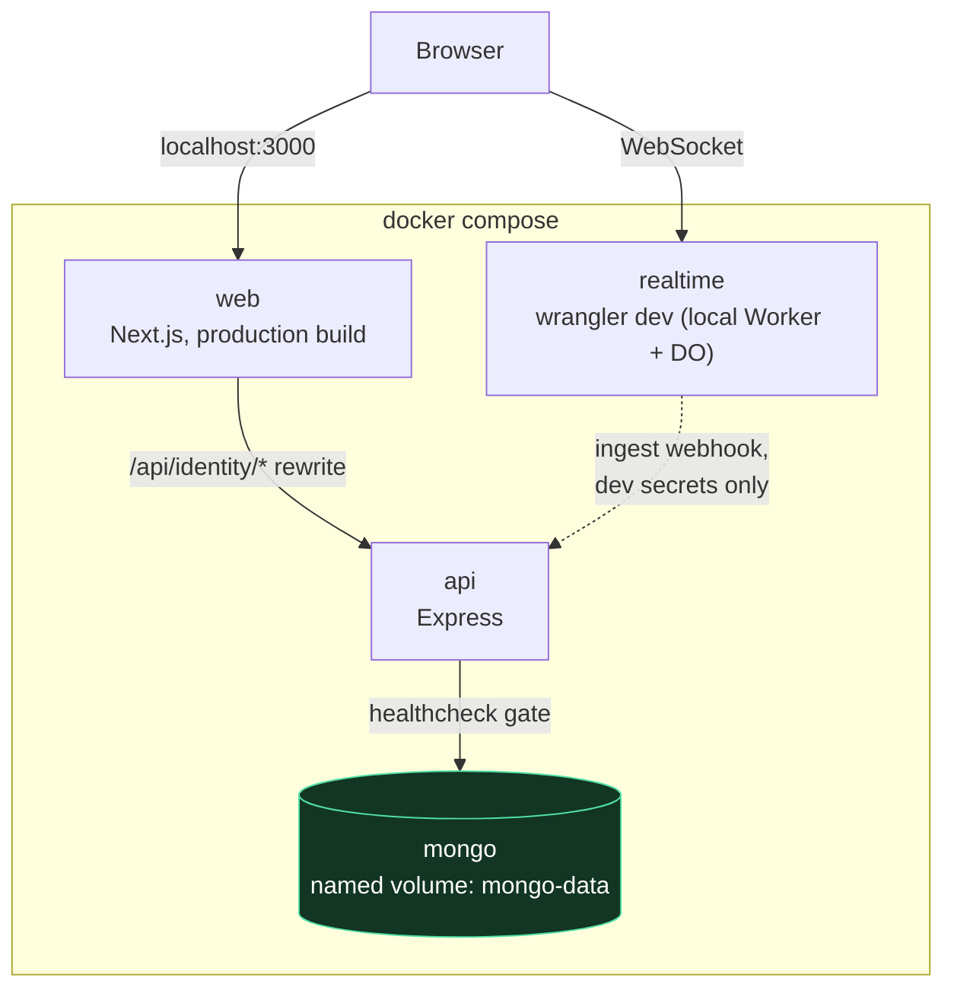
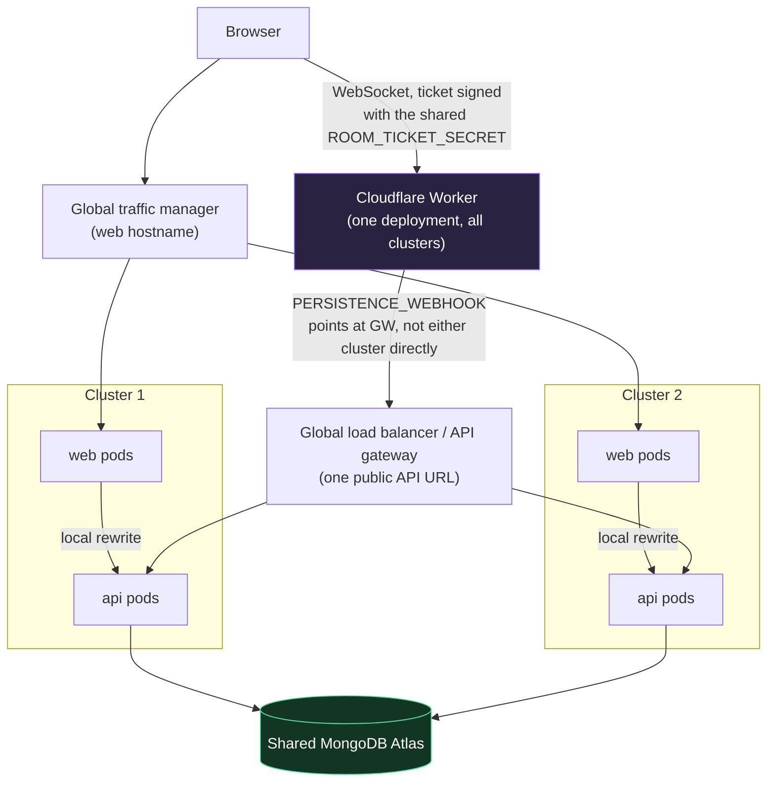

# Containers and Kubernetes

Threadline has two portable, supported deployment modes:

- **Docker Compose** is a complete local environment: Next.js, the Express API, MongoDB, and Wrangler's local Durable Object runtime.
- **Kubernetes** deploys the stateless web and API containers. It continues to use MongoDB Atlas (or another managed MongoDB deployment) and the Cloudflare Worker in production.

The latter distinction is intentional. Durable Objects provide single-instance, globally coordinated room state. The `realtime` Docker image is a local development emulator, not a second production implementation that could diverge from Cloudflare's Durable Object behavior.

## Table of contents

- [Docker Compose](#docker-compose)
- [Image contracts](#image-contracts)
- [Kubernetes prerequisites](#kubernetes-prerequisites)
- [Prepare a cluster](#prepare-a-cluster)
- [Validate and deploy](#validate-and-deploy)
- [More than one cluster](#more-than-one-cluster)

## Docker Compose

Install Docker Desktop, then run this from the repository root:

```bash
npm run docker:up
```

Open `http://localhost:3000`. Compose starts all four services and waits for MongoDB and the API health checks before starting dependent services.



`depends_on` with `condition: service_healthy` is what makes "waits for health checks" literal — `web` and `realtime` don't start until `api`'s `/health` responds, and `api` doesn't start until Mongo accepts connections. This is the same topology as production (three planes, one Mongo), just with the Cloudflare Worker's local emulator standing in for the deployed one.

| Service  | Address                        | Purpose                                                          |
| -------- | ------------------------------ | ---------------------------------------------------------------- |
| Web      | `http://localhost:3000`        | Production-mode Next.js container with a same-origin API rewrite |
| API      | `http://localhost:4000/health` | Express API backed by the Compose MongoDB database               |
| Realtime | `http://localhost:8787/health` | Wrangler local Worker and Durable Object runtime                 |
| MongoDB  | internal only                  | Durable development data in the `mongo-data` named volume        |

The Compose configuration contains only intentionally non-secret development keys. It does not read your Cloudflare, Atlas, OIDC, or email credentials. Stop it with `npm run docker:down`. If you also want to discard the local MongoDB data, run `docker compose down --volumes`; that action deletes the Compose database volume.

If the normal `npm run dev` stack is already running, stop it before Compose because they use the same host ports. The image build alone can be checked without starting services:

```bash
npm run docker:build
```

## Image contracts

The API image is deliberately runtime-configured. Set its production configuration with platform secrets, never Docker build arguments:

```text
MONGODB_URI
ROOM_TICKET_SECRET
INTERNAL_INGEST_SECRET
OIDC_PRIVATE_JWK
AUTH_DELIVERY_WEBHOOK
AUTH_DELIVERY_SECRET
WEB_ORIGIN
OIDC_ISSUER
AUTH_ACTION_ORIGIN
COOKIE_SECURE=true
```

Next.js substitutes `NEXT_PUBLIC_*` values during its build, so the web image needs its public configuration when it is built. `THREADLINE_API_ORIGIN` is server-only: it tells Next.js where to proxy `/api/identity/*` and must be reachable from the web container.

```bash
docker build -f apps/web/Dockerfile \
  --build-arg THREADLINE_API_ORIGIN=http://threadline-api:4000 \
  --build-arg NEXT_PUBLIC_API_ORIGIN=/api/identity \
  --build-arg NEXT_PUBLIC_REALTIME_ORIGIN=https://threadline-realtime.<account>.workers.dev \
  -t threadline-web:1.0.0 .

docker build -f apps/api/Dockerfile -t threadline-api:1.0.0 .
```

## Kubernetes prerequisites

The manifests are portable Kustomize YAML. A production cluster needs:

1. An ingress controller compatible with `networking.k8s.io/v1` (the supplied annotations target ingress-nginx).
2. TLS certificates for the web host and a public API host. `cert-manager` is a common way to provision these.
3. Metrics Server if you want the included CPU HorizontalPodAutoscalers to scale.
4. An externally reachable API hostname. Cloudflare Workers uses it for durable-event hand-off; the web container continues to proxy browser identity requests internally.
5. A managed MongoDB connection string. MongoDB is intentionally not deployed as a Kubernetes StatefulSet here: identity and room history need a database with backups, upgrades, and a clear durability plan.
6. A deployed Threadline Cloudflare Worker and a TURN service for production WebRTC.

The Kubernetes `Ingress` has two hosts by design:

- `threadline.example.invalid` routes public UI traffic to Next.js.
- `api.threadline.example.invalid` routes the authenticated Worker persistence webhook to Express.

Replace both placeholder hosts before applying. The browser talks to `/api/identity/*` on the web host, so the session cookie remains first-party even though the Worker calls the API host directly.

## Prepare a cluster

Build and push immutable images to a registry your cluster can pull from. The web build must refer to the externally deployed Worker URL, while its API proxy should use the in-cluster API service.

```bash
docker build -f apps/api/Dockerfile -t ghcr.io/your-organization/threadline-api:1.0.0 .
docker build -f apps/web/Dockerfile \
  --build-arg THREADLINE_API_ORIGIN=http://threadline-api:4000 \
  --build-arg NEXT_PUBLIC_API_ORIGIN=/api/identity \
  --build-arg NEXT_PUBLIC_REALTIME_ORIGIN=https://threadline-realtime.<account>.workers.dev \
  -t ghcr.io/your-organization/threadline-web:1.0.0 .
docker push ghcr.io/your-organization/threadline-api:1.0.0
docker push ghcr.io/your-organization/threadline-web:1.0.0
```

Copy the production overlay or edit its image names, version tags, public origins, and ingress hosts. Do not use the `.example.invalid` values in a real deployment.

Generate the stable OIDC private JWK once, then create the namespace-scoped secret. Keep that JWK for the lifetime of the issuer; replacing it invalidates existing signed tokens.

```bash
npm run generate:oidc-key --workspace=@threadline/api > /tmp/threadline-oidc-private.jwk
kubectl create namespace threadline-production --dry-run=client -o yaml | kubectl apply -f -
kubectl -n threadline-production create secret generic threadline-secrets \
  --from-literal=MONGODB_URI='mongodb+srv://…' \
  --from-literal=ROOM_TICKET_SECRET="$(openssl rand -hex 32)" \
  --from-literal=INTERNAL_INGEST_SECRET="$(openssl rand -hex 32)" \
  --from-file=OIDC_PRIVATE_JWK=/tmp/threadline-oidc-private.jwk \
  --from-literal=AUTH_DELIVERY_WEBHOOK='https://your-email-worker.example/send' \
  --from-literal=AUTH_DELIVERY_SECRET="$(openssl rand -hex 32)"
```

Store the two generated secrets in your password manager or secret manager. Set the same `ROOM_TICKET_SECRET` in Cloudflare as `ROOM_TICKET_SECRET`, and set the same `INTERNAL_INGEST_SECRET` in Cloudflare as `PERSISTENCE_SECRET`. Set the Worker `PERSISTENCE_WEBHOOK` to the public API host:

```text
https://api.<your-host>/v1/internal/room-events
```

The Kubernetes secret is intentionally not a repository manifest. Use External Secrets, Sealed Secrets, or your platform's secret integration when available.

## Validate and deploy

The repository validates both Kustomize overlays without needing a live cluster:

```bash
npm run k8s:validate
```

After customizing the production overlay, review rendered YAML before applying it:

```bash
kubectl kustomize infra/kubernetes/overlays/production
kubectl diff -k infra/kubernetes/overlays/production
kubectl apply -k infra/kubernetes/overlays/production
kubectl -n threadline-production rollout status deployment/threadline-api
kubectl -n threadline-production rollout status deployment/threadline-web
```

The base includes non-root containers, read-only filesystems, health probes, PodDisruptionBudgets, and CPU autoscaling. Start with the development overlay for a one-replica verification deployment; it shares the same production safeguards but lowers replicas.

## More than one cluster

Threadline can use multiple clusters for web/API capacity, but the clusters must be deliberately configured as one logical deployment:

1. Build the web image with one public web origin and the same public Cloudflare Worker URL.
2. Give every cluster the same MongoDB deployment, `OIDC_PRIVATE_JWK`, `ROOM_TICKET_SECRET`, and `INTERNAL_INGEST_SECRET`.
3. Put a global load balancer or API gateway in front of each cluster's public API ingress, then set the Worker `PERSISTENCE_WEBHOOK` to that global URL. A cluster-local Service name cannot be reached by Cloudflare.
4. Route the public web hostname through your global traffic manager. Keep the browser's `/api/identity/*` rewrite pointed at its local `threadline-api` Service.
5. Use the same TLS certificate strategy and ensure every cluster receives secret rotations before switching the Worker secret.

This is active-active for the stateless web/API plane. The Cloudflare Durable Object remains the single authoritative owner for each room, so no cross-cluster room-leader election or Redis synchronization is required.



The Worker only ever knows about one API URL — the gateway's — never a cluster-local Kubernetes `Service` name, which Cloudflare's edge cannot resolve or route to. Every cluster shares the same `ROOM_TICKET_SECRET` and `INTERNAL_INGEST_SECRET` for exactly the reason in the diagram: a ticket issued by cluster 1 must verify correctly against the one Worker deployment, and an ingest webhook the Worker sends might land on either cluster through the gateway.
