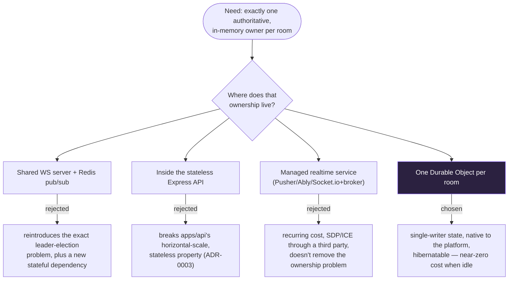

# ADR-0001: One Cloudflare Durable Object per room for live coordination

## Status

Accepted

## Date

2026-08-01

## Context

Threadline rooms need a live-presence and WebRTC-signaling layer: who's currently in the room, and relaying offer/answer/ICE messages between participants' browsers. This requires exactly one authoritative, in-memory owner per room — two servers each holding half of a room's participant list is a correctness bug, not a scaling feature. The rest of the product (`apps/api`) is a conventional stateless HTTP service that can run anywhere; this one piece needs single-writer, low-latency, globally-addressable state.

## Decision

Use one Cloudflare Durable Object per room, addressed by `idFromName(roomId)`, running in `apps/realtime` as a standalone Cloudflare Worker separate from the main API.

## Alternatives Considered

### A shared WebSocket server + Redis pub/sub

- Pros: Familiar operational model; no new platform to learn.
- Cons: Reintroduces exactly the coordination problem a Durable Object solves for free — now _you_ own leader election (or sticky sessions) per room, plus an additional stateful dependency (Redis) to provision, monitor, and pay for.
- Rejected: Solves nothing a DO doesn't already solve, at strictly more operational cost.

### Run signaling inside the main Express API process

- Pros: One fewer deployable service.
- Cons: `apps/api` is meant to be horizontally scaled and stateless (see [ADR-0003](0003-repository-interface.md)); holding per-room in-memory WebSocket state there would either break that property or require the same Redis-coordination problem as above.
- Rejected: Conflates two components with genuinely different scaling and statefulness requirements.

### A managed realtime service (e.g. Pusher, Ably, Socket.io + a hosted broker)

- Pros: Zero infrastructure to run.
- Cons: Recurring cost proportional to connections/messages; signaling payloads (SDP, ICE candidates) would flow through a third party by default; doesn't remove the need to model "one owner per room" — it just relocates that logic into a vendor's product.
- Rejected: Not necessary given Cloudflare Durable Objects already provide the primitive natively, and the project already deploys through Cloudflare for this piece regardless.

## Consequences

- Cloudflare becomes a hard production dependency for the live-session feature specifically (not for auth, not for durable records — those remain on Vercel/Node + MongoDB Atlas).
- The Durable Object is hibernatable (see [ADR-0005](0005-sqlite-hibernatable-durable-object.md)), so idle rooms cost near-nothing.
- Local development needs `wrangler dev`'s local Durable Object emulation (`npm run dev:realtime:local`) — this is a real, if imperfect, local emulator, not a second production implementation that could drift from Cloudflare's actual behavior. See [`../troubleshooting.md`](../troubleshooting.md) for a known local-only networking quirk in this emulation.
- The Durable Object never talks to MongoDB directly; it hands durable events to the API over an authenticated webhook (see [`../architecture.md`](../architecture.md#durable-event-hand-off)), keeping the database credential and connection pool entirely out of the Workers runtime.

## Scope of the Redis rejection

This record rejects Redis as a **coordination** primitive for room presence and fan-out. It does not say the project may never depend on Redis: [ADR-0009](0009-redis-for-ephemeral-counters.md) later accepted it in `apps/api` for ephemeral rate-limit counters, which need no single owner and are allowed to be lost. Both decisions stand. `apps/realtime` still has no Redis dependency, and could not have one — workerd exposes no Node TCP socket.
