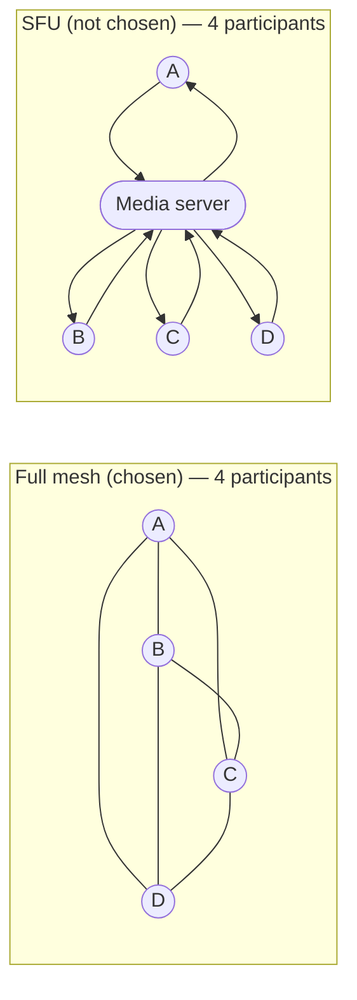

# ADR-0002: Full-mesh WebRTC, not a media server (SFU)

## Status

Accepted

## Date

2026-08-01

## Context

A Threadline room needs live audio/video, screen share, and file transfer between participants. There are two standard architectures for multi-party WebRTC: a full mesh (every participant connects directly to every other participant) or a Selective Forwarding Unit — a media server every participant uploads to once, which forwards streams to everyone else. The product's actual target is small, focused engineering sessions — planning, incident response, pair work, reviews — not large broadcast-style calls.

## Decision

Implement a full mesh in the browser (`apps/web/lib/peer-mesh.ts`, `PeerMesh`): one `RTCPeerConnection` and one data channel per remote participant, with the Durable Object doing nothing but relaying signaling messages (see [ADR-0001](0001-durable-objects-for-realtime.md)). No media server anywhere in the stack.

6 direct peer connections vs. 4 uploads through one server — the mesh's O(n²) connection count is exactly why it's the wrong choice past roughly a dozen participants, and exactly why it needs no server at all below that.

## Alternatives Considered

### An SFU (mediasoup, LiveKit, Cloudflare Calls, etc.)

- Pros: Scales to far more simultaneous participants; only one upload stream per participant regardless of room size; enables server-side recording/composition later.
- Cons: A real piece of infrastructure to run, operate, and pay for (self-hosted media server, or a metered third-party service); adds a server in the media path, which is exactly the kind of dependency Threadline's other realtime choices (see ADR-0001) deliberately avoided; total unnecessary complexity for the product's actual room sizes.
- Rejected for now: The cost is disproportionate to the current target use case. Revisit if/when the product needs rooms larger than roughly a dozen simultaneous video participants — see [`../roadmap.md`](../roadmap.md).

### A hosted P2P/WebRTC SDK (Twilio Video, Agora, etc.)

- Pros: Handles mesh-vs-SFU switching, TURN, and reconnection logic for you.
- Cons: Recurring per-minute cost; vendor lock-in for a core product feature; less control over exactly what's persisted and where signaling flows (relevant given Threadline's durable-record design, see [`../architecture.md`](../architecture.md#data-model)).
- Rejected: The mesh a small, in-house `PeerMesh` class provides is genuinely simple enough to own directly, and keeps signaling entirely inside Threadline's own trust boundary (see [`../security.md`](../security.md#realtime--api-ingest-secret)).

## Consequences

- Bandwidth and CPU cost per participant scale with the number of _other_ participants (O(n) connections each, O(n²) total across the room) — a real, known ceiling, not a hidden one.
- No media ever touches a server; the Worker only ever sees SDP and ICE candidates (see [`../architecture.md`](../architecture.md#system-topology)).
- Direct peer-to-peer connectivity depends on ICE/STUN succeeding; symmetric NATs and locked-down networks need a TURN relay, which isn't wired up yet — tracked in [`../roadmap.md`](../roadmap.md).
- Every participant pair needs an unambiguous, deterministic rule for who initiates the connection (see the userId tie-break in [`../realtime.md`](../realtime.md#webrtc-mesh-why-both-sides-have-to-offer)) — getting the "who observes a new peer and calls connect()" logic wrong is exactly the class of bug this mesh shape is prone to, and exactly what was found and fixed in this codebase's history.
