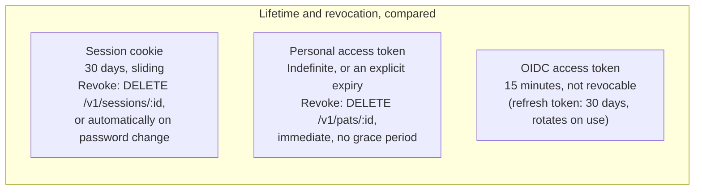

# ADR-0004: Three separate authentication surfaces

## Status

Accepted

## Date

2026-08-01

## Context

Threadline has three genuinely different kinds of caller: a human in a browser (needs a persistent, CSRF-safe, revocable login), trusted automation/scripts/CLIs acting on a user's behalf without that user's password (needs a scoped, independently revocable credential), and other first-party Threadline surfaces that want a standard, interoperable way to establish who's signed in (needs something an off-the-shelf OIDC client library can consume). A single shared credential type for all three would force compromises specific to each: cookies aren't appropriate for scripts, a static API key isn't revocable per-use-case or auditable the way OAuth tokens are, and neither is a standard enough shape for OIDC-aware tooling to consume directly.

## Decision

Support three independent, purpose-built authentication surfaces:

1. **Session cookie** — `HttpOnly`, `SameSite=Lax`, opaque token, backed by a `Session` row. For browsers.
2. **Personal access token (PAT)** — `tl_pat_…`, explicitly scoped at creation, independently revocable. For automation.
3. **First-party OIDC** (Authorization Code + PKCE) — short-lived RS256 access tokens, audience-bound to a registered client. For other first-party Threadline surfaces that want standard identity tokens.

Full detail: [`../security.md`](../security.md), [`../api.md`](../api.md#three-ways-to-authenticate) (which has the routing flowchart for "which surface does this caller use").

The OIDC token's short, fixed lifetime is the trade-off that makes "not revocable" acceptable — a stolen token is only useful for the remainder of a 15-minute window, versus a session or PAT that stays valid until someone explicitly revokes it.

## Alternatives Considered

### A single API-key scheme for everything

- Pros: One code path, one thing to explain.
- Cons: Conflates "a human is actively in a browser" with "a script is running unattended" — exactly the distinction CSRF protection depends on. An API key sent as a bearer token has no CSRF exposure (it's never automatically attached by a browser to a third-party site's request the way a cookie is), so building CSRF defenses around it would be either wasted effort or, worse, applied inconsistently.
- Rejected: The security properties these three caller types actually need are different enough that unifying them would weaken at least one.

### Sessions and PATs only, no first-party OIDC

- Pros: Simpler; OIDC (authorization codes, PKCE, JWKS, discovery documents) is a lot of protocol surface to implement and maintain.
- Cons: Any other first-party surface wanting to establish identity would need a bespoke integration instead of a standard one, and standard OIDC client libraries/tooling couldn't be pointed at Threadline directly.
- Rejected: The protocol complexity is real, but it's implemented once (`apps/api/src/security.ts`'s `OidcSigner` plus the `/oauth/*` routes) and gives every future first-party integration a standard, well-understood path for free.

## Consequences

- Three different credential lifetimes to reason about and independently test: 30-day sliding sessions, indefinite-until-revoked PATs, and 15-minute OIDC access tokens with 30-day rotating refresh tokens.
- A handful of routes are deliberately **session-only**, rejecting PATs outright even with `admin:*` scope (creating/listing/revoking PATs, listing sessions, listing OIDC clients) — a stolen PAT should never be able to mint more credentials or enumerate a user's logged-in browsers. This asymmetry has to be maintained by hand per-route rather than falling out of a single generic auth middleware.
- `apps/api/src/security.ts` owns password hashing, opaque token generation, and RSA/JWT signing all in one file — a deliberate concentration of the credential-handling code so it isn't scattered.
- OIDC access tokens are intentionally **not** revocable (their 15-minute lifetime is treated as short enough that revocation isn't needed) — a real design trade-off worth knowing before assuming every credential in the system behaves the same way under a "revoke this now" incident-response action.
