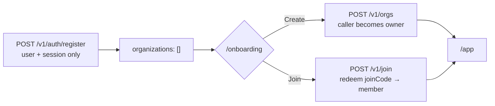

# ADR-0006: Self-service workspace creation and invite-code joining, not org-at-registration

## Status

Accepted

## Date

2026-08-12

## Context

Registration originally created a user, an organization named after them (or a name they supplied), and an `owner` membership all in one request — an account and its first workspace were the same act. That collapsed two genuinely different questions into one: "who is this person" and "which team are they on." It broke down in an obvious way once more than one person needed to work together: whoever registered first for a given team became its owner more or less by accident of ordering, there was no way for a second person to join that same workspace short of the owner manually adding them by email through `POST /v1/orgs/:orgId/members` (itself requiring the owner to already know the new person exists as a Threadline account), and an account could never belong to more than one organization at all — switching teams meant a second, disconnected account. None of that matches how real teams form: someone is invited into an existing workspace far more often than they're the one starting it, and plenty of people legitimately belong to more than one.

## Decision

Decouple account creation from workspace membership entirely, and make joining an existing workspace a first-class, self-service action:

1. `POST /v1/auth/register` creates a user and a session only. No organization, no membership. `GET /v1/auth/me` correctly returns `organizations: []` for a brand-new account.
2. `POST /v1/orgs` creates a workspace on demand; the caller becomes its `owner` and it's assigned a fresh, unique, regenerable `joinCode`.
3. `POST /v1/join` redeems another workspace's `joinCode` and creates a `member` membership — this is the self-service join path a second person actually uses, no prior email-based invite from the owner required.
4. `apps/web`'s `/onboarding` is the single UI surface for both: mandatory (no way out) the moment an account has zero workspaces, reachable again afterward from the sidebar's workspace switcher for adding another one.
5. Accounts can belong to more than one organization; the web app remembers the last one used (`localStorage`, `apps/web/lib/workspace-preference.ts`) and falls back through `?org=` → last-used → first-available, in that order, so there is never a state where an org-scoped page has nothing to resolve to as long as the account has at least one membership.
6. The three existing membership roles (`owner`/`admin`/`member`) gained one additional rule specific to self-service joining: only an `owner` may grant `admin`, and an admin may self-demote to `member` only if another admin already exists — a guard scoped to _self_-service demotion only, since an owner-directed change is exempt (the owner is always a fallback administrator).

Full endpoint-by-endpoint detail: [`../api.md`](../api.md#organizations--rooms). Full ABAC detail for the invite code and role rules: [`../security.md`](../security.md#workspace-invite-codes-and-role-changes).

## Alternatives Considered

### Keep organization creation at registration, add a separate "join another org" flow later

- Pros: Smaller change — registration's existing behavior is untouched, and multi-workspace support is purely additive.
- Cons: Doesn't fix the actual problem. "Whoever registers first becomes owner" is still true for a brand-new team's first member, and a person joining an _existing_ team still has to register into a throwaway organization of their own first, then abandon it — an awkward two-step that a self-service join should be able to skip entirely.
- Rejected: The core complaint (registration shouldn't decide organizational membership at all) survives any version of this that still creates an org at signup.

### A dedicated multi-use invite-token collection instead of one regenerable code per organization

- Pros: Supports per-invitee tokens (single-use, individually revocable, expirable, attributable to who sent it) — a materially richer invite system, closer to what tools like Slack or Linear actually offer.
- Cons: A new collection, its own CRUD surface, its own set of permission checks, and a noticeably bigger UI (generate/list/revoke individual invites) for a feature whose actual requirement was "a shareable code a team can hand out" — the richer version wasn't asked for and adds real surface area for marginal benefit at this project's scale.
- Rejected: A single regenerable `joinCode` per organization satisfies every stated requirement (shareable, owner/admin-controlled, optionally delegable to members, revocable by regenerating) with a much smaller surface. Worth revisiting if per-invitee tracking or expiry ever becomes a real requirement.

### Let any member add anyone by email, no join code at all

- Pros: No new secret to manage, no rate-limiting concern, reuses the pre-existing `POST /v1/orgs/:orgId/members` path unchanged.
- Cons: Requires the person adding someone to already know they have a Threadline account and their exact registered email — doesn't solve "a new person wants to join a workspace they were told about" at all, only "an existing member wants to add another existing account." The two are different use cases and this alternative only ever addressed the second one.
- Rejected: `POST /v1/orgs/:orgId/members` was kept exactly as-is for that second case (an admin adding a known existing account by email) and the join-code path was added alongside it as a distinct, complementary flow — not a replacement.

## Consequences

- **Every `/app/**` page now has to handle "the account has a session but zero organizations" as a real, reachable state**, not an edge case — `WorkspaceGate` redirects to `/onboarding` for it, and every org-scoped page's data-fetching code has to tolerate `selectedOrganization()` returning `undefined`.
- **A join code is a genuine secret and has to be treated like one.** It's rate-limited on `/v1/join` the same as a login attempt, stripped from every general-purpose response, and only ever returned by one dedicated, permission-gated endpoint — getting any of that wrong reopens exactly the kind of oracle/leak this ADR's own implementation pass had to catch and fix before merge (see [`../security.md`](../security.md#workspace-invite-codes-and-role-changes)).
- **A unique index on existing data is a migration, not just a schema change.** Adding `joinCode` with a unique constraint to a collection that already had rows without one crashed production at boot until a one-off backfill ran — see [`../operations.md`](../operations.md#incident-a-unique-index-on-a-pre-existing-collection-took-down-every-request). Any future required, unique field added to an existing collection needs the same backfill-before-index discipline.
- **"Last-used workspace" is now real client state that has to be kept honest.** It lives in `localStorage`, not the API, so it can point at a workspace the account no longer belongs to (a removed membership) — every page that reads it still falls back to the first organization the API actually returns, so this degrades gracefully rather than breaking, but it is one more piece of client-side state to reason about that didn't exist when an account could only ever have one organization.
