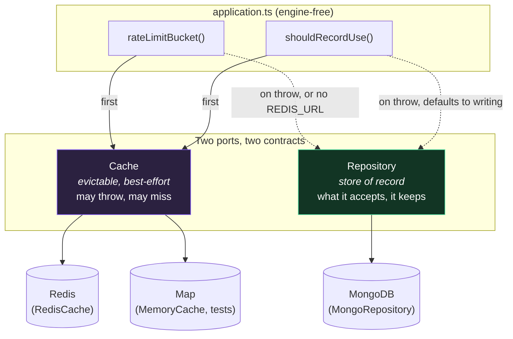

# ADR-0009: A separate `Cache` port for ephemeral counters, backed by Redis, never load-bearing

## Status

Accepted

## Date

2026-09-04

## Context

Two operations in `apps/api` write to MongoDB on paths where nothing durable is actually being recorded.

**Rate limiting.** `Repository.incrementRateLimit` runs an atomic aggregation-pipeline upsert against the `rate_limits` collection on every request to `/v1/auth/login`, `/v1/auth/register`, both password-reset routes, and `/v1/join`. That write exists to be discarded — a TTL index deletes each bucket when its window closes. It is a database round trip, on the unauthenticated surface, for a number nobody will ever read again.

**Session bookkeeping.** `authenticate()` and `authenticatePat()` set `lastUsedAt` and write the credential back on *every authenticated request*. So reading anything at all costs a database write. The field is rendered only as a relative time ("active 3 minutes ago") in the sessions and tokens lists in `apps/web/components/settings.tsx`, so second-level precision was never worth anything, but it is paid for on every call.

Doing nothing was defensible while both were merely slow. What made it worth changing is that they scale with exactly the traffic the service most wants to be cheap: credential-guessing attempts, and ordinary authenticated reads.

The obvious answer — "put a cache in front of Mongo" — is where this gets dangerous, and why it needs a record. [ADR-0001](0001-durable-objects-for-realtime.md) already rejected Redis once, for realtime presence and fan-out, and that rejection still stands. A decision to introduce Redis for something else has to be explicit about which door it is opening and which one stays shut.

## Decision

Introduce a **second, separate port** — `Cache` in [`apps/api/src/cache.ts`](../../apps/api/src/cache.ts) — alongside the existing `Repository`. It is deliberately not part of `Repository`.

The interface is two operations, no more:

- `incrementWindow(key, windowMs)` — an atomic fixed-window counter, returning the same `RateLimitEntry` shape as `Repository.incrementRateLimit` so the two are interchangeable at the call site.
- `claim(key, ttlMs)` — "did this already happen recently", used to collapse repeated `lastUsedAt` write-through.

There is no `get`/`set`. The moment this becomes a general key-value store, something durable ends up in it.

Two implementations, mirroring the `Repository` arrangement: `MemoryCache` (test double and single-process local dev) and `RedisCache`. `cache.ts` is **the only file permitted to import the Redis driver**, exactly as `repository.ts` is the only file permitted to import the MongoDB driver. `createApp()` takes `cache` as an *optional* option; `apps/api/src/index.ts` constructs one only when `REDIS_URL` is set.

**The fallback direction is the load-bearing part.** Every `Cache` call site degrades toward *more* work, never toward less enforcement:

| Call site | Cache present and answering | Cache absent, unreachable, or slow |
| --- | --- | --- |
| `rateLimitBucket` | `Cache.incrementWindow` | `Repository.incrementRateLimit` — the *stricter* store, since a TTL index never drops a live bucket the way LRU eviction can |
| `shouldRecordUse` | `Cache.claim` decides whether to write | writes unconditionally, i.e. exactly the previous behaviour |

Nothing about **authorization** is cached. The session or token row is still read from the repository on every single request; only the `lastUsedAt` write is collapsed. That is the reason skipping it is safe at all, and it is asserted directly — `app.test.ts` revokes a session while a live touch-claim is held and requires the next request to 401.

### The ongoing cost, worked

ADR-0003 records that every new persistence operation must be implemented twice. This decision adds a second, sharper tax: **every new `Cache` operation must have a defined degradation, decided at the call site, before it can be used.**

`claim` is the worked example. Its failure mode is not "return false" — that would silently stop recording `lastUsedAt` for the entire duration of a Redis outage, and the symptom (a "last active" timestamp frozen days in the past) would be indistinguishable from a bug in the sessions list. It must fail toward `true`, doing the write. That asymmetry is not visible in the type signature; it lives in the `catch` block in `application.ts` and in this record. A future third operation needs the same analysis, and "it returns a sensible default" is not that analysis.

## Alternatives Considered

### Add the two operations to `Repository` and implement them in both existing implementations

- Pros: One port instead of two. No new file, no new option on `createApp()`, and `MongoRepository` already implements `incrementRateLimit` correctly.
- Cons: `Repository` means *store of record* — what it accepts, it keeps. Redis under `allkeys-lru` can evict any key at any moment, TTL or not. Merging the two behind one interface means a route handler cannot tell, from the type, whether the value it just read is durable, and the first time somebody stores something that matters behind a method that happens to be Redis-backed, the loss is silent.
- Rejected: the separation is the entire safety property. A caller that cannot state what it will do when the store throws is using the wrong port, and one combined interface removes the prompt to ask.

### Make Redis the store of record for rate limits, with no repository fallback

- Pros: Simplest possible code path — one store, no branch, no duplicated semantics.
- Cons: A Redis outage then has only two possible behaviours, and both are bad. Fail open leaves `/v1/auth/login`, `/v1/join`, and password reset entirely unlimited, which is the attack this service specifically rate limits. Fail closed turns a cache outage into a total authentication outage.
- Rejected: MongoDB is already there, already correct, and already holds the schema. Degrading to it costs a branch and keeps both failure modes off the table.

### An in-process LRU cache in `apps/api` instead of Redis

- Pros: No new dependency, no new secret, no network hop, no new deployment path.
- Cons: This is the precise bug that moved rate limiting into the repository in the first place. `apps/api` runs as many concurrent short-lived serverless instances; a per-instance counter gets a fresh, empty bucket per cold start, making the effective limit "however many instances the platform spins up" rather than 12. See [`../security.md`](../security.md#rate-limits) and [`../operations.md`](../operations.md#incidents).
- Rejected: it re-introduces a documented, already-fixed vulnerability to save a dependency. `MemoryCache` exists for tests and single-process local dev only, and `index.ts` never constructs it.

### Extend this to realtime presence and fan-out, reversing ADR-0001

- Pros: Redis is now provisioned and connected; pub/sub would be nearly free to reach for.
- Cons: Presence needs exactly one authoritative owner per room. Redis pub/sub gives message distribution, not single-ownership, so this would reintroduce leader election or sticky sessions — the problem a Durable Object solves for free. It is also not implementable as written: `apps/realtime` runs on workerd, which has no Node TCP socket, so neither `node-redis` nor `ioredis` runs there at all, and a hibernating Durable Object holding a connection is wrong in any case.
- Rejected: [ADR-0001](0001-durable-objects-for-realtime.md) stands unchanged. This ADR opens a door for **ephemeral counters in `apps/api`** and nothing else. `apps/realtime` does not get a Redis dependency.

## Consequences

- Rate limiting no longer writes to MongoDB on the unauthenticated surface, and authenticated requests no longer write on every read. Both remain correct with Redis absent, unreachable, or slow.
- **A fourth stateful dependency exists to provision, monitor, and pay for.** It is optional at every level — `REDIS_URL` unset means the service behaves exactly as it did before this record — but "optional" is not "free": it is one more thing whose failure has to be understood before an incident, not during one.
- **Rate limiting is measurably weaker while Redis is serving it**, in one specific way: under memory pressure `allkeys-lru` can evict a live counter mid-window, handing the affected caller a fresh budget. MongoDB's TTL index cannot do that. This is a real, deliberate trade, recorded in [`../security.md`](../security.md#rate-limits) rather than discovered later. It is bounded to one window and applies per evicted key.
- **A Redis outage mid-window also resets counters**, because the repository has no record of the attempts Redis counted. Bounded the same way, and unavoidable for any two-store fallback that is not dual-writing — and dual-writing would defeat the entire purpose.
- `lastUsedAt` is now accurate to within `useRecordIntervalMs` (60s) rather than to the request. Invisible in the relative-time UI that renders it; anything that ever needs exact last-use has to stop using this field rather than shorten the interval.
- **Every future `Cache` operation costs a degradation analysis**, not just an implementation. See the worked example above.
- Key eviction is now a shared-fate concern if the Redis instance is shared with another application. Keys are namespaced with `REDIS_KEY_PREFIX` (default `threadline:`) so they are at least attributable, but a prefix does not partition an LRU budget.
- `/health` gained a `cache` field (`ready` / `unavailable` / `disabled`) so "degraded to MongoDB" is distinguishable from "healthy" without reading logs. The service is healthy in all three states, which is the point.
- **`createRedisCache()` must never await the connection, and this is a trap worth naming.** `node-redis`'s `connect()` does not reject when the server is unreachable — it retries according to `reconnectStrategy` — so `await client.connect()` with a strategy that always returns a delay *never returns at all*. Awaiting it meant an unreachable Redis blocked the API's boot indefinitely, which was the exact opposite of this record's central claim; it was written that way first and caught by starting the app against a dead port. The connection is therefore started and not awaited: the cache reports `unavailable` until the socket is ready, calls fall back in the meantime, and the driver reconnects on its own with no restart. Anyone "tidying up" that un-awaited promise reintroduces the outage.
