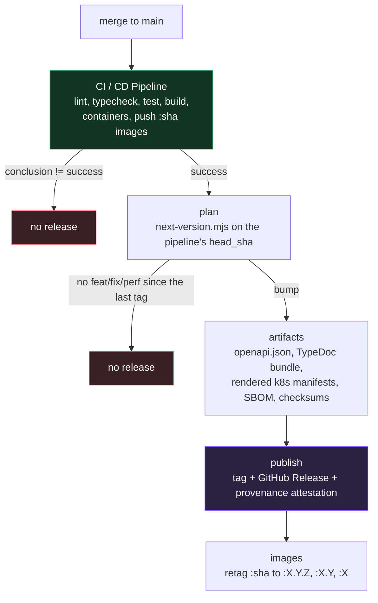

# ADR-0010: Releases derived from commit history, cut automatically from green CI

## Status

Accepted

## Date

2026-09-05

## Context

Releases were cut by hand. `v1.0.0` and `v1.1.0` were both created manually, with notes written by hand, and nothing tied either tag to a specific state of CI — a tag could in principle have been placed on a commit whose pipeline had failed, and nothing would have said so.

Three costs made that worth changing:

1. **It is work that has to be remembered.** A release only happens when somebody decides to do one, which means the gap between "shipped" and "released" is however long it takes for that to occur to someone.
2. **Nothing connected a release to what was in it.** The information needed to write the notes was already in the commit history — this repository has enforced conventional commits at the hook and in CI since early on (`scripts/verify-commit-message.mjs`) — but it was being re-derived by a human reading `git log`.
3. **Nothing connected a release to an artifact.** The CI pipeline already builds and publishes container images to GHCR for every commit on `main`, and already generates an OpenAPI document and a TypeDoc reference. None of it was attached to anything a consumer could point at and say "this is v1.1.0".

Doing nothing meant continuing to pay all three, on a repository whose commit convention already contained everything a release needed.

## Decision

Derive the release from the commits, and cut it automatically when CI passes on `main`.

**`scripts/next-version.mjs`** reads the history since the newest semver tag, classifies each commit by its conventional-commit type, and emits a plan: the bump, the next version, and grouped release notes. It is dependency-free like every other script in `scripts/`, so the same plan can be inspected locally with `make release-plan` before it ever runs in CI.

Only `feat`, `fix`, `perf`, and `revert` can *trigger* a release; a breaking change (`!` or a `BREAKING CHANGE:` footer) forces a major. Everything else — `docs`, `chore`, `ci`, `style`, `test`, `build`, `refactor` — appears in the notes when it rides along with a releasable change but cannot cause a release on its own.

**`.github/workflows/release.yml`** runs on `workflow_run` after the `CI / CD Pipeline` workflow completes on `main`, and only when its conclusion is `success`.

Two details in that flow are load-bearing rather than incidental:

- **The release is cut from `github.event.workflow_run.head_sha`, not `github.sha`.** On a `workflow_run` event the latter is the default branch tip, which is not necessarily the commit the pipeline actually passed on. This repository has already had one production incident from deploying a different commit than the one intended ([`../operations.md`](../operations.md#incident-deploying-from-the-wrong-branch-silently-reverted-production)); resolving the SHA explicitly is the cheap way not to repeat it in the release path.
- **Images are re-tagged, never rebuilt.** `docker buildx imagetools create` copies the manifest that CI already built and tested onto the version tags, so `ghcr.io/…:1.2.0` is byte-identical to the image the pipeline validated. Rebuilding at release time would produce a different image than the one that passed.

The release notes travel from the plan job to the publish job as an uploaded artifact and are written to a file before `gh release create` reads them. They are assembled from commit subjects — contributor-authored text — and must never be interpolated into a shell command or a workflow expression.

## Alternatives Considered

### release-please (or semantic-release) maintaining a release pull request

- Pros: The industry default. Maintains a committed `CHANGELOG.md`, handles versioning across workspaces, and is far less code than a bespoke planner.
- Cons: It works by opening a pull request that a human then merges — so releasing still requires someone to notice and act, which is the exact cost being removed. Worse, `main` carries a ruleset requiring a pull request *and* passing status checks, and a PR opened by `GITHUB_TOKEN` does not trigger workflow runs; the release PR would sit permanently unmergeable without either a personal access token stored as a secret or an admin bypass on every release.
- Rejected: it trades one manual step for a different manual step, and needs new credentials to work at all in this repository's protection model.

### Committing a `CHANGELOG.md` and bumping `package.json` versions

- Pros: The changelog is readable in the repository, offline, at any commit.
- Cons: Both require writing to `main`, which the ruleset protects. Automating a push to a protected branch means giving CI a bypass — a far larger permission than "create a tag and a release" — to produce a file that GitHub Releases already renders and links.
- Rejected: the permission is disproportionate to the benefit. The three workspace manifests stay at their current versions for the same reason; they are private and unpublished, and the product's version has always been the tag rather than `package.json`.

### Releasing on every push to `main`, without the CI gate

- Pros: Simpler trigger, no `workflow_run` indirection, no dependency on another workflow's name.
- Cons: A release could be created for a commit whose tests failed. The `:sha` images would also not necessarily exist yet, so the re-tagging step would race the build.
- Rejected: "a release implies CI passed" is worth more than the simpler trigger, and it is only enforceable at the trigger.

### Publishing the workspaces to npm as part of the release

- Pros: Conventional for a Node monorepo.
- Cons: Nothing here is a library. `@threadline/api`, `@threadline/web`, and `@threadline/realtime` are private deployable applications; publishing them would create packages nobody should install.
- Rejected: the artifacts consumers actually want here are the container images, the API contract, and the manifests — which is what the release attaches.

## Consequences

- **Releasing is no longer a task.** Merging a `feat:` or `fix:` to `main` with green CI produces a tagged release with notes and artifacts, and merging anything else produces nothing.
- **The commit convention became load-bearing.** It was already enforced, but a sloppy subject line now shows up verbatim in a public release note, and a `feat:` used where `chore:` was meant now cuts a minor version. That is a real increase in what a commit message costs to get wrong — mitigated by `make release-plan`, which shows the exact consequence before merging.
- **Version numbers are only as meaningful as the types.** A repository that labels everything `feat:` gets a minor bump per change and a version number that says nothing. The type table in the planner is the mechanism, but the discipline is human.
- **Every release carries a provenance attestation and an SBOM**, which is a real supply-chain improvement and also a new thing that can fail — a broken attestation step fails the publish job after the artifacts are built but potentially before the release exists.
- **Re-running the workflow is safe but not idempotent in the useful direction.** The publish job refuses to move an existing tag and fails loudly instead. Recovering from a partial release means deleting the tag and the release deliberately, not re-running and hoping.
- **The planner is now code that has to be right.** Version arithmetic is invisible until it is wrong and awkward to undo once a tag is pushed, so `scripts/next-version.test.mjs` covers the bump precedence, both breaking-change spellings, tag selection when tags are created out of order, and the unparseable-commit path. `vitest.config.ts` was widened to include `scripts/**/*.test.mjs` for it.
- **A release still cannot deploy anything.** This publishes tags, notes, artifacts, and image tags. Vercel and Cloudflare deployments remain separate and manual, as recorded in [`../deployment.md`](../deployment.md).
