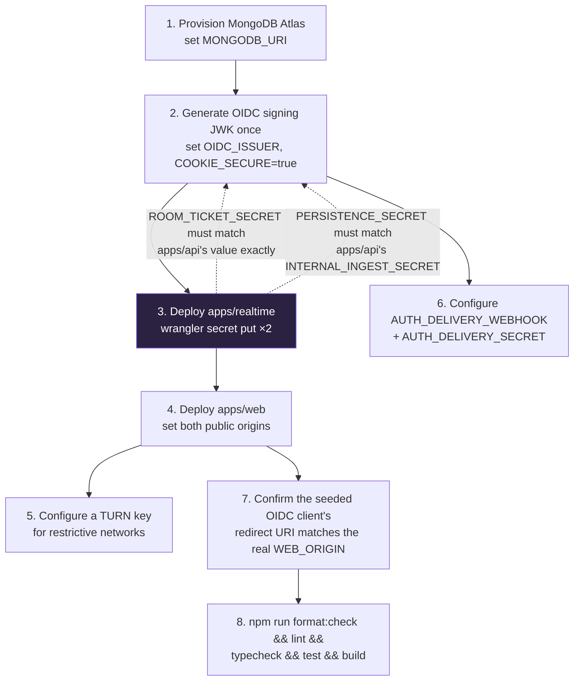
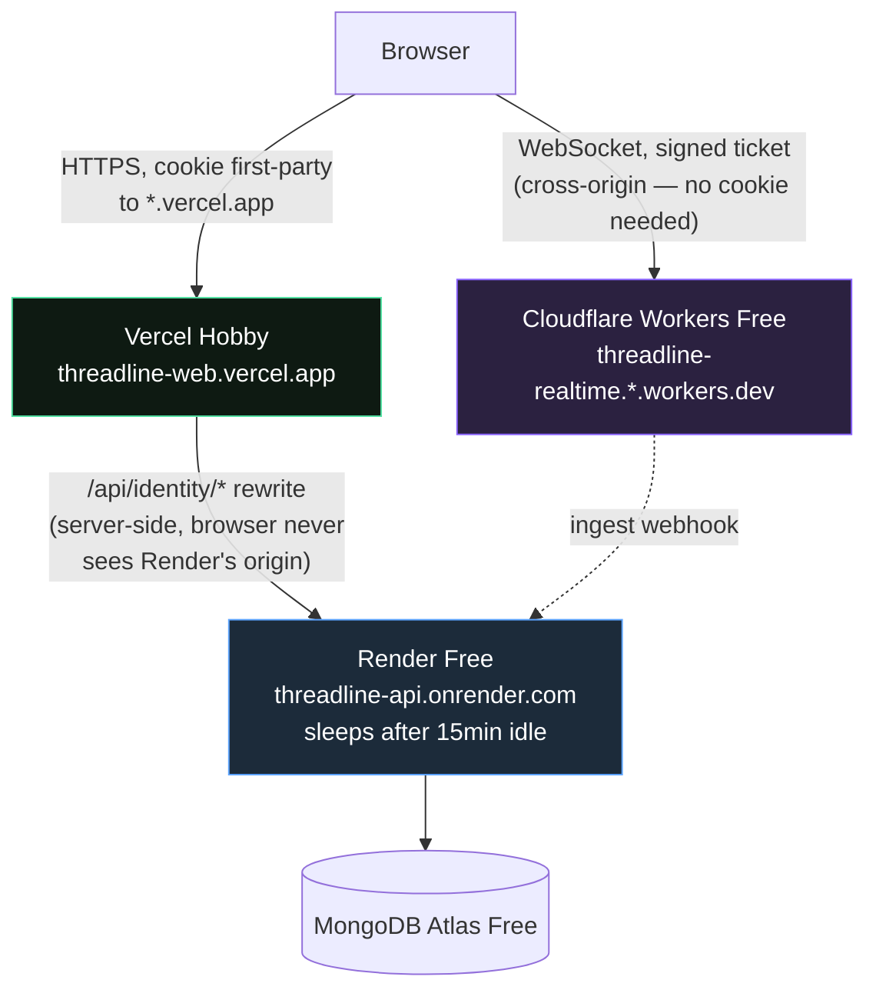

# Deploying Threadline

Threadline uses three production runtimes by design.

| Component       | Target                     | Required configuration                                                                                                                                          | Optional                                                                  |
| --------------- | -------------------------- | --------------------------------------------------------------------------------------------------------------------------------------------------------------- | ------------------------------------------------------------------------- |
| `apps/web`      | Vercel                     | `NEXT_PUBLIC_API_ORIGIN`, `NEXT_PUBLIC_REALTIME_ORIGIN`                                                                                                         | `NEXT_PUBLIC_SITE_URL` (canonical origin), `NEXT_PUBLIC_SENTRY_DSN`, `SENTRY_ORG`, `SENTRY_AUTH_TOKEN` (source maps) |
| `apps/api`      | Any always-on Node 22 host | `MONGODB_URI`, `OIDC_ISSUER`, `WEB_ORIGIN`, `OIDC_PRIVATE_JWK`, `ROOM_TICKET_SECRET`, `INTERNAL_INGEST_SECRET` | `AUTH_DELIVERY_WEBHOOK` + `AUTH_DELIVERY_SECRET` (both, or neither — without them no mail is sent, which affects only the mailed reset link; account recovery runs on recovery codes), `SENTRY_DSN`, `TURN_KEY_ID`, `TURN_KEY_API_TOKEN`, `REDIS_URL` + `REDIS_KEY_PREFIX`                         |
| `apps/realtime` | Cloudflare Workers         | `ROOM_TICKET_SECRET`, `PERSISTENCE_WEBHOOK=<api>/v1/internal/room-events`, `PERSISTENCE_SECRET`                                                                 | —                                                                         |

Every "Optional" variable above is additive only — omitting all of them leaves Sentry inert (both SDKs no-op without a DSN) and never fails a build or a boot. See [`security.md`](security.md#error-monitoring-sentry) for exactly what each does and doesn't capture.

`REDIS_URL` deserves one paragraph of its own because it is the only optional variable that changes where data lives. Set, the API counts rate-limit windows and collapses `lastUsedAt` writes in Redis instead of MongoDB ([ADR-0009](decisions/0009-redis-for-ephemeral-counters.md)); unset, unreachable, or slow, all of that goes to MongoDB and the service behaves exactly as it did before. It is never fatal — the API boots without waiting on the connection, serves from MongoDB until Redis answers, and starts using it the moment it does, with no restart. Three things worth checking before pointing production at an instance:

- **Region.** Redis has to be near the API. A cross-region instance makes every cached call slower than the MongoDB call it replaces, which inverts the entire benefit. Measure from the deployed service, not from a laptop.
- **Connection count.** `apps/api` on a serverless platform holds one connection per warm instance. An instance with a low `maxclients` will start rejecting connections under exactly the concurrency that made caching attractive — at which point every call falls back to MongoDB, correctly but with a wasted round trip first. On serverless, prefer a Redis with a generous client limit, or an HTTP-based one.
- **Whether it is shared.** `maxmemory-policy allkeys-lru` evicts across the whole keyspace, so another application's traffic can evict Threadline's rate-limit counters. `REDIS_KEY_PREFIX` (default `threadline:`) keeps the keys attributable but does not partition the memory budget. See [`security.md`](security.md#where-the-counters-actually-live) for what eviction costs.

For Docker Compose and Kubernetes—including one or more clusters—see [`containers-and-kubernetes.md`](containers-and-kubernetes.md). Kubernetes self-hosts only the stateless web/API plane; Cloudflare remains the production owner of room Durable Objects.

## Table of contents

- [Live reference deployment](#live-reference-deployment)
- [Production checklist](#production-checklist)
- [Zero-cost public preview](#zero-cost-public-preview)

## Live reference deployment

This exact codebase runs at these URLs — the pattern described in [Zero-cost public preview](#zero-cost-public-preview) below, with both `apps/web` and `apps/api` on Vercel (rather than Vercel + Render) and `apps/realtime` on Cloudflare Workers:

| Component       | Live URL                                                                                                 |
| --------------- | -------------------------------------------------------------------------------------------------------- |
| `apps/web`      | [`threadline-rtc.vercel.app`](https://threadline-rtc.vercel.app)                                         |
| `apps/api`      | [`threadline-app-api.vercel.app`](https://threadline-app-api.vercel.app)                                 |
| `apps/realtime` | [`threadline-realtime.threadline-dn.workers.dev`](https://threadline-realtime.threadline-dn.workers.dev) |

Since `apps/api` here is also Vercel (not an always-on host), it runs as serverless functions rather than the long-lived Node process the rest of this doc assumes — everything else (the same-origin rewrite, the ABAC model, the ticket/webhook secrets) is unchanged.

The `apps/realtime` URL above isn't a page to open in a browser — Cloudflare Workers serves it, but the only route it exposes to a plain GET is `/health`; everything else is the WebSocket upgrade the web app performs with a signed room ticket (see [Trust boundaries](../ARCHITECTURE.md#trust-boundaries)). It's listed here for completeness, not as something a reader should click through.

## Production checklist



The two dotted arrows are the ones worth slowing down for — they're cross-platform values (one on Vercel/wherever `apps/api` runs, one on Cloudflare) with nothing in the code that enforces they match. Getting either wrong doesn't error at deploy time; it fails silently at runtime (every ticket rejected, or every durable event silently never persisted) — see [`operations.md`](operations.md#incidents) for two real examples.

1. Provision MongoDB Atlas with a dedicated least-privilege application user and set `MONGODB_URI`.
2. Generate an RSA signing JWK exactly once with `npm run generate:oidc-key --workspace=@threadline/api`, store its JSON as `OIDC_PRIVATE_JWK`, then deploy the Express container behind HTTPS. Set `OIDC_ISSUER` to its public canonical URL and `COOKIE_SECURE=true`.
3. Deploy the Durable Object service with `npm run deploy --workspace=@threadline/realtime`; set secrets with `wrangler secret put`.
4. Deploy `apps/web` to Vercel and configure both public origins using HTTPS URLs.
5. Create a Cloudflare Realtime TURN key and set its ID and API token on `apps/api` as `TURN_KEY_ID` and `TURN_KEY_API_TOKEN`. The authenticated room-ticket response generates 24-hour credentials for each room join and passes only those short-lived credentials to `PeerMesh`; the permanent API token never reaches the browser. Port 53 candidates are removed because browsers block them. If TURN is temporarily unavailable, joining falls back to direct STUN-assisted connectivity instead of failing the room ticket.
6. Configure `AUTH_DELIVERY_WEBHOOK` and `AUTH_DELIVERY_SECRET` to a transactional-email worker. It receives the recipient and one-time action URL for a password reset. **The API does not fail fast when this is missing** — it only refuses to boot when the webhook is set without its secret. With neither set, `POST /v1/auth/password-reset/request` still answers `202` (it has to, or it would leak whether an account exists) and the token expires undelivered — so the mailed *link* silently does nothing. Account recovery itself is unaffected: it runs on [recovery codes](security.md#recovery-codes) issued at registration, which need no mail at all. Configure these two only if you want the emailed path in addition. There is no email-verification flow to configure; it was removed for exactly this reason — see [`api.md`](api.md#email-delivery).
7. `users.username` carries a unique index that `MongoRepository.connect` builds at boot. Against a database that
   already holds duplicate usernames it cannot build, and **that is deliberately not fatal** — it logs the offending
   names and continues, because failing the boot here would repeat
   [the incident](operations.md#incident-a-unique-index-on-a-pre-existing-collection-took-down-every-request) that took
   every request down once already. If you see that log line, follow
   [the dedupe runbook](operations.md#runbook-resolving-duplicate-usernames); until you do, uniqueness is best-effort
   rather than atomic.
8. The initial `threadline-web` OIDC redirect is seeded as `<WEB_ORIGIN>/oidc/callback`; add additional first-party clients directly to `oauth_clients`. Exact matching is enforced.
9. Run the same checks as CI: `npm run format:check && npm run lint && npm run typecheck && npm test && npm run build`.

Use sibling HTTPS domains for `WEB_ORIGIN` and the API (for example, `app.example.com` and `id.example.com`) so the HttpOnly browser session cookie remains same-site. Never put MongoDB, OIDC, room-ticket, email-delivery, or TURN credentials in `NEXT_PUBLIC_*` environment variables.

## Zero-cost public preview

You can publish Threadline without buying a domain by using provider URLs. This is suitable for a portfolio release or early testers, with free-tier limits and possible cold starts.

| Component | Free host                      | Example URL                                 |
| --------- | ------------------------------ | ------------------------------------------- |
| Web       | Vercel Hobby                   | `threadline-web.vercel.app`                 |
| API       | Render Free Docker Web Service | `threadline-api.onrender.com`               |
| Database  | MongoDB Atlas Free cluster     | persistent Atlas connection                 |
| Realtime  | Cloudflare Workers Free        | `threadline-realtime.<account>.workers.dev` |



There is deliberately no Redis in that diagram: `REDIS_URL` is optional, and the zero-cost path leaves it unset so rate limits and session bookkeeping run on Atlas. Adding one is a later, separate decision — see the three checks above and [ADR-0009](decisions/0009-redis-for-ephemeral-counters.md).

Four different providers, zero shared infrastructure, and the browser only ever sees two origins directly (`Web`, over HTTPS, and `RT`, over WebSocket — which doesn't carry the session cookie at all, only its own signed ticket). `API` is only ever reached server-side, through the rewrite — which is the entire reason the rewrite exists: without it, a session cookie set by Render would not be sent back on a request to a `*.vercel.app` page, because they're different sites.

### Keep browser authentication same-origin

Free-provider hostnames do not share a cookie site. The web app includes a Vercel rewrite at `/api/identity/*` so its session cookie is first-party to the Vercel URL. Configure the Vercel project with:

```text
THREADLINE_API_ORIGIN=https://threadline-api.onrender.com
NEXT_PUBLIC_API_ORIGIN=/api/identity
NEXT_PUBLIC_REALTIME_ORIGIN=https://threadline-realtime.<account>.workers.dev
# Optional — canonical origin for SEO metadata. Defaults to the production
# host, so set it on preview deployments to stop them claiming production's URL:
# NEXT_PUBLIC_SITE_URL=https://threadline-web.vercel.app
# Optional — error/performance monitoring, inert without it:
# NEXT_PUBLIC_SENTRY_DSN=https://<key>@o<org-id>.ingest.us.sentry.io/<project-id>
```

Set the API configuration to:

```text
NODE_ENV=production
WEB_ORIGIN=https://threadline-web.vercel.app
OIDC_ISSUER=https://threadline-api.onrender.com
COOKIE_SECURE=true
MONGODB_URI=<Atlas connection string>
ROOM_TICKET_SECRET=<long random value>
INTERNAL_INGEST_SECRET=<different long random value>
OIDC_PRIVATE_JWK=<output from generate:oidc-key>
AUTH_DELIVERY_WEBHOOK=<email delivery endpoint>
AUTH_DELIVERY_SECRET=<long random value>
# Optional — error/performance monitoring, inert without it:
# SENTRY_DSN=https://<key>@o<org-id>.ingest.us.sentry.io/<project-id>
```

`OIDC_ISSUER` (and `WEB_ORIGIN`) must be a bare origin — no path, no trailing slash. `index.ts`'s `parseOrigin()` enforces this by round-tripping the value through `new URL(value).origin` and rejecting anything that doesn't match exactly; a value like `https://host/api/identity` throws at boot and takes down every request (`FUNCTION_INVOCATION_FAILED` on Vercel), not just OIDC routes. `OIDC_ISSUER` identifies the API itself (it ends up in signed ticket and token `iss` claims) — it is not the browser-facing URL the OIDC flow is reachable at, so it does not need to encode the same-origin rewrite path.

Do not expose `THREADLINE_API_ORIGIN` to the browser. The rewrite relays browser traffic to Render while retaining the Vercel session-cookie origin.

### Render API deployment

Create a free **Web Service** from the repository, select Docker, leave the repository root as the build context, and use `apps/api/Dockerfile` as the Dockerfile path. Add the API variables above. The API has no local persistent state; Atlas retains user and room data when Render restarts. A free Render Web Service sleeps after 15 minutes of inactivity, so its first request after idle can take about a minute.

### Cloudflare realtime configuration

Set `PERSISTENCE_WEBHOOK` to `https://threadline-api.onrender.com/v1/internal/room-events`. Set the Worker `ROOM_TICKET_SECRET` to the API's `ROOM_TICKET_SECRET`, and Worker `PERSISTENCE_SECRET` to the API's `INTERNAL_INGEST_SECRET`.
