# Frontend (`apps/web`)

Next.js App Router, no global state library, no server-side data fetching for authenticated content — every authenticated page is a client component that calls the typed `apiFetch()` client directly. This doc covers how the pieces compose; see [`api.md`](api.md) for what those calls actually hit and [`security.md`](security.md) for what the server independently re-checks regardless of what the UI decides to show.

## Table of contents

- [Screens](#screens)
- [Route tree](#route-tree)
- [WorkspaceGate: the one place session checking happens](#workspacegate-the-one-place-session-checking-happens)
- [Shell composition](#shell-composition)
- [`lib/api.ts`: the entire HTTP client](#libapits-the-entire-http-client)
- [Theme](#theme)
- [Component inventory](#component-inventory)
- [Room workspace: connection lifecycle and reconnection](#room-workspace-connection-lifecycle-and-reconnection)
- [Client-side ABAC is UX only](#client-side-abac-is-ux-only)

## Screens

Every distinct surface in the app, captured against the live deployment at [threadline-rtc.vercel.app](https://threadline-rtc.vercel.app). The landing page, dashboard, room chat, whiteboard, settings, and calendar are shown in the [root README](../README.md#what-the-interface-looks-like) instead of being repeated here.

<table>
<tr>
<td width="50%">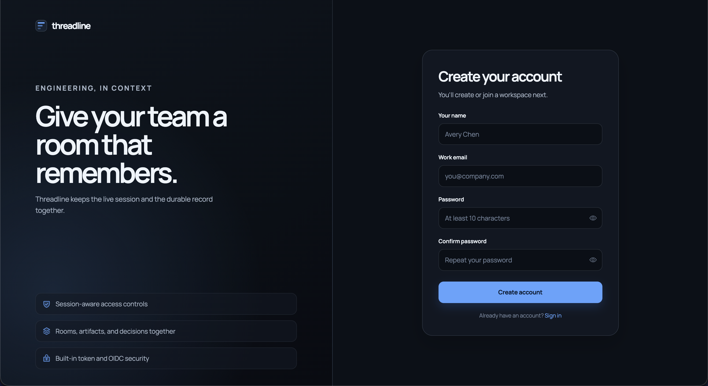<br/><sub>Create workspace</sub></td>
<td width="50%">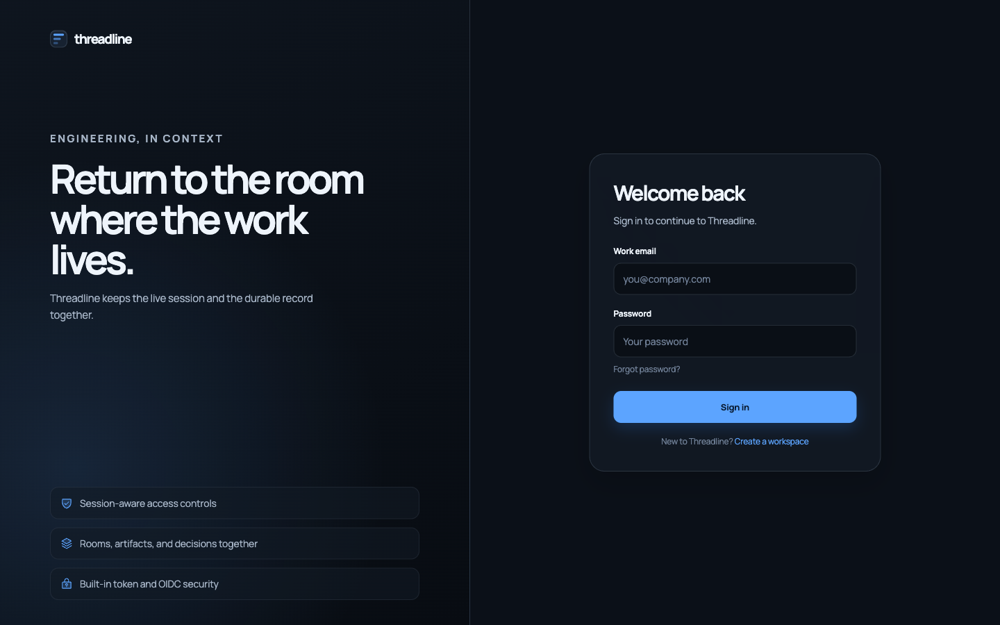<br/><sub>Sign in</sub></td>
</tr>
<tr>
<td width="50%">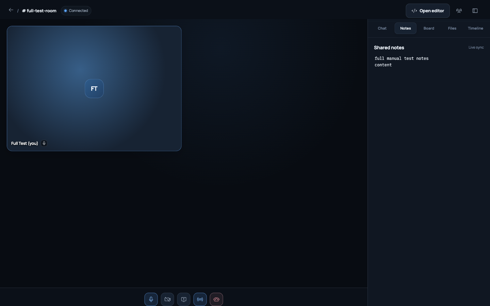<br/><sub>Room &mdash; shared notes</sub></td>
<td width="50%">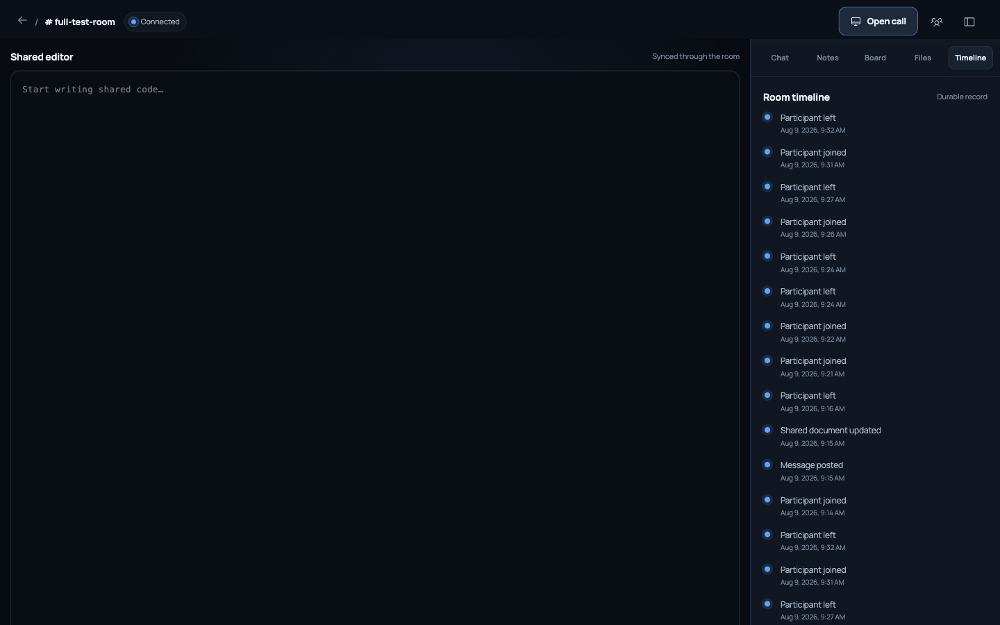<br/><sub>Room &mdash; shared code editor</sub></td>
</tr>
<tr>
<td width="50%">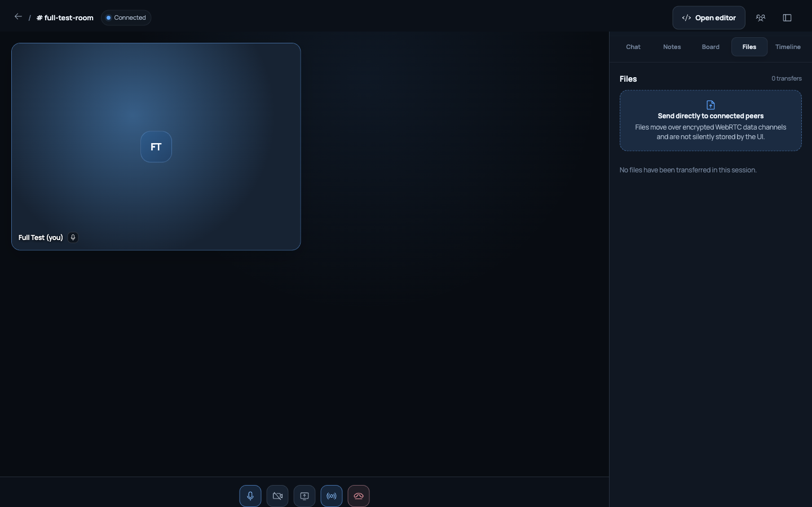<br/><sub>Room &mdash; direct file transfer</sub></td>
<td width="50%">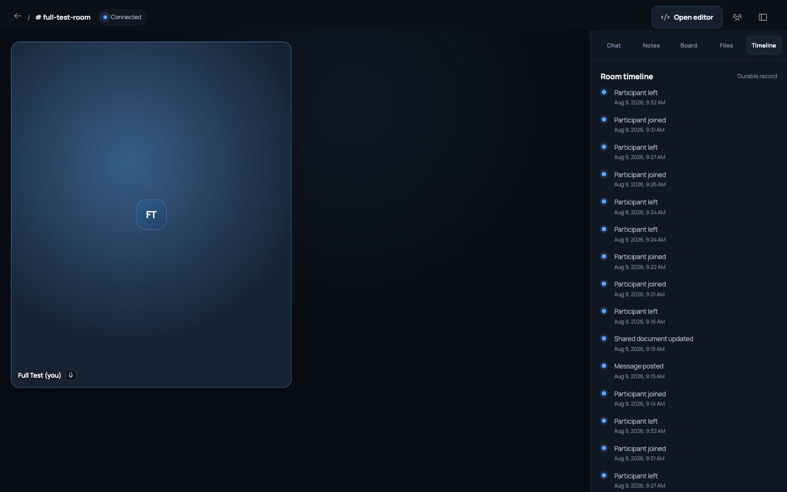<br/><sub>Room &mdash; durable timeline</sub></td>
</tr>
<tr>
<td width="50%">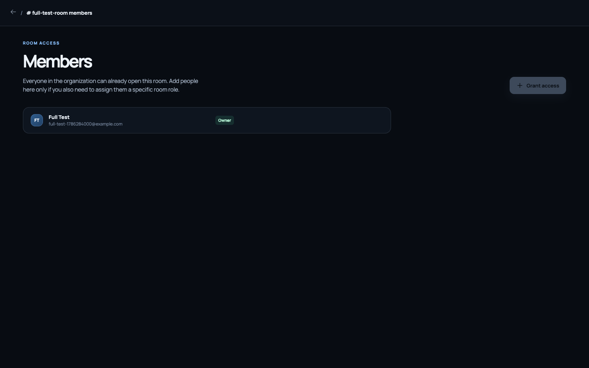<br/><sub>Room membership (grant access)</sub></td>
<td width="50%">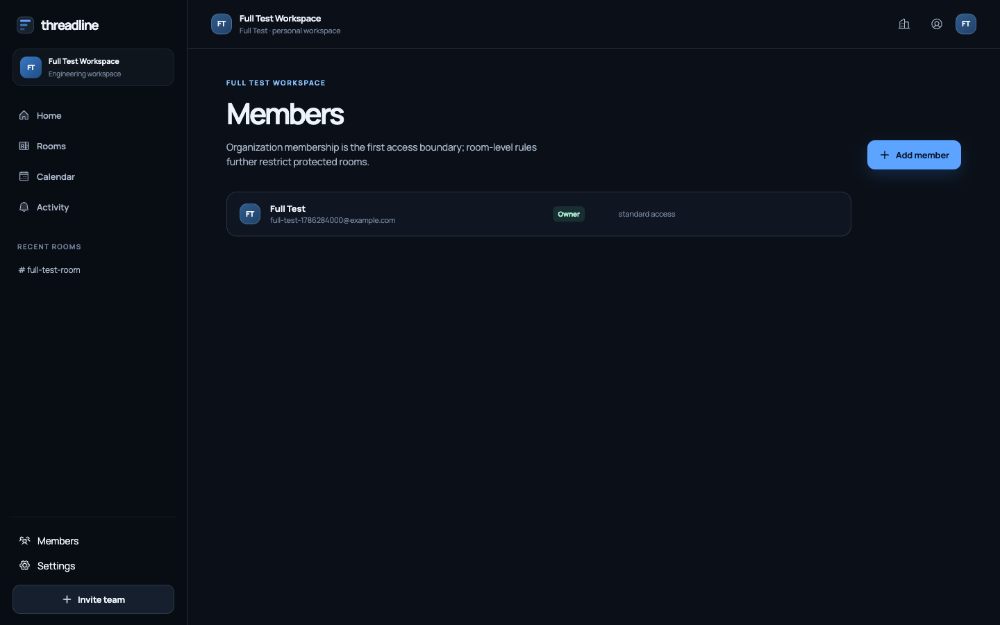<br/><sub>Organization members</sub></td>
</tr>
<tr>
<td width="50%">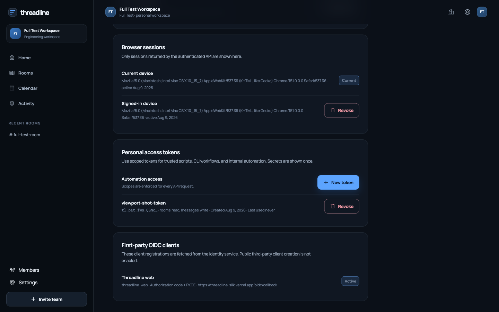<br/><sub>Personal access tokens</sub></td>
<td width="50%">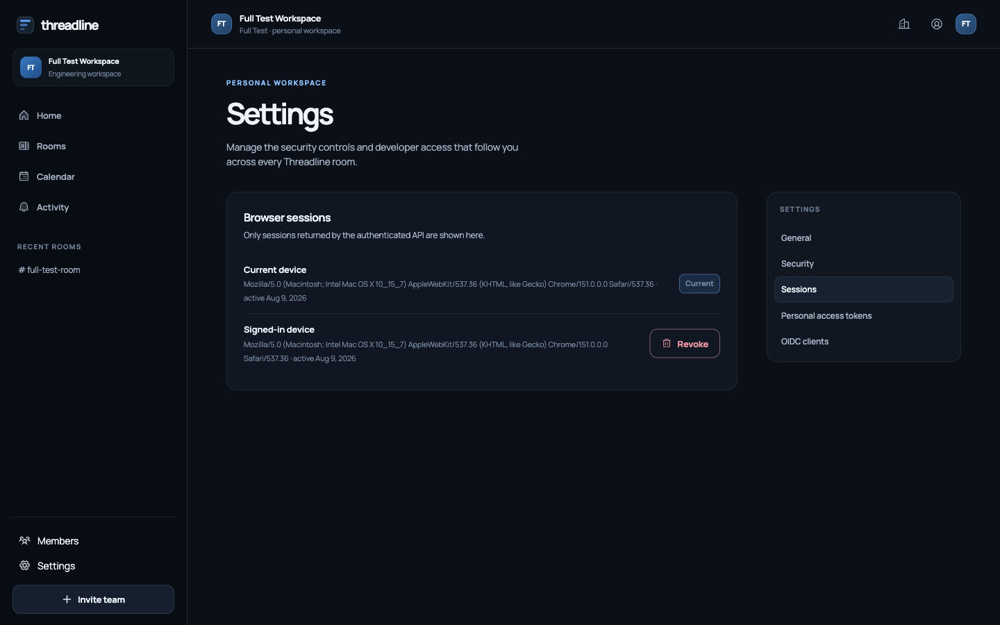<br/><sub>Browser sessions</sub></td>
</tr>
<tr>
<td width="50%">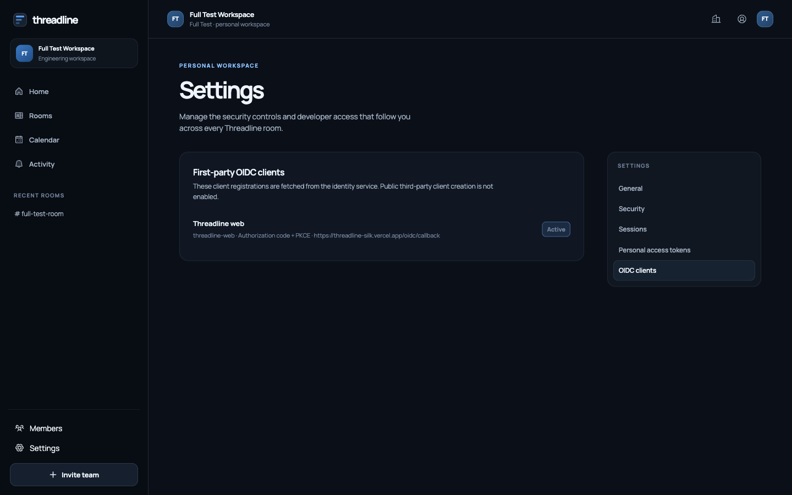<br/><sub>First-party OIDC clients</sub></td>
<td width="50%">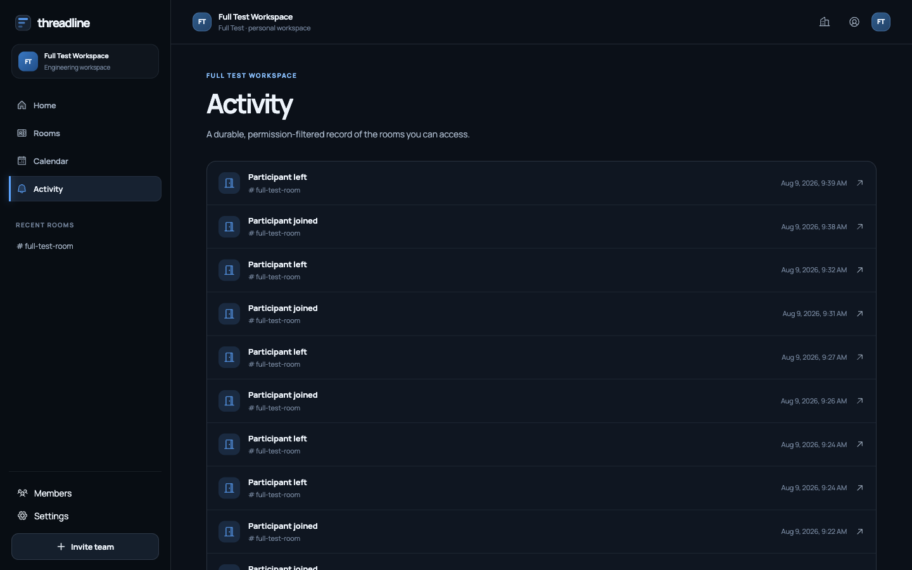<br/><sub>Activity feed</sub></td>
</tr>
<tr>
<td width="50%">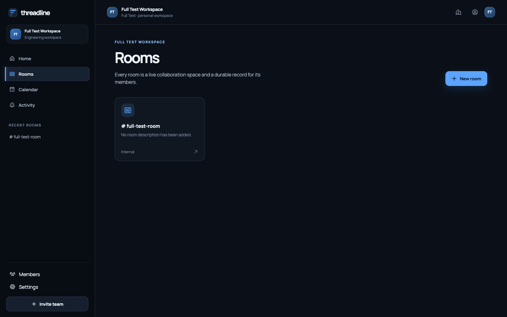<br/><sub>Rooms directory</sub></td>
<td width="50%">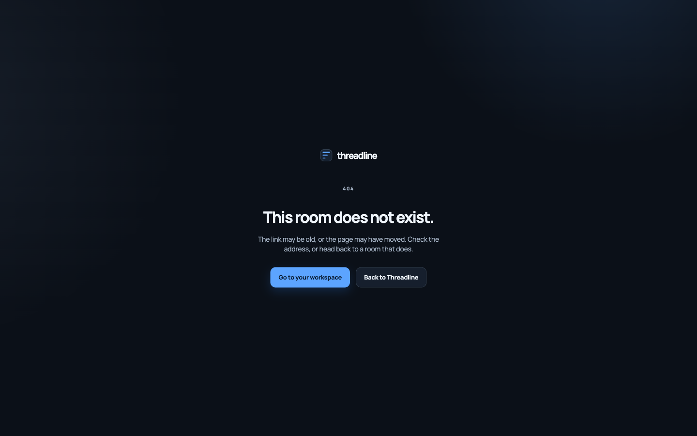<br/><sub>404 page</sub></td>
</tr>
</table>

## Route tree

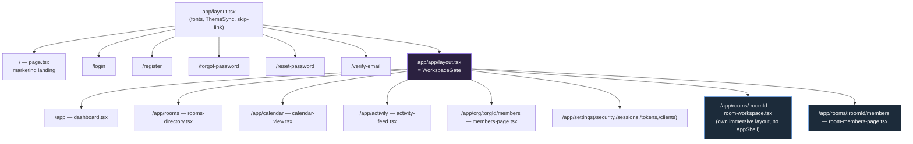
```mermaid
graph TD
    Root["app/layout.tsx<br/>(fonts, ThemeSync, skip-link)"] --> Landing["/ — page.tsx<br/>marketing landing"]
    Root --> Login["/login"]
    Root --> Register["/register"]
    Root --> Forgot["/forgot-password"]
    Root --> Reset["/reset-password"]
    Root --> Verify["/verify-email"]
    Root --> AppLayout["app/app/layout.tsx<br/>= WorkspaceGate"]

    AppLayout --> Dashboard["/app — dashboard.tsx"]
    AppLayout --> Rooms["/app/rooms — rooms-directory.tsx"]
    AppLayout --> Calendar["/app/calendar — calendar-view.tsx"]
    AppLayout --> Activity["/app/activity — activity-feed.tsx"]
    AppLayout --> OrgMembers["/app/org/:orgId/members — members-page.tsx"]
    AppLayout --> Settings["/app/settings(/security,/sessions,/tokens,/clients)"]
    AppLayout --> Room["/app/rooms/:roomId — room-workspace.tsx<br/>(own immersive layout, no AppShell)"]
    AppLayout --> RoomMembers["/app/rooms/:roomId/members — room-members-page.tsx"]

    style AppLayout fill:#2b2140,stroke:#8a63ff,color:#fff
    style Room fill:#1c2b3a,stroke:#5ca4ff,color:#fff
    style RoomMembers fill:#1c2b3a,stroke:#5ca4ff,color:#fff
```

Every route under `/app/**` passes through exactly one gate (`app/app/layout.tsx`), and every route under it is a thin server component that renders one client component — `page.tsx` files in this codebase do essentially nothing but pick which component to render and, for dynamic segments, unwrap `params`.

## WorkspaceGate: the one place session checking happens

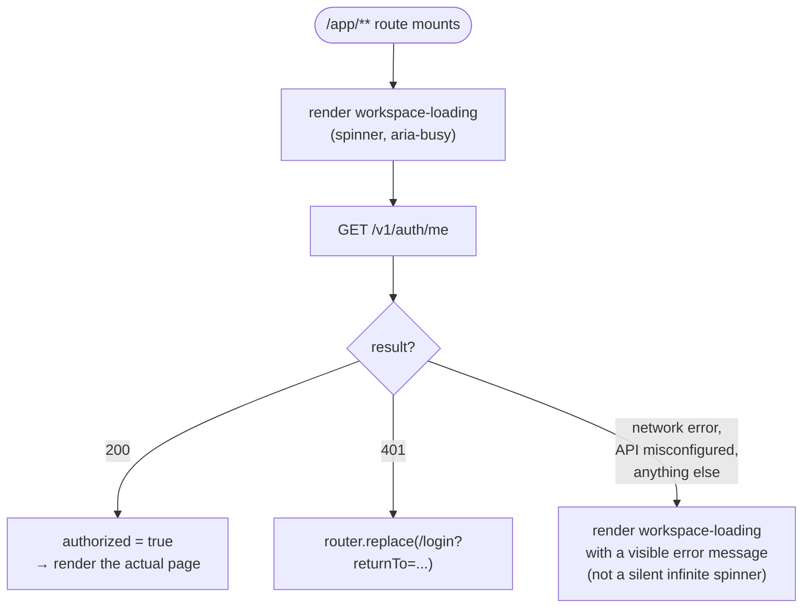
```mermaid
flowchart TD
    Mount(["/app/** route mounts"]) --> Loading["render workspace-loading<br/>(spinner, aria-busy)"]
    Loading --> Fetch["GET /v1/auth/me"]
    Fetch --> Result{"result?"}
    Result -- "200" --> Authorized["authorized = true<br/>→ render the actual page"]
    Result -- "401" --> Redirect["router.replace(/login?returnTo=...)"]
    Result -- "network error,<br/>API misconfigured,<br/>anything else" --> ErrorState["render workspace-loading<br/>with a visible error message<br/>(not a silent infinite spinner)"]
```

No `/app/**` page does its own auth check — `WorkspaceGate` (`apps/web/components/workspace-gate.tsx`) is the single choke point, and every page below it renders on the assumption that a session already exists. This is deliberately server-blind: `WorkspaceGate` doesn't know or care _which_ organization or room the caller is about to look at — that's the server's job on the next request, via ABAC (see [`api.md`](api.md#attribute-based-access-control-abac)). The non-401 error branch exists because the original version had no such branch: any failure that wasn't a clean 401 (API unreachable, `NEXT_PUBLIC_API_ORIGIN` unset) left the user staring at a permanent, silent spinner with no way out.

## Shell composition

Every `/app/**` page except the room view follows the same shape:

```tsx
<main id="main-content">
  <AppShell active="activity">
    <WorkspaceTopbar />
    <ActivityFeed />
  </AppShell>
</main>
```

- **`AppShell`** is two divs: `WorkspaceSidebar` and a content section. That's the entire component.
- **`WorkspaceSidebar`** fetches `/v1/auth/me` and `/v1/orgs/:orgId/rooms` itself (independent of whatever the page below it fetches), renders the org switcher, nav links, and the 5 most recent rooms.
- **`WorkspaceTopbar`** independently fetches `/v1/auth/me` again for the identity badge in the header. It is deliberately not shared state with the sidebar or the page body — three separate components hitting `/v1/auth/me` on the same page load is the accepted cost of not having a client-side identity cache/context yet (see [`roadmap.md`](roadmap.md)).
- **The room view is the one exception.** `room-workspace.tsx` and `room-members-page.tsx` render their own `<main className="room-layout">` with their own compact topbar, never wrapped in `AppShell` — the live session is meant to be immersive, not boxed in by a persistent sidebar.

### The `?org=` convention

Every org-scoped page (`dashboard`, `rooms-directory`, `calendar-view`, `activity-feed`, `workspace-sidebar`, `workspace-topbar`) reads the active organization from a `?org=<id>` search param via `useSearchParams()`, and resolves it with the same helper every time:

```ts
// lib/api.ts
export function selectedOrganization(identity: IdentityResponse, organizationId?: string | null) {
  return identity.organizations.find((organization) => organization.id === organizationId) ?? identity.organizations[0];
}
```

No component owns "the current organization" as shared state — the URL is the only source of truth, and every page independently falls back to the caller's first organization when the param is absent or doesn't match. Switching organizations in the sidebar is a `router.push` that changes only the query string.

## `lib/api.ts`: the entire HTTP client

```ts
export async function apiFetch<T>(path: string, init?: RequestInit): Promise<T> {
  const response = await fetch(apiUrl(path), {
    credentials: "include",
    ...init,
    headers: { ...(init?.body ? { "content-type": "application/json" } : {}), ...init?.headers },
  });
  if (response.status === 204) return undefined as T;
  const data = (await response.json().catch(() => ({}))) as { message?: string } & T;
  if (!response.ok) throw new ApiError(data.message ?? "The request could not be completed.", response.status);
  return data;
}
```

That's the whole client — no generated SDK, no React Query/SWR layer. Every component calls `apiFetch<ResponseShape>(path, init)` directly inside a `useEffect` or an event handler, and handles the thrown `ApiError` (which carries an HTTP `status`) locally. `credentials: "include"` is unconditional, which is what makes the session cookie work — see [`security.md`](security.md#session-cookies) for why that's safe (`SameSite=Lax` + the CSRF origin check on the server, not anything client-side).

`apiOrigin` comes from `NEXT_PUBLIC_API_ORIGIN`, which is either a full origin (`http://localhost:4000`) for local/hybrid dev or a same-origin path (`/api/identity`) in the Vercel same-origin-rewrite deployment mode — see [`deployment.md`](deployment.md) for when to use which.

## Theme

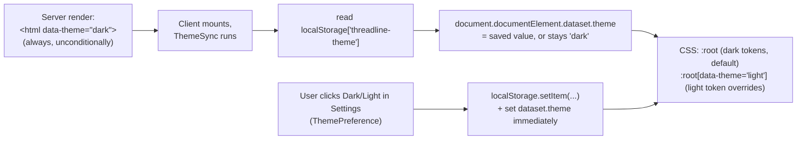
```mermaid
flowchart LR
    SSR["Server render:<br/>&lt;html data-theme=&quot;dark&quot;&gt;<br/>(always, unconditionally)"] --> Hydrate["Client mounts,<br/>ThemeSync runs"]
    Hydrate --> Read["read localStorage['threadline-theme']"]
    Read --> Apply["document.documentElement.dataset.theme<br/>= saved value, or stays 'dark'"]
    Apply --> CSS["CSS: :root (dark tokens, default)<br/>:root[data-theme='light'] (light token overrides)"]
    Toggle["User clicks Dark/Light in Settings<br/>(ThemePreference)"] --> Write["localStorage.setItem(...)<br/>+ set dataset.theme immediately"]
    Write --> CSS
```

The server always renders `data-theme="dark"` — there's no cookie-based theme detection, so a light-theme user sees one client-side flip from dark to light on first paint (`ThemeSync`, mounted once in the root layout) rather than a server-computed initial theme. This is a deliberate simplicity trade-off, not an oversight: it avoids needing a theme cookie and its own CSRF/consent considerations for what is a pure cosmetic preference.

Fonts are `next/font/google`: **Manrope** for `--font-geist` (variable weight) and **IBM Plex Mono** for `--font-geist-mono` (weights 400/500/600/700) — the CSS variable names are legacy (kept to avoid touching every `var(--font-geist)` reference in `globals.css` when the font itself changed) and don't literally mean "Geist" anymore.

## Component inventory

| Component                                                           | Role                                                                                                                                           |
| ------------------------------------------------------------------- | ---------------------------------------------------------------------------------------------------------------------------------------------- |
| `workspace-gate.tsx`                                                | The one auth checkpoint for `/app/**`                                                                                                          |
| `app-shell.tsx`, `workspace-sidebar.tsx`, `workspace-topbar.tsx`    | Persistent chrome for every non-room `/app/**` page                                                                                            |
| `brand.tsx`                                                         | Logo mark, reused in the landing nav and both auth panes                                                                                       |
| `auth-shell.tsx`, `auth-form.tsx`, `password-recovery.tsx`          | Login/register/forgot/reset/verify screens                                                                                                     |
| `landing-atmosphere.tsx`, `landing-motion.tsx`, `landing-scene.tsx` | Marketing page visuals and GSAP/motion interaction                                                                                             |
| `dashboard.tsx`                                                     | `/app` home: recent rooms, recent activity, room-creation modal                                                                                |
| `rooms-directory.tsx`                                               | `/app/rooms`: full room list                                                                                                                   |
| `calendar-view.tsx`                                                 | `/app/calendar`: event list + scheduling modal                                                                                                 |
| `activity-feed.tsx`                                                 | `/app/activity`: durable event stream across visible rooms                                                                                     |
| `members-page.tsx`                                                  | `/app/org/:orgId/members`: organization membership                                                                                             |
| `room-members-page.tsx`                                             | `/app/rooms/:roomId/members`: explicit room membership, only route with a "grant access" flow                                                  |
| `settings.tsx`                                                      | `/app/settings(/security,/sessions,/tokens,/clients)`: appearance, sessions, PATs, OIDC clients, email verification                            |
| `room-workspace.tsx`                                                | The live room: chat, notes, whiteboard, files, timeline, WebRTC controls — see [`realtime.md`](realtime.md)                                    |
| `app-select.tsx`                                                    | Custom accessible listbox/combobox used by every form that isn't a plain text input (role select, room visibility, calendar room picker, etc.) |
| `theme-sync.tsx`, `theme-preference.tsx`                            | Theme application (mount-time) and the user-facing toggle                                                                                      |

## Room workspace: connection lifecycle and reconnection

`room-workspace.tsx` owns one raw `WebSocket` (`socketRef`) and hand-rolls its own reconnect logic — no library, no `EventSource`-style auto-retry from the browser. The state machine:

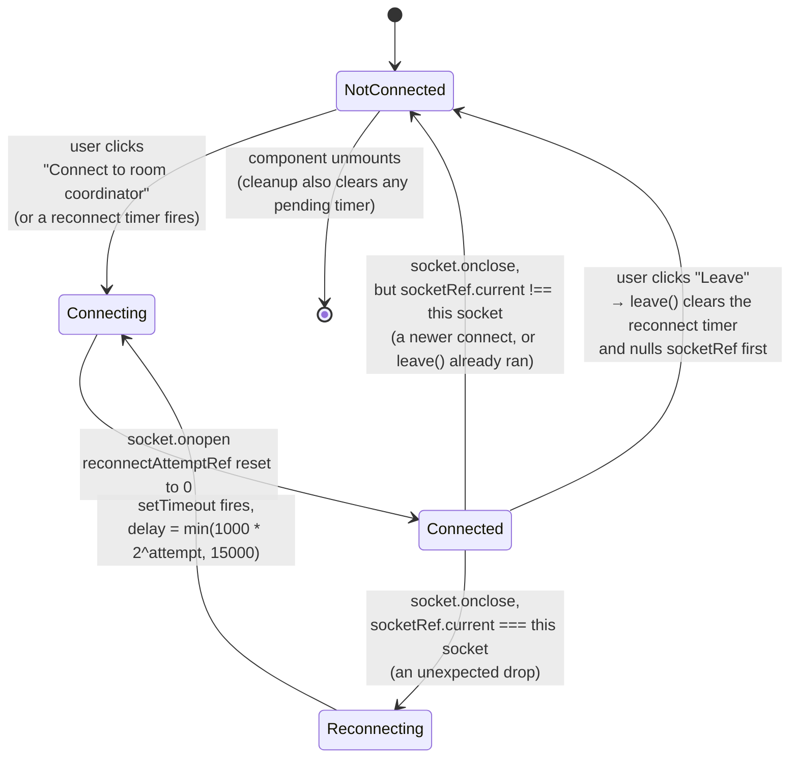
```mermaid
stateDiagram-v2
    [*] --> NotConnected
    NotConnected --> Connecting: user clicks<br/>"Connect to room coordinator"<br/>(or a reconnect timer fires)
    Connecting --> Connected: socket.onopen<br/>reconnectAttemptRef reset to 0
    Connected --> NotConnected: socket.onclose,<br/>but socketRef.current !== this socket<br/>(a newer connect, or leave() already ran)
    Connected --> Reconnecting: socket.onclose,<br/>socketRef.current === this socket<br/>(an unexpected drop)
    Reconnecting --> Connecting: setTimeout fires,<br/>delay = min(1000 * 2^attempt, 15000)
    Connected --> NotConnected: user clicks "Leave"<br/>→ leave() clears the reconnect timer<br/>and nulls socketRef first
    NotConnected --> [*]: component unmounts<br/>(cleanup also clears any pending timer)
```

The one-line guard that makes this safe to reason about: `leave()` and the unmount cleanup both set `socketRef.current = null` **before** the socket's own `onclose` fires, so by the time that handler runs, `socketRef.current !== socket` and it correctly declines to reconnect. Reconnecting after an intentional leave, or after navigating away from the room entirely, would otherwise silently keep a WebSocket alive (and keep retrying) against a page the user no longer has open — verified live by force-closing the socket via Playwright's `page.routeWebSocket()` and watching the UI cycle `Connected → Reconnecting… → Connected` on its own, then confirming a manual "Leave" click does _not_ trigger a reconnect afterward.

### The whiteboard had to stay mounted off-tab

The whiteboard tab's `<canvas>` used to be conditionally rendered — `{panel === "board" && (<canvas ref={boardRef} .../>)}` — exactly like the other four panels (chat/notes/files/timeline). That pattern is correct for those four, because they store their content in React state (`messages`, `timeline`, `notes`, `files`) that persists regardless of which tab is visible. It is wrong for the whiteboard, because incoming strokes are drawn **imperatively**, straight onto the canvas element, with no separate stroke-history state to fall back on:

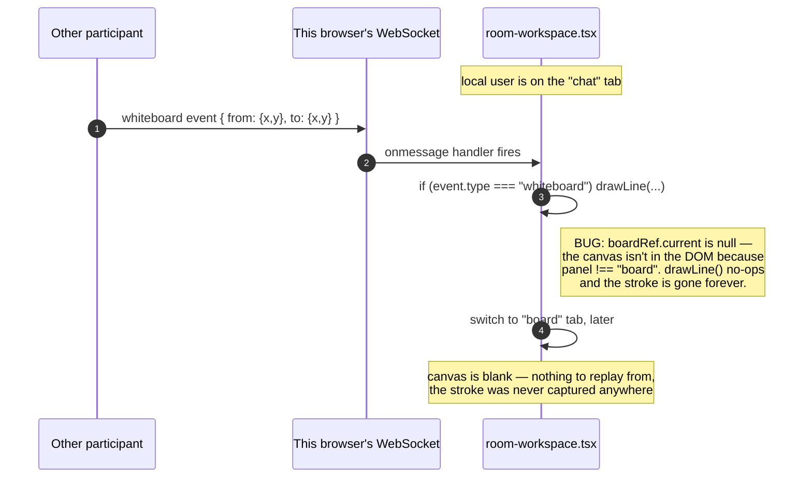
```mermaid
sequenceDiagram
    autonumber
    participant Other as Other participant
    participant Socket as This browser's WebSocket
    participant UI as room-workspace.tsx

    Note over UI: local user is on the "chat" tab
    Other->>Socket: whiteboard event { from: {x,y}, to: {x,y} }
    Socket->>UI: onmessage handler fires
    UI->>UI: if (event.type === "whiteboard") drawLine(...)
    Note right of UI: BUG: boardRef.current is null —<br/>the canvas isn't in the DOM because<br/>panel !== "board". drawLine() no-ops<br/>and the stroke is gone forever.
    UI->>UI: switch to "board" tab, later
    Note over UI: canvas is blank — nothing to replay from,<br/>the stroke was never captured anywhere
```

The fix keeps the whiteboard's markup always mounted and toggles `display: none` instead of unmounting it, so `boardRef.current` is never null once the room has rendered once — the canvas keeps receiving and drawing every stroke regardless of which tab is active, and switching to "board" later shows the accurate, up-to-date board rather than a blank one. Verified with two independent real browser sessions: one drew while the other's tab sat on "chat," and the stroke was already there — correct, non-zero pixel count — the moment the second browser switched tabs.

## Client-side ABAC is UX only

Several components recompute a permission locally to decide whether to show a button — for example `settings.tsx`/`members-page.tsx`/`room-members-page.tsx` compute `canManage` from `organization.role`/`organization.attributes` before rendering an "Add member"/"Grant access" button. This logic is a **direct mirror** of `canOrganization()`/`canRoom()` in `apps/api/src/policy.ts`, kept in sync by hand — it exists purely so the UI doesn't show controls a request would immediately reject, and it grants nothing. The server re-derives every decision independently on every request; see [`api.md`](api.md#attribute-based-access-control-abac).
