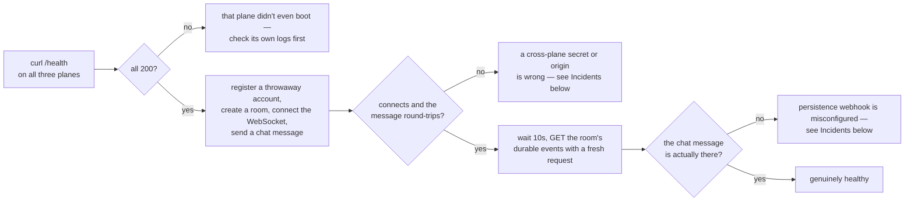
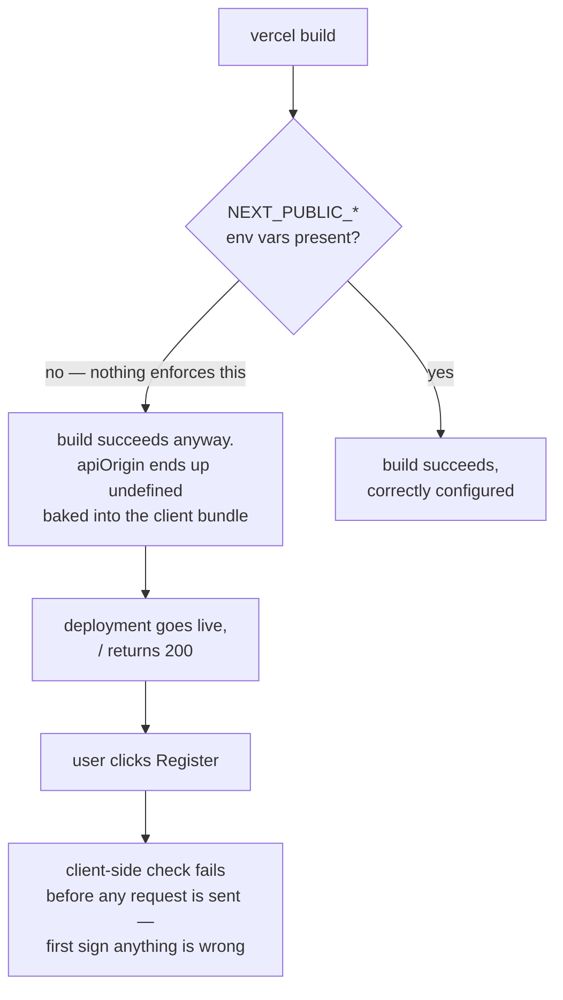

# Operations

This is a runbook, not a wishlist: how to tell whether the deployed system is actually healthy, how to triage when it isn't, and a complete record of every real incident found operating this exact deployment — what the symptom looked like, what was actually wrong, and how each was found and fixed. Nothing in the incidents section is hypothetical.

## Table of contents

- [Monitoring and health checks](#monitoring-and-health-checks)
- [Incident response process](#incident-response-process)
- [Incidents](#incidents)
  - [Incident: room tickets always rejected — `ROOM_TICKET_SECRET` mismatch](#incident-room-tickets-always-rejected--room_ticket_secret-mismatch)
  - [Incident: rate limiter shared one bucket across every endpoint](#incident-rate-limiter-shared-one-bucket-across-every-endpoint)
  - [Incident: durable events never persisted](#incident-durable-events-never-persisted)
  - [Incident: `PERSISTENCE_SECRET` / `INTERNAL_INGEST_SECRET` mismatch](#incident-persistence_secret--internal_ingest_secret-mismatch)
  - [Incident: the deployed web app had zero environment variables](#incident-the-deployed-web-app-had-zero-environment-variables)
  - [Incident: `WEB_ORIGIN` pointed at `localhost:3000` in production](#incident-web_origin-pointed-at-localhost3000-in-production)
  - [Incident: `OIDC_ISSUER` with a path crashed the entire API](#incident-oidc_issuer-with-a-path-crashed-the-entire-api)
  - [Incident: Vercel build broken by a floating `next` version](#incident-vercel-build-broken-by-a-floating-next-version)
  - [Incident: the seeded OIDC client's redirect URI never updated](#incident-the-seeded-oidc-clients-redirect-uri-never-updated)
  - [Incident: stale presence after disconnect, and the whiteboard off-tab loss](#incident-stale-presence-after-disconnect-and-the-whiteboard-off-tab-loss)
  - [Incident: a unique index on a pre-existing collection took down every request](#incident-a-unique-index-on-a-pre-existing-collection-took-down-every-request)
  - [Incident: deploying from the wrong branch silently reverted production](#incident-deploying-from-the-wrong-branch-silently-reverted-production)
  - [Near-miss: the username unique index could not build, and this time nothing went down](#near-miss-the-username-unique-index-could-not-build-and-this-time-nothing-went-down)
- [Runbook: resolving duplicate usernames](#runbook-resolving-duplicate-usernames)
- [Reads that used to grow without bound](#reads-that-used-to-grow-without-bound)
- [Known gaps carried here from live testing](#known-gaps-carried-here-from-live-testing)

## Monitoring and health checks

| Plane           | Endpoint              | Proves                                       | Does **not** prove                                                                    |
| --------------- | --------------------- | -------------------------------------------- | ------------------------------------------------------------------------------------- |
| `apps/api`      | `GET /health`         | The process booted, config passed validation | `WEB_ORIGIN` is correct, secrets match the other planes, Mongo indexes exist          |
| `apps/realtime` | `GET /health`         | The Worker is deployed and routable          | `ROOM_TICKET_SECRET`/`PERSISTENCE_SECRET` match the API, `PERSISTENCE_WEBHOOK` is set |
| `apps/web`      | `GET /` returns `200` | The build succeeded and static assets serve  | `NEXT_PUBLIC_API_ORIGIN`/`NEXT_PUBLIC_REALTIME_ORIGIN` were set at build time         |

**The recurring lesson of every incident below is the same one**: every plane in this system can report itself perfectly healthy — process up, `200` on `/health`, build green — while being completely non-functional for an actual user, because the thing that's broken is a cross-plane agreement (two secrets that must match, an env var that must exist, an origin that must be exact) that no single plane's own health check can see. A real health check for this system means exercising the seams, not just each box:



Every step past "all `/health` checks pass" in this flowchart is exactly the closed-loop test used to find real incidents #1, #3, and #4 below — a plain curl-based script that registers an account, creates a room, opens a WebSocket, and checks whether a message sent through it is actually still there on a later, independent request.

## Incident response process

1. **Reproduce with a fresh, isolated identity.** Register (or reuse) a throwaway account rather than debugging against whatever session happens to be open in a browser tab — this rules out stale-cookie confusion (see [`troubleshooting.md`](troubleshooting.md#testing-with-two-different-logged-in-accounts-in-one-browser-breaks-the-wrong-tab)) as a variable before assuming the system itself is broken.
2. **Isolate the plane.** Three independent services means the failure is almost always at exactly one seam — narrow it with direct `curl` calls to each plane before touching any code.
3. **Check config before code.** Every incident below except the reconnect/presence/whiteboard bugs was a _configuration_ problem, not a logic bug — the code was correct and had been for a while. `vercel env ls` / `wrangler secret list` (names only, never values) before reading source.
4. **Fix forward with the smallest change, verify end-to-end, then document it here.** A config fix is not "done" until the health-check flowchart above passes end-to-end against production — not just until the specific symptom disappears.

## Incidents

### Incident: room tickets always rejected — `ROOM_TICKET_SECRET` mismatch

**Symptom:** Every WebSocket upgrade to `apps/realtime` failed with `Invalid room ticket`, including tickets requested and used within seconds — ruling out expiry.

**Root cause:** `ROOM_TICKET_SECRET` is set independently on two different platforms (Vercel for `apps/api`, which signs; Cloudflare for `apps/realtime`, which verifies — see [`security.md`](security.md#secrets-inventory)), and the two values didn't match. Nothing enforces they do; a wrong value on either side fails every ticket, silently, with no distinguishing error beyond "invalid."

**Found by:** A closed-loop script — register, create a room, request a ticket, decode its `exp`/`iat` to rule out expiry, then attempt the WebSocket upgrade directly with `curl` and inspect the raw response.

**Fix:** Generated one new shared secret, set it identically via `wrangler secret put ROOM_TICKET_SECRET` and `vercel env add ROOM_TICKET_SECRET`, redeployed both, re-ran the closed-loop script to confirm a `101` upgrade.

### Incident: rate limiter shared one bucket across every endpoint

Full root cause, diagrammed before/after: [`security.md`](security.md#rate-limits). In short: an in-memory `Map` keyed by `request.path` (which Express rebases to `/` inside an exact-path `app.use` mount) meant `/v1/auth/login`, `/v1/auth/register`, and the password-reset endpoint all shared one counter, and that counter reset on every serverless cold start. **Found by:** hammering `/login` in a loop and noticing `/register` started failing too. **Fixed by:** keying on `request.baseUrl` and moving the counter into `Repository.incrementRateLimit`, backed by an atomic Mongo update. Regression test: [`testing.md`](testing.md#api-integration-tests).

### Incident: durable events never persisted

Root cause: a missing `PERSISTENCE_WEBHOOK` variable. Full detail, with the delivery/retry state diagram: [`realtime.md`](realtime.md#one-crash-that-looked-like-a-persistence-bug) and [`troubleshooting.md`](troubleshooting.md#room-events-chat-joins-activity-feed-never-show-up-even-though-the-room-connects-fine). In short: `apps/realtime/wrangler.toml` had no `[vars]` block at all, so `PERSISTENCE_WEBHOOK` was `undefined`, and `record()`'s guard (`if (this.env.PERSISTENCE_WEBHOOK && this.env.PERSISTENCE_SECRET)`) meant delivery was never even attempted — not failing, just silently skipped. The live WebSocket worked perfectly the entire time, which is exactly what made this invisible during normal use. **Found by:** sending a chat message through two independent live sessions, then re-fetching the room's durable events with a _third_, independent request and finding only `room.created`. **Fixed by:** adding `PERSISTENCE_WEBHOOK` to `wrangler.toml`'s `[vars]` and redeploying.

### Incident: `PERSISTENCE_SECRET` / `INTERNAL_INGEST_SECRET` mismatch

Same class of bug as the room-ticket incident above, on the other shared secret: the Worker's `PERSISTENCE_SECRET` and the API's `INTERNAL_INGEST_SECRET` (same value, different names on each side by design — see [`security.md`](security.md#secrets-inventory)) didn't match, so even after fixing `PERSISTENCE_WEBHOOK` above, every delivery attempt was rejected by the ingest endpoint's secret check. **Fixed by:** generating one new shared value and setting it identically on both platforms, in the same pass as the `PERSISTENCE_WEBHOOK` fix.

### Incident: the deployed web app had zero environment variables

**Symptom:** The site returned `200`, the landing page rendered correctly, everything _looked_ deployed and healthy — but registration and login failed immediately, client-side, with "Threadline API is not configured."

**Root cause:** The Vercel project for `apps/web` had never had `NEXT_PUBLIC_API_ORIGIN`, `NEXT_PUBLIC_REALTIME_ORIGIN`, or `THREADLINE_API_ORIGIN` set. Because these are baked in at _build_ time, not read at runtime, a build with none of them set succeeds cleanly — there's no boot-time validation on the frontend the way there is on `apps/api` (see [`security.md`](security.md#boot-time-validation)), so nothing failed until a user actually tried to use the app.



**Found by:** noticing the "1 participant" room screenshots earlier in a testing pass were all against a build that, it turned out, had never actually been deployed with working configuration in the first place — confirmed by registering against the live URL and getting the config error immediately.

**Fix:** Set `THREADLINE_API_ORIGIN`, `NEXT_PUBLIC_API_ORIGIN=/api/identity`, `NEXT_PUBLIC_REALTIME_ORIGIN`, redeployed.

### Incident: `WEB_ORIGIN` pointed at `localhost:3000` in production

**Symptom:** Even after the previous incident's fix, requests from the real deployed web app were still rejected — `csrf_rejected` (see [`troubleshooting.md`](troubleshooting.md#this-browser-request-did-not-originate-from-threadline--csrf_rejected)).

**Root cause:** The API's `WEB_ORIGIN` was still set to `http://localhost:3000` — apparently left over from whatever local testing happened before the web app was ever properly deployed, and never updated. `ADDITIONAL_WEB_ORIGINS` correctly allowed `localhost:3000` (for hybrid local dev against the live API), which is exactly why _local_ testing against this same API had been working the whole time and masked the problem.

**Fix:** Set `WEB_ORIGIN` to the real deployed web origin, kept `localhost:3000` in `ADDITIONAL_WEB_ORIGINS` so local hybrid dev kept working, redeployed, verified `Access-Control-Allow-Origin` on a direct `curl` against both origins.

### Incident: `OIDC_ISSUER` with a path crashed the entire API

**Symptom:** Immediately after the fix above, **every** API request started returning `FUNCTION_INVOCATION_FAILED` — not just OIDC routes, `/health` too.

**Root cause:** Self-inflicted, and caught within minutes. Fixing `WEB_ORIGIN` above, the very next env var touched (`OIDC_ISSUER`) was set to `<web-origin>/api/identity` — following an existing (also-wrong) example in `deployment.md` at the time — but `apps/api/src/index.ts`'s `parseOrigin()` requires a bare origin with no path, and throws if it doesn't round-trip exactly through `new URL(value).origin`. That throw happens during `createConfiguredApp()`, before any router exists, so it takes down every route, not just the misconfigured one.

**Fix:** Set `OIDC_ISSUER` to the API's own bare origin (it identifies the API itself, in signed token `iss` claims — it is not the browser-facing rewrite path), redeployed, confirmed `/health` recovered immediately. The stale example in `deployment.md` that caused this was corrected in the same pass — see [`deployment.md`](deployment.md#zero-cost-public-preview) for the fixed version and the full explanation of why the value has to be bare.

### Incident: Vercel build broken by a floating `next` version

**Symptom:** `vercel --prod` for `apps/web` failed with `ENOENT: no such file or directory, open '.next/next-server.js.nft.json'` — reproducible on every retry, while the exact same code built cleanly with `npm run build` locally.

**Root cause:** `apps/web/package.json` pinned `next` with a caret range (`^16.2.12`). Vercel's fresh `npm install` resolved a newer patch release (`16.3.0`) that has an output-file-tracing regression under this monorepo's `output: "standalone"` config; the local `node_modules` had never been reinstalled since `16.2.12` was current, so the same floating range silently resolved to two different actual versions in the two environments.

**Fix:** Pinned `next` to an exact version (`16.2.12`, no caret) in `package.json`, regenerated the lockfile, redeployed — Vercel's build log then correctly reported `Detected Next.js version: 16.2.12` and succeeded.

### Incident: the seeded OIDC client's redirect URI never updated

**Symptom:** The "Threadline web" first-party OIDC client's registered redirect URI kept showing a stale domain (`http://localhost:3000/oidc/callback`) in Settings, even after `WEB_ORIGIN` was corrected and the API redeployed.

**Root cause:** `MongoRepository.connect()` seeds this client with `{ $setOnInsert: firstPartyWebClient(webRedirectUri) }` — `$setOnInsert` only writes on the very first insert, ever. Once the document existed (seeded back when `WEB_ORIGIN` was still wrong), no later boot with a corrected `WEB_ORIGIN` ever touched it again.

**Fix:** Split the seed into `$set` for everything that should track current config (`redirectUris`, `name`, `allowedScopes`, `isFirstParty`) and `$setOnInsert` only for `createdAt` — the client now self-heals its redirect URI on every boot rather than needing a manual database edit.

### Incident: stale presence after disconnect, and the whiteboard off-tab loss

Both are real UI/realtime bugs (not configuration), each with its own root-cause diagram in the doc that owns that code: the presence race in [`realtime.md`](realtime.md#a-second-quieter-hibernation-quirk-the-departing-socket-counts-itself-present), the whiteboard mount lifecycle in [`frontend.md`](frontend.md#the-whiteboard-had-to-stay-mounted-off-tab). Both were found the same way — two genuinely independent, cookie-isolated browser sessions against the live deployment, not a single-session smoke test — which is also why neither showed up in earlier single-participant screenshot passes of this exact app.

### Incident: a unique index on a pre-existing collection took down every request

**Symptom:** Immediately after deploying the org/workspace rework, **every** API request started returning `FUNCTION_INVOCATION_FAILED` — identical failure mode to the `OIDC_ISSUER` incident above, but a completely different cause.

**Root cause:** The new `Organization.joinCode` field shipped with a unique index — `db.collection<Organization>("orgs").createIndex({ joinCode: 1 }, { unique: true })` in `MongoRepository.connect()` — added on the assumption that the collection would only ever contain documents created under the new schema. Production Mongo already had roughly 22 organizations from before this change, none of which had a `joinCode` field at all, so Mongo treated every one of them as `joinCode: null` for indexing purposes. A unique index tolerates at most one `null`; building it against 22 failed outright, and because index creation happens inside `connect()` — before the app finishes booting — the failure took the entire process down on every cold start, not just requests that touched an organization.

**Found by:** `vercel logs` on the failing deployment, which surfaced the actual driver error directly: `MongoServerError: Index build failed ... E11000 duplicate key error collection: threadline.orgs index: joinCode_1 dup key: { joinCode: null }`.

**Fix:** A one-off script connected to the production database directly, found every organization missing a `joinCode`, and backfilled each with a freshly generated, mutually unique code (plus `allowMemberInvites: false` where that was also missing) before the next boot attempted to build the index again. No code change was needed — the index definition was correct for the schema going forward; the data just had to catch up to it first. The general lesson: a unique index added for a field on an _existing_ collection is a migration, not just a schema change, and needs a backfill pass before (or atomically with) rollout whenever the collection might already have rows.

### Incident: deploying from the wrong branch silently reverted production

**Symptom:** Shortly after adding Sentry instrumentation on a separate branch and deploying `apps/api` to production, live registration through the actual deployed app started requiring a workspace name again — behavior from before the org/workspace rework, which had already been live in production for hours.

**Root cause:** The Sentry work had been branched from `main` before the org/workspace rework's PR was merged into it, since that PR was still open. Deploying that branch straight to Vercel with `vercel --prod` deployed exactly what was on it — a version of `apps/api` older than what was already live — silently rolling production back to the pre-rework registration schema. Nothing about the deploy command or its output indicated this; a `vercel --prod` deploy from the "wrong" branch looks identical to one from the right branch.

**Found by:** Testing the live registration flow against the actual production URL immediately after the deploy, as a matter of habit, rather than trusting a green build.

**Fix:** Cherry-picked the Sentry commit onto the correct branch (the one with the org/workspace rework already on it) instead of the stale one, redeployed `apps/api` and `apps/web` from that combined branch, and re-verified the registration flow lived. The standalone Sentry pull request was closed in favor of folding its one commit into the existing, still-open PR, so there is exactly one branch to deploy from going forward rather than two that can silently diverge.

### Near-miss: the username unique index could not build, and this time nothing went down

**Date:** 2026-08-14. **Impact:** none — recorded because the absence of impact is the point.

**What happened:** `users.username` gained a unique index in the same change that made username uniqueness atomic.
On the first production boot after that deploy, the index failed to build:

```
[threadline] Could not create the unique index on users.username. Usernames are NOT being enforced
atomically; concurrent requests can still create duplicates. Resolve the duplicates below and restart.
  duplicate usernames: test (2), test000 (2)
  underlying error: E11000 duplicate key error ... index: username_unique dup key: { username: "test" }
```

**Why it did not become an outage:** this is the same failure mode as
[the joinCode incident](#incident-a-unique-index-on-a-pre-existing-collection-took-down-every-request), which took down
every request. The lesson from that one was written into the code: `ensureUniqueUsernameIndex` is deliberately kept out
of the boot-time `Promise.all` and is non-fatal. It logs the offending usernames, falls back to a non-unique index so
lookups stay indexed, and lets the service boot. The application-level check still returned `409` for the ordinary case
throughout; only a genuine concurrent race was unprotected.

**Where the duplicates came from:** the web sign-up form used to derive a username from the email local part and append
`000`. Two accounts at different domains sharing a local part therefore collided — `test@gm.com` / `test@gm.comm` and
`test@mim.com` / `test@aa.com`. That derivation now happens server-side against a uniqueness check.

**Resolution:** ran the dedupe runbook below, redeployed the API, and confirmed the index built (`username_unique
unique=true`, 0 duplicates, and a probe insert of a taken username rejected with `11000`). A redundant non-unique
`username_1` index left behind by the fallback was dropped.

**The transferable lesson:** the joinCode incident's fix was a one-off backfill script; its *durable* fix was making the
index build non-fatal. The second time the same class of problem occurred, that decision converted an outage into a log
line. Prefer degrading loudly over failing closed for anything that runs during boot against data you do not control.

## Runbook: resolving duplicate usernames

Symptom: the log line above, or `inspectUsernameUniqueness` reporting `indexed: false`.

```bash
# Report only — reads, writes nothing. Shows exactly which accounts would be renamed.
MONGODB_URI='<production uri>' npm run dedupe:usernames --workspace=@threadline/api

# Apply — the oldest holder of each name keeps it; every other holder is renamed
# with a short random suffix. Accounts are never deleted or merged.
MONGODB_URI='<production uri>' npm run dedupe:usernames --workspace=@threadline/api -- --apply
```

Then redeploy (or wait for a cold start) so `MongoRepository.connect` retries the index, and confirm it took:

```
index: username_unique  unique=true
duplicates: 0
```

Renaming only changes the handle. Email, password hash, and sessions are untouched, and usernames are not used for
sign-in — so the affected people keep working without noticing. Run the report first regardless; it is the record of
what changed.

## Reads that used to grow without bound

Two durable-event reads fetched an entire history and discarded most of it, so their cost grew with a room's age rather
than with the size of the answer:

| Read | Was | Now |
| ---- | --- | --- |
| `GET /v1/rooms/:roomId/events` | every event the room ever recorded | most recent `limit` (default 200), selected in the database, with a `before` cursor for older pages |
| `GET /v1/orgs/:orgId/activity` | every event across every visible room, then `.slice(0, 100)` in JS | most recent 100, selected in the database |

Worth knowing when reading old dashboards or capacity numbers: response sizes and query times for these two endpoints
are not comparable across that change. If either ever looks slow again, check whether a caller is passing a large
`limit` before assuming the index regressed.

## Known gaps carried here from live testing

Not incidents (nothing broke), but real, load-bearing findings from the same testing passes that found the incidents above, and worth keeping in one place rather than only in `roadmap.md`:

- **Diagnostic accounts accumulate in production Mongo.** Every incident above that needed a closed-loop reproduction registered a real, throwaway account against the real production database (there is no separate staging environment). No delete endpoint exists for user accounts, so these accumulate — harmless, but real data, and worth knowing about before querying the `users` collection and being surprised by `tl-diag-*@example.com`-style rows.
- **`AUTH_DELIVERY_WEBHOOK` isn't configured on the live deployment, so no mail is sent at all.** Account recovery does not depend on it: it runs on [recovery codes](security.md#recovery-codes) issued at registration. What is unavailable is the mailed reset *link* — `POST /v1/auth/password-reset/request` correctly returns `202` (by design, never leaking account existence) and the token expires undelivered. Wiring up a real transactional-email provider remains a separate integration decision. A support question to expect: someone who lost their codes has no route back in, by design. See [`roadmap.md`](roadmap.md).
