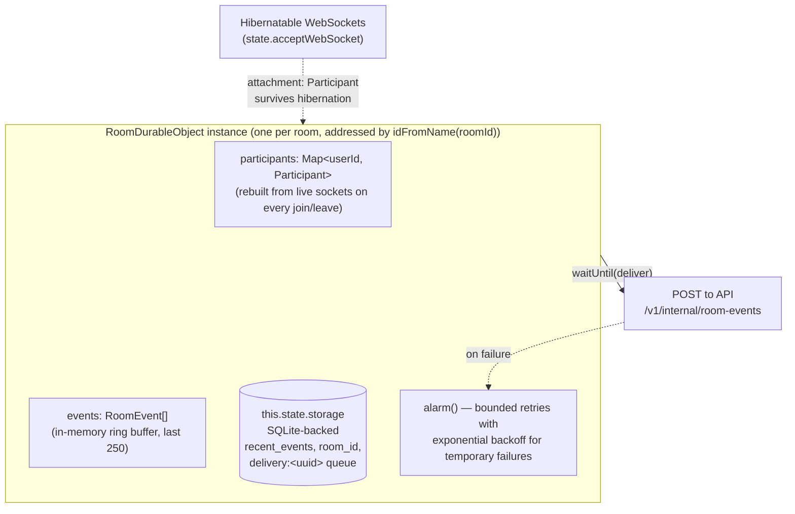
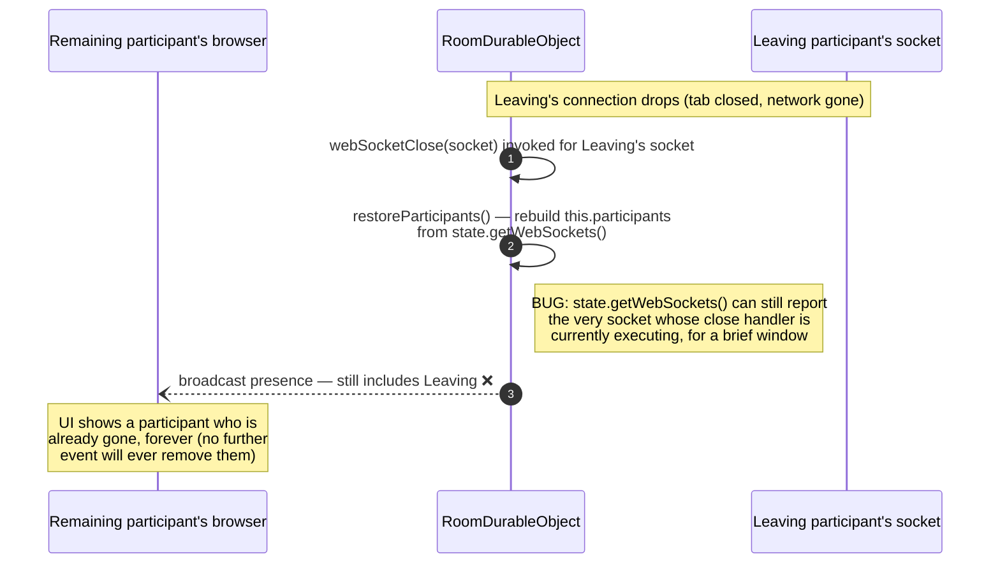
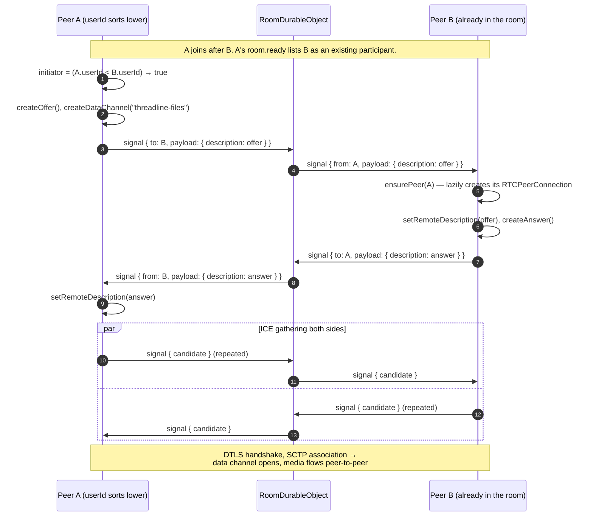
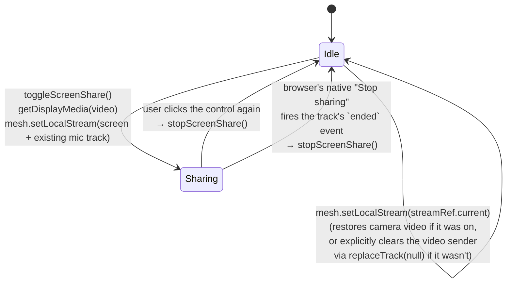

# Realtime & RTC

This is the plane most of Threadline's actual complexity lives in: one Cloudflare Durable Object per room coordinating presence and WebRTC signaling over hibernatable WebSockets, plus a browser-side mesh (`apps/web/lib/peer-mesh.ts`) that turns that signaling into real peer-to-peer audio, video, screen share, and file transfer. Nothing here touches MongoDB directly — the Durable Object's only connection to the durable-records plane is a fire-and-forget webhook (see [`architecture.md`](architecture.md#durable-event-hand-off)).

## Table of contents

- [RoomDurableObject](#roomdurableobject)
- [WebSocket protocol](#websocket-protocol)
- [Joining a room](#joining-a-room)
- [WebRTC mesh: why both sides have to offer](#webrtc-mesh-why-both-sides-have-to-offer)
- [Screen sharing](#screen-sharing)
- [Known limitations](#known-limitations)

## RoomDurableObject



- **Hibernatable, not held-open.** `this.state.acceptWebSocket(socket)` (rather than a plain `addEventListener`) lets Cloudflare evict the Durable Object from memory between messages and restore it on the next one — the room doesn't cost compute while everyone's just idle-connected. Each socket's `Participant` (userId, username, role, joinedAt, screenSharing) is serialized onto the socket itself via `serializeAttachment`, so it survives that eviction without a storage round-trip.
- **SQLite-backed storage** (`new_sqlite_classes` migration in `wrangler.toml`) holds the last 250 events for fast reconnect replay and a durability queue (`delivery:UUID` keys) for events not yet acknowledged by the API.
- **The alarm is the only retry mechanism.** Temporary failures (network errors, `408`, `425`, `429`, or `5xx`) use exponential backoff from 30 seconds to 30 minutes and stop after eight attempts. Permanent `4xx` rejections are logged and deleted immediately so one poison event cannot create an infinite request loop.
- **Editor snapshots are coalesced.** Live keystrokes still broadcast immediately, but Mongo persistence keeps only the latest code/notes snapshot and sends it after two seconds of quiet or every ten seconds during continuous typing.

```mermaid
stateDiagram-v2
    [*] --> Queued: record() called<br/>(chat, editor, screen-share, join/leave —<br/>never cursor/signal/whiteboard)
    Queued --> Delivering: waitUntil(deliver(key, delivery))<br/>fires immediately, doesn't block the caller
    Delivering --> Delivered: POST /v1/internal/room-events<br/>returns 2xx
    Delivered --> [*]: storage.delete("delivery:UUID")
    Delivering --> Rejected: permanent 4xx
    Rejected --> [*]: log and delete poison delivery
    Delivering --> Failed: network error, 408/425/429, or 5xx
    Failed --> Scheduled: exponential backoff, max 8 attempts
    Scheduled --> Delivering: alarm retries due deliveries
    Failed --> [*]: retry limit reached; log and delete
```



**This retry loop only ever runs at all if `PERSISTENCE_WEBHOOK` and `PERSISTENCE_SECRET` are both set** — `record()` checks `if (this.env.PERSISTENCE_WEBHOOK && this.env.PERSISTENCE_SECRET)` before it does anything. If either is missing, nothing above this line ever executes: no delivery attempt, no failure, no alarm, no log line — the event silently never leaves the Durable Object's own storage. That is a materially different failure mode from "delivery is retrying and will eventually succeed," and it happened for real in this project's own deployment — see [`operations.md`](operations.md#incident-durable-events-never-persisted) for the incident.

### One crash that looked like a persistence bug

`broadcast()` used to call `send()` on every socket in `state.getWebSockets()` with no guard:

```ts
private broadcast(message: ServerMessage, recipient?: string) {
  for (const socket of this.state.getWebSockets()) {
    const participant = socket.deserializeAttachment() as Participant | null;
    if (!recipient || participant?.userId === recipient) send(socket, message);
  }
}
```

That's correct almost all the time. It breaks in exactly one moment: `webSocketClose(socket)` calls `this.broadcast({ type: "presence", ... })` to tell everyone else someone left — but per a documented Cloudflare hibernation-API quirk, **the closing socket itself is still present in `state.getWebSockets()` while its own `webSocketClose` handler is running.** `send()` on that socket throws `TypeError: Can't call WebSocket send() after close()`, synchronously, inside an `async` function — which means the throw aborts the handler right there, and the very next line, `await this.record({ type: "participant.left", ... })`, never runs. The room event was silently dropped, with no error visible anywhere except a Worker log nobody was tailing.

The symptom that actually surfaced it wasn't a crash report — it was `POST /v1/orgs/:orgId/activity` never showing `participant.left` events. The fix:

```ts
private broadcast(message: ServerMessage, recipient?: string) {
  for (const socket of this.state.getWebSockets()) {
    const participant = socket.deserializeAttachment() as Participant | null;
    if (recipient && participant?.userId !== recipient) continue;
    try {
      send(socket, message);
    } catch {
      // stale/closing socket — skip it, don't let it abort delivery to
      // everyone else or abort the caller before it finishes recording.
    }
  }
}
```

One stale socket can no longer take down delivery to the rest of the room, or abort whatever the caller does next. This is exactly the regression [`testing.md`](testing.md#durable-object-tests) covers by connecting a real socket, closing it, and asserting the durable event still lands — a test that only means anything because it runs against the real hibernation API, not a stub of it.

### A second, quieter hibernation quirk: the departing socket counts itself present

Fixing the crash above did not fix everything about disconnect handling — it just stopped it from throwing. A second, unrelated bug in the same code path only showed up once persistence itself was working end-to-end: a user who left a room kept showing up in the `presence` list broadcast to everyone else, indefinitely.



The fix does not try to out-wait the platform's timing — it stops trusting `getWebSockets()` for the one socket the handler already knows for certain is gone, since `webSocketClose(socket)` is handed that exact socket as its argument:

```ts
async webSocketClose(socket: WebSocket) {
  const participant = socket.deserializeAttachment() as Participant | null;
  socket.close();
  if (!participant) return;
  // state.getWebSockets() can still report this socket for a moment after the
  // platform invoked this very handler for it — exclude it explicitly rather
  // than trust the enumeration.
  this.restoreParticipants(socket);
  this.broadcast({ type: "presence", payload: [...this.participants.values()] });
  await this.record({ type: "participant.left", ... });
}

private restoreParticipants(excludeSocket?: WebSocket) {
  this.participants = new Map();
  for (const socket of this.state.getWebSockets()) {
    if (socket === excludeSocket) continue;
    const participant = socket.deserializeAttachment() as Participant | null;
    if (participant) this.participants.set(participant.userId, participant);
  }
}
```

This one is worth calling out specifically because **the local test suite cannot catch it** — Miniflare's hibernation simulation does not reproduce the timing quirk, so the existing "presence updates when a peer leaves" test (see [`testing.md`](testing.md#durable-object-tests)) passed both before and after this fix. It was only found by driving two independently-authenticated real browser sessions against the deployed Worker and watching one's presence list after closing the other.

## WebSocket protocol

Client → server (`ClientMessage.type`):

| Type           | Who can send it                | Effect                                                                                                                              |
| -------------- | ------------------------------ | ----------------------------------------------------------------------------------------------------------------------------------- |
| `signal`       | anyone                         | Relayed 1:1 to `payload.to` (WebRTC offer/answer/ICE candidate)                                                                     |
| `cursor`       | anyone                         | Broadcast to everyone, never persisted                                                                                              |
| `chat`         | member/host/owner (not viewer) | Broadcast + persisted                                                                                                               |
| `editor`       | member/host/owner              | Broadcast + persisted (shared notes/code document sync)                                                                             |
| `whiteboard`   | member/host/owner              | Broadcast, never persisted (too high-frequency)                                                                                     |
| `screen-share` | member/host/owner              | Broadcast + persisted; also flips `participant.screenSharing`                                                                       |
| `heartbeat`    | anyone                         | Server replies `{ type: "heartbeat", at }`. Protocol-level keepalive support — not currently sent on an interval by the web client. |
| `timeline`     | member/host/owner              | Accepted and would broadcast + persist like `chat`/`editor`; not currently emitted by the web client. Reserved.                     |

Server → client:

| Type                                                                  | When                                                                                          |
| --------------------------------------------------------------------- | --------------------------------------------------------------------------------------------- |
| `room.ready`                                                          | Once, right after a socket is accepted: `{ participant, participants, recentEvents }`         |
| `presence`                                                            | Broadcast to everyone whenever the participant set changes (join, leave, screen-share toggle) |
| `signal`                                                              | Relayed WebRTC signaling payload, with `from` set to the sender's userId                      |
| any of `chat` / `editor` / `whiteboard` / `screen-share` / `timeline` | Relayed verbatim from another client, `from`/`at` stamped by the server                       |

A `viewer` role can read and receive everything but is server-side blocked from sending any write-type message — the check (`role === "viewer" && [...].includes(event.type)`) lives in the Durable Object itself, not just the UI, so a viewer can't bypass it by talking to the WebSocket directly.

## Joining a room

```mermaid
sequenceDiagram
    autonumber
    participant B as Browser
    participant DO as RoomDurableObject

    B->>DO: WS upgrade /rooms/:roomId?ticket=(HS256 JWT, 120s exp)
    DO->>DO: jwtVerify(ticket, ROOM_TICKET_SECRET)
    alt invalid / expired / room_id mismatch
        DO-->>B: 401/403, connection refused
    else valid
        DO->>DO: acceptWebSocket(socket); serializeAttachment(participant)
        DO-->>B: room.ready { participant, participants, recentEvents }
        DO--)B: presence broadcast to everyone already in the room
        DO->>DO: record participant.joined (queued for durable hand-off)
    end
```

## WebRTC mesh: why both sides have to offer

`PeerMesh` (`apps/web/lib/peer-mesh.ts`) is a small full-mesh WebRTC client: one `RTCPeerConnection` and one data channel per remote peer, with the Durable Object doing nothing but relaying `signal` messages between them. There's a tie-break rule — the participant whose `userId` sorts lexicographically lower is the offering side — so exactly one side sends the initial offer instead of both racing.



**The subtle bug this shape used to have, and why the fix matters:** the Durable Object only ever sends a fresh `room.ready` (with the full peer list) to the socket that _just connected_ — everyone already in the room only gets a `presence` broadcast. Earlier client code only ever called `PeerMesh.connect()` from the `room.ready` handler, so only the newcomer ever attempted to initiate. If the tie-break rule decided the newcomer should _not_ be the initiator (a coin flip on random UUIDs), **neither side ever called `createOffer()`**, and the pair silently never connected — no error, just a permanently empty mesh between those two participants. The fix (`room-workspace.tsx`) makes the `presence` handler _also_ attempt `connect()` for any peer it hasn't seen before, using the same tie-break, tracked in a `knownPeersRef` set so it only ever offers once per peer. Whoever observes a new peer first — via `room.ready` or via `presence` — is covered, so the outcome no longer depends on join order or which side of the coin flip a random UUID lands on. This was verified by reproducing the dead-mesh case with two real, independently-authenticated browser sessions and a WebRTC data-channel file transfer, before and after the fix.

## Screen sharing



Two things this design deliberately gets right:

- **The microphone keeps flowing while sharing.** `toggleScreenShare()` builds the stream handed to the mesh as `new MediaStream([screenVideoTrack, existingMicAudioTrack])` rather than replacing the whole local stream — so already-connected peers keep hearing you, and any peer who joins _during_ the share still gets your audio (not just video), because the combined stream is what a newly-joining peer's `ensurePeer()` reads from.
- **Stopping restores cleanly, including "no camera at all."** `PeerMesh.applyStream()` tracks each remote sender by kind (audio/video) against a stable per-peer slot rather than by matching the currently-attached track, so it can call `sender.replaceTrack(null)` to genuinely remove a media kind — not just leave a frozen last frame — when there's nothing to restore it to.

## Known limitations

- **Full mesh, not an SFU.** Bandwidth and CPU cost per participant scale with the number of _other_ participants (O(n) connections each, O(n²) total). Fine for small focused sessions; not designed for large broadcast-style rooms. See [`architecture.md`](architecture.md#why-its-split-this-way) for why this trade-off was made deliberately.
- **TURN is operator-configured.** When `TURN_KEY_ID` and `TURN_KEY_API_TOKEN` are set on the API, each authenticated room ticket includes short-lived Cloudflare Realtime TURN credentials and `PeerMesh` uses relay candidates when direct connectivity is blocked. Without those two server-only settings, the app deliberately falls back to its public STUN server; that is adequate on many home networks but cannot traverse every symmetric NAT or locked-down corporate firewall.
- **No delivery confirmation on file transfer.** `uploadFiles()` marks a sent file "Sending by direct transfer" immediately and never updates that status even after the whole chunked transfer completes — the UI can't currently distinguish "sent," "still sending," and "peer never received it."
