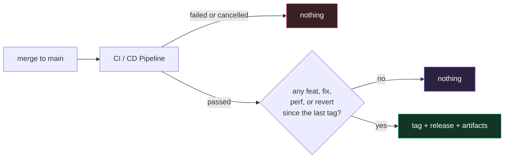

# Releases

Releases are not a task anyone performs. Merge to `main`, and if the commits since the last tag changed behavior and CI passed, a release exists a few minutes later with notes and artifacts attached.

The reasoning, the alternatives, and what this costs are in [ADR-0010](decisions/0010-releases-derived-from-commit-history.md). This page is the operational version: what happens, how to predict it, and what to do when it goes wrong.

## Table of contents

- [What triggers a release](#what-triggers-a-release)
- [How the version is chosen](#how-the-version-is-chosen)
- [Previewing a release before you merge](#previewing-a-release-before-you-merge)
- [What each release contains](#what-each-release-contains)
- [Container image tags](#container-image-tags)
- [Verifying a release](#verifying-a-release)
- [When something goes wrong](#when-something-goes-wrong)

## What triggers a release



Both gates matter:

- **CI must have passed.** `.github/workflows/release.yml` runs on `workflow_run` after the `CI / CD Pipeline` workflow completes, and does nothing unless its conclusion is `success`. A release therefore cannot exist for a commit whose tests failed.
- **Something must have changed.** A batch of `docs:` and `chore:` commits produces no release, on purpose. A repository that cuts a version for a typo fix trains people to ignore its releases.

Nothing else releases. There is no schedule, no manual step, and no button you are expected to remember.

## How the version is chosen

From the conventional-commit types this repository already enforces:

| In a commit | Bump | Example |
| --- | --- | --- |
| `BREAKING CHANGE:` footer, or `!` after the type/scope | **major** | `feat(api)!: drop the legacy field` → `2.0.0` |
| `feat:` | **minor** | `feat(web): add a shortcut` → `1.3.0` |
| `fix:`, `perf:`, `revert:` | **patch** | `fix(api): correct a header` → `1.2.1` |
| `docs:`, `chore:`, `ci:`, `style:`, `test:`, `build:`, `refactor:` | none | no release |

The highest bump present wins, regardless of order — a `fix:` merged after a `feat:` still produces a minor, not a patch.

Commits that do not parse as conventional commits are summarised under **Other** in the notes rather than failing the release. The commit-message hook rejects those at authoring time, so this only matters for history that predates it or something merged with `--no-verify`.

## Previewing a release before you merge

Run this on your branch, any time:

```bash
make release-plan          # or: npm run release:plan
```

```text
  Previous release: v1.1.0
  Commits since:    6 (2 releasable)
  Bump:             minor
  Next release:     v1.2.0

### ✨ Features
- **api:** count rate limits and touches in an optional redis cache (abc1234)
…
```

This is the same script CI runs (`scripts/next-version.mjs`), with no network access and no dependencies, so what it prints is what will happen. `make release-notes` prints just the notes body.

Use it before merging anything you are unsure about — it is the fastest way to notice that a `feat:` you meant as a `chore:` is about to cut a minor version.

You can also run the workflow manually from the Actions tab. It defaults to **dry-run**, which computes the plan and builds every artifact without creating a tag or a release.

## What each release contains

| Artifact | What it is for |
| --- | --- |
| `threadline-openapi-v<version>.json` | The API contract at that version. Generated, gitignored in the repository, so a release is the only place it is pinned to something citable. |
| `threadline-api-reference-v<version>.tar.gz` | The TypeDoc symbol reference, browsable offline. |
| `threadline-kubernetes-production-v<version>.yaml` | The production overlay, rendered, with images already pointed at this release. Appliable as-is rather than a template to edit. |
| `threadline-sbom-v<version>.cdx.json` | CycloneDX SBOM of the full dependency tree, for scanners and audits. |
| `checksums.txt` | SHA-256 of every file above. |

Every artifact also carries a [build provenance attestation](https://docs.github.com/actions/security-guides/using-artifact-attestations), so a consumer can verify it was produced by this workflow from this commit rather than uploaded by hand.

## Container image tags

The pipeline already pushes `ghcr.io/<owner>/threadline-{web,api,realtime}:<sha>` for every commit on `main`. A release adds version tags to **those exact images** — `imagetools create` copies the manifest rather than rebuilding, so the image behind a version tag is byte-identical to the one CI tested.

| Tag | Moves? | Use it when |
| --- | --- | --- |
| `1.2.0` | never | You want a specific, reproducible version. This is what production should pin. |
| `1.2` | on each patch | You want fixes but not features. |
| `1` | on each minor | You want everything short of a breaking change. |
| `latest` | every push to `main` | Local experiments only — it is not a release tag and can be ahead of every version above. |
| `<sha>` | never | Bisecting, or correlating an image with an exact commit. |

## Verifying a release

```bash
# Artifacts match what the release says they are
sha256sum -c checksums.txt

# The artifact really came from this repository's release workflow
gh attestation verify threadline-openapi-v1.2.0.json --repo hoangsonww/Threadline-RealTime-Collab

# The image behind a version tag is the one CI tested
docker buildx imagetools inspect ghcr.io/hoangsonww/threadline-api:1.2.0
```

## When something goes wrong

**A release did not appear after merging.** Check, in order: did the `CI / CD Pipeline` run conclude `success`; and does `make release-plan` on `main` report a bump? If the plan says `none`, the merge contained no `feat`/`fix`/`perf`/`revert` — that is the system working.

**The version is wrong.** It was computed from the commit types on `main`. Fixing it means the next release, not this one: releases are never rewritten, because a moved tag silently changes what a version means for anyone who already pulled it.

**The workflow failed after tagging.** The publish job **refuses to move an existing tag** and fails loudly rather than overwriting, so re-running a partially-completed release will not silently clobber it. Recovery is deliberate:

```bash
gh release delete v1.2.0 --cleanup-tag --yes
```

Then re-run the workflow from the Actions tab. Do this only if nobody has pulled the release.

**A release went out that should not have.** Delete it as above and cut a `revert:` commit; the revert itself earns a patch release, which is the honest record. Do not re-point the tag.
