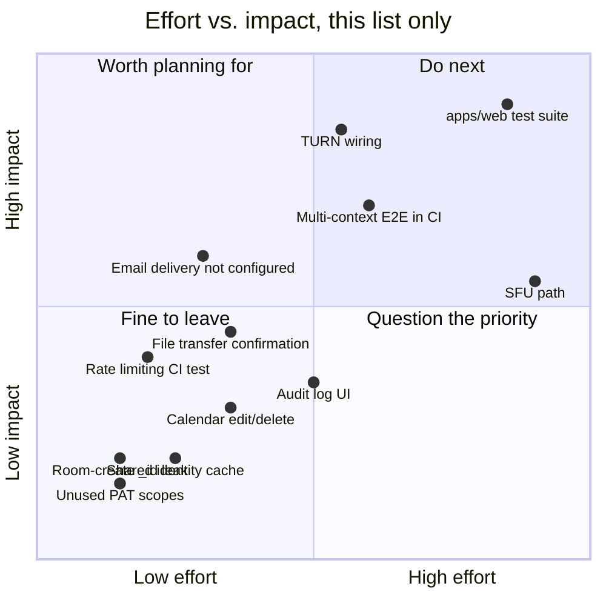

# Roadmap / Known Gaps

Every item here was found by actually exercising the running system — live registration flows, real two-session WebRTC tests, reading the actual route/policy code — not speculative feature ideas. Each links to the doc where it's explained in full. This is an honest gap list, not a backlog promise.

Placement is a judgment call, not a formula — TURN and the `apps/web` test suite land in "worth planning for" specifically because they're the two gaps most likely to surface as a real user complaint (calls that don't connect off a friendly network; a UI regression that ships unnoticed) rather than something only a code reader would ever find.

## Table of contents

- [Gap list](#gap-list)
- [Explicitly out of scope (decided, not forgotten)](#explicitly-out-of-scope-decided-not-forgotten)

## Gap list

| Area          | Gap                                                        | Why it's not done                                                                                                                                                                                                                                                                                                                                                                                                                                                                     | Detail                                                                     |
| ------------- | ---------------------------------------------------------- | ------------------------------------------------------------------------------------------------------------------------------------------------------------------------------------------------------------------------------------------------------------------------------------------------------------------------------------------------------------------------------------------------------------------------------------------------------------------------------------- | -------------------------------------------------------------------------- |
| WebRTC        | TURN requires operator credentials                         | The API and `PeerMesh` now support short-lived Cloudflare TURN credentials. Deployments that omit `TURN_KEY_ID` and `TURN_KEY_API_TOKEN` intentionally fall back to STUN only and therefore cannot traverse every symmetric NAT or locked-down corporate network.                                                                                                                                                         | [`realtime.md`](realtime.md#known-limitations)                             |
| WebRTC        | Full mesh only, no SFU path                                | Fine at small-room scale (the product's actual target); would need real infrastructure work (a media server, per-participant bandwidth adaptation) to support larger broadcast-style rooms.                                                                                                                                                                                                                                                                                           | [`architecture.md`](architecture.md#why-its-split-this-way)                |
| File transfer | No progress during a transfer                               | `uploadFiles()` does report the outcome — a sent file moves to "Sent to N connected peers" or "No peer was ready — try again" once `sendFile` resolves. What is still missing is anything _during_ a large transfer: there is no percentage, no per-peer breakdown, and no way to tell a slow transfer from a stalled one. | [`realtime.md`](realtime.md#screen-sharing) |
| Testing       | No automated suite for `apps/web`                          | Every UI fix and feature this session (the WebRTC mesh initiator bug, the room-membership UI, the screen-share state machine) was verified through live manual testing, not a regression suite. This is the single largest testing gap in the repo.                                                                                                                                                                                                                                   | [`testing.md`](testing.md#everything-the-automated-suites-dont-cover)      |
| Testing       | No multi-browser-context E2E wired into CI                 | Two genuinely independent browser contexts (separate cookie jars, separate real registered users) has been done and _did_ catch real bugs — see [`testing.md`](testing.md#everything-the-automated-suites-dont-cover) — but only by hand, never as an automated Playwright suite CI runs on every PR.                                                                                                                                                                                 | [`testing.md`](testing.md#everything-the-automated-suites-dont-cover)      |
| API surface   | `messages:*` / `artifacts:*` scopes are defined but unused | Selectable when creating a PAT; no route checks them yet, because the REST endpoints they'd gate (chat/artifact access outside the Durable Object) don't exist — live chat only flows through the WebSocket today.                                                                                                                                                                                                                                                                    | [`api.md`](api.md#scopes)                                                  |
| API surface   | `POST /v1/orgs/:orgId/rooms` leaks Mongo's internal `_id`  | The Mongo driver mutates the object passed to `insertOne()` by adding its own `_id`, and this endpoint's response is built by spreading that same object back — the exact pattern already found and fixed for organization responses (see [`security.md`](security.md#workspace-invite-codes-and-role-changes)), just not yet applied here since this route was outside that change's scope. Low severity — an internal database identifier, not a credential — but real and unfixed. | [`security.md`](security.md#workspace-invite-codes-and-role-changes)       |
| Frontend      | No shared identity cache                                   | `WorkspaceSidebar`, `WorkspaceTopbar`, and the page body each independently call `GET /v1/auth/me` on the same page load. Works, just redundant — a shared context/cache would cut that to one call.                                                                                                                                                                                                                                                                                  | [`frontend.md`](frontend.md#shell-composition)                             |
| Operability   | Audit log has no UI                                        | Every sensitive mutation writes an `AuditLog` row (`auth.login`, `room.create`, `org.member_add`, …), but nothing currently reads it back for an end user or admin. Written for future incident-response tooling.                                                                                                                                                                                                                                                                     | [`security.md`](security.md#audit-log)                                     |
| Operability   | Email delivery isn't configured on the live deployment     | `AUTH_DELIVERY_WEBHOOK` is unset there, so no email sends at all; that requires a real transactional-email provider account, a separate integration decision. This no longer blocks account recovery — that runs on [recovery codes](security.md#recovery-codes) instead — so what remains unavailable is only the mailed reset *link*, which is a convenience rather than the sole route back in. | [`security.md`](security.md#recovery-codes) |
| Frontend      | Calendar events are create-only                            | Both the API and the UI support creating a scheduled session; neither has an edit or delete path once one exists.                                                                                                                                                                                                                                                                                                                                                                     | [`api.md`](api.md#organizations--rooms)                                    |

## Explicitly out of scope (decided, not forgotten)

- **Redis for presence, fan-out, or anything in `apps/realtime`.** Settled twice, in opposite directions, for good reasons: [ADR-0001](decisions/0001-durable-objects-for-realtime.md) rejected it for presence because a room needs one authoritative owner and a cache does not provide one, and [ADR-0009](decisions/0009-redis-for-ephemeral-counters.md) accepted it in `apps/api` for ephemeral counters, which have no owner to elect. The realtime plane additionally cannot use it — workerd has no Node TCP socket.
- **Server-side live streaming (HLS/RTMP-style broadcast to many viewers).** Evaluated and deliberately not pursued: it would need infrastructure (transcoding, either Cloudflare Stream or a self-hosted pipeline) that doesn't fit the project's current Vercel + Cloudflare Durable Objects + MongoDB Atlas constraints without adding a paid, non-free-tier dependency. The room's WebRTC mesh remains the only live-video path.
