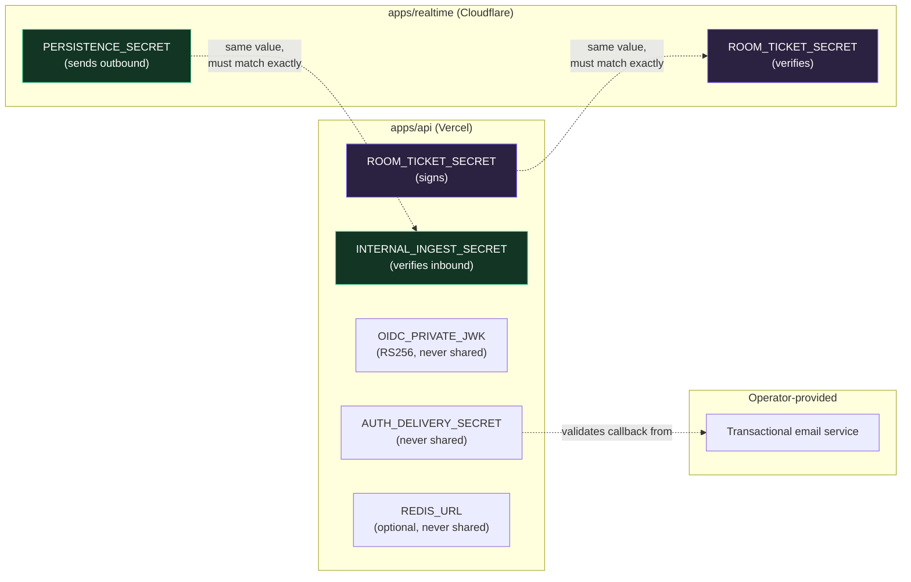
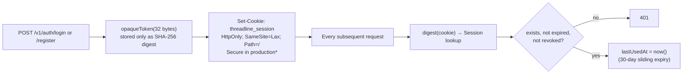
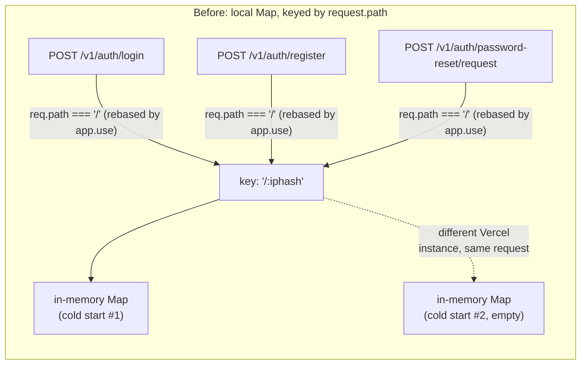
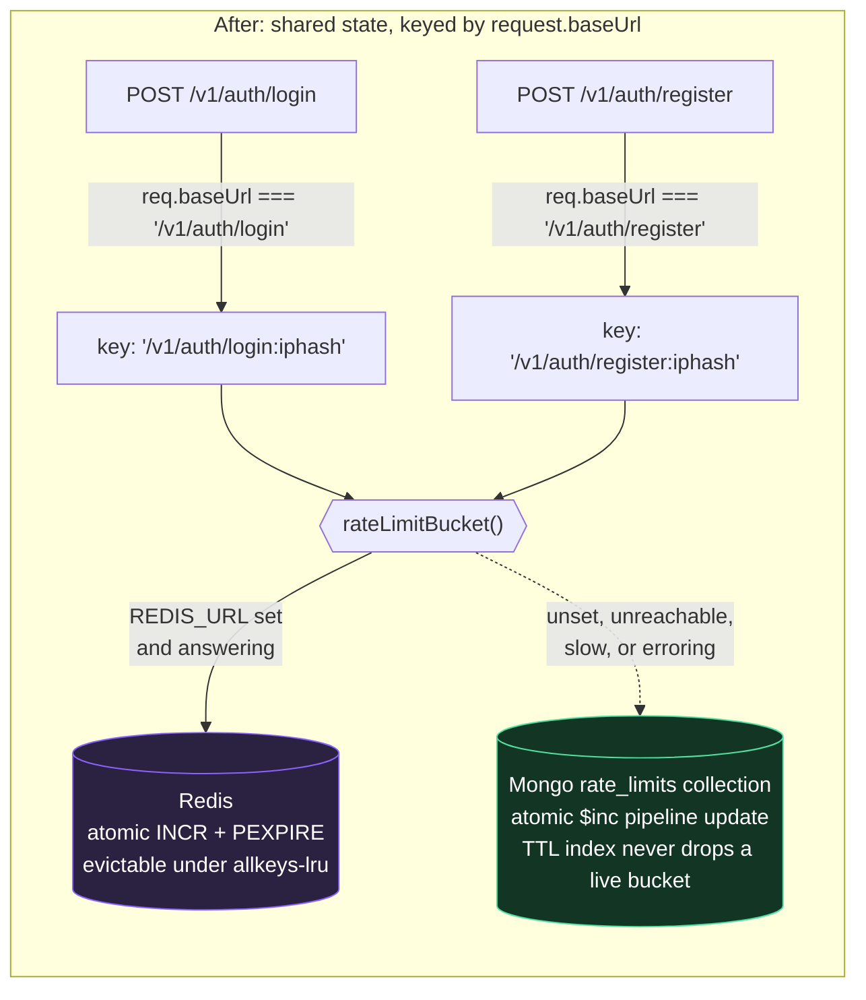
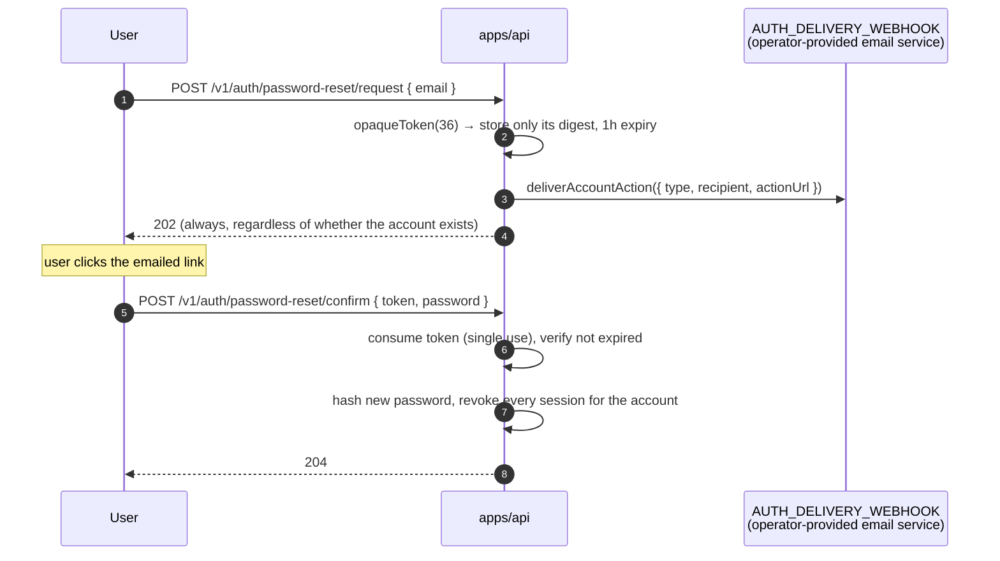

# Security Model

This is the trust model in one sentence: **every plane re-verifies authorization independently, secrets are single-purpose and never reused across planes, and nothing durable is written on the strength of a shared secret alone.** The sections below are the detail behind that sentence.

## Table of contents

- [Secrets inventory](#secrets-inventory)
- [Password & credential storage](#password--credential-storage)
- [Session cookies](#session-cookies)
- [Rate limits](#rate-limits)
- [Workspace invite codes and role changes](#workspace-invite-codes-and-role-changes)
- [Personal access tokens](#personal-access-tokens)
- [Room tickets](#room-tickets)
- [Realtime → API ingest secret](#realtime--api-ingest-secret)
- [First-party OIDC](#first-party-oidc)
- [Password reset tokens](#password-reset-tokens)
- [Recovery codes](#recovery-codes)
- [Boot-time validation](#boot-time-validation)
- [Audit log](#audit-log)
- [Content Security Policy](#content-security-policy)
- [Error monitoring (Sentry)](#error-monitoring-sentry)
- [Reporting a vulnerability](#reporting-a-vulnerability)

## Secrets inventory

Every secret below is single-purpose — none of them can be substituted for another, and a leak of one does not compromise what the others protect. The two **shared** secrets are the only ones held by more than one plane, and each authorizes exactly one narrow thing:

`REDIS_URL` is optional — unset, the API behaves exactly as it did before [ADR-0009](decisions/0009-redis-for-ephemeral-counters.md) — and it embeds its own password, so it is a secret in the same sense as the rest. It authorizes exactly one narrow thing: the ephemeral counters described under [Rate limits](#rate-limits). It cannot be substituted for any other secret, and what it protects is deliberately worthless on its own — rate-limit windows keyed by a **hashed** IP (`sha256(request.ip)`, truncated; the raw address never reaches Redis) and opaque "was this credential used in the last 60 seconds" flags. No session token, no password hash, no room ticket, and nothing that grants access to anything ever goes into it. A leak lets someone reset their own rate-limit counters; it does not authenticate them as anyone. `apps/api/src/cache.ts` never logs the URL, including on the connection-failure path where it would be most tempting.

Both shared secrets are **independently configured on two different platforms**, with nothing in the code enforcing they match — a value entered wrong on either side fails closed (every ticket rejected, or every ingest webhook rejected) rather than open, but it also fails _silently_: nothing crashes, the symptom is just "realtime doesn't work" or "events never persist," with no error visible unless someone specifically diagnoses it. This exact class of mismatch happened for real, twice, in this project's own deployment — see [`operations.md`](operations.md#incidents) for both.

## Password & credential storage

- Passwords are hashed with **Argon2id** (`memoryCost: 19456, timeCost: 2, parallelism: 1` — `apps/api/src/security.ts`), never stored or logged in plaintext.
- `Credential` is a table separate from `User`, so a user object can be returned/logged without any risk of leaking a hash alongside it.
- Password reset always responds `202 Accepted` whether or not the email exists — the API never reveals account existence through this endpoint.

## Session cookies

\* `Secure` is skipped only for an origin that is both explicitly listed in `ADDITIONAL_WEB_ORIGINS` **and** a loopback HTTP origin (`http://localhost`, `127.0.0.1`, `[::1]`) — the one carve-out for testing a locally-running client against an otherwise production-configured API. Every other origin gets a `Secure` cookie whenever `secureCookies` is on.

**CSRF defense** is a lightweight but effective origin check, not a token: any state-changing request (not `GET`/`HEAD`/`OPTIONS`) that carries the session cookie _and_ an `Origin` header not in the allow-list is rejected with `403 csrf_rejected` before it reaches any route handler. Combined with `SameSite=Lax` (which already stops the cookie from attaching to most cross-site requests), this closes the specific gap Lax alone doesn't cover — cross-site requests that don't count as a top-level navigation.

**Revocation is immediate and explicit.** Changing a password revokes every _other_ active session in the same request; completing a password reset revokes _all_ sessions for that account.

## Rate limits

| Endpoint                                   | Limit       | Keyed by                       |
| ------------------------------------------ | ----------- | ------------------------------ |
| `POST /v1/auth/login`                      | 12 / 15 min | `baseUrl + sha256(request.ip)` |
| `POST /v1/auth/register`                   | 8 / hour    | same                           |
| `POST /v1/auth/password-reset/request`     | 5 / hour    | same                           |
| `POST /v1/auth/password-reset/redeem`      | 10 / 15 min | same                           |
| `POST /v1/join`                            | 10 / 15 min | same                           |

`POST /v1/join` checks a caller-supplied secret (an organization's invite code) against every organization in the system — the same shape of risk as a password check, and it's rate limited at the same tier as login rather than left unlimited, to keep guessing codes at scale (across however many organizations exist) from being free.

IPs are hashed (never stored raw) even in the rate-limit bucket key. Counters are stored via `Repository.incrementRateLimit` (an atomic, upsert-based Mongo aggregation-pipeline update in production, a plain `Map` in `MemoryRepository`) rather than process-local memory, so the limit is genuinely shared across every serverless instance handling that IP — a naive in-process `Map` gets a fresh, empty bucket per cold start on Vercel, which made the limit trivially bypassable (and, worse, inconsistently enforced for legitimate users) before this was fixed. The key uses `request.baseUrl`, not `request.path` — Express rebases `req.path` to be relative to an `app.use` mount point, so an exact-path mount like `app.use("/v1/auth/login", ...)` sees `req.path === "/"` for every request regardless of which of the four routes matched; `request.baseUrl` is the literal mounted path and is what actually distinguishes one rate-limited endpoint's bucket from another's. Getting this wrong doesn't error — it silently merges all four endpoints' budgets into one shared counter. See [`containers-and-kubernetes.md`](containers-and-kubernetes.md) for how the API is scaled in practice.

**Before, both bugs at once** — an in-memory counter that resets per serverless instance, keyed by a value that collides across all four endpoints:

Every rate-limited endpoint shared one bucket keyed only by IP, and that one bucket's count depended on which of many concurrent serverless instances happened to handle the request — hammering `/login` measurably ate into `/register`'s budget, and the _effective_ limit for a determined caller was closer to "however many cold instances Vercel spins up" than 12 or 8.

**After:**

Both stores are shared across every serverless instance, so the property this diagram exists to show is unchanged. The dashed arrow is the important one: it degrades toward the **stricter** store, never toward an unlimited endpoint.

Four independent, correctly-isolated buckets, consistent no matter which of Vercel's serverless instances happens to serve a given request. See [`operations.md`](operations.md#incident-rate-limiter-shared-one-bucket-across-every-endpoint) for how this was actually found.

### Where the counters actually live

When `REDIS_URL` is configured, `rateLimitBucket()` in `application.ts` counts in Redis (an atomic `INCR` + `PEXPIRE` Lua script — see [ADR-0009](decisions/0009-redis-for-ephemeral-counters.md)) instead of MongoDB. Both stores are shared across every instance, so the property that matters above is unchanged. Three things about that are worth stating plainly rather than leaving to be discovered:

- **Redis is weaker than MongoDB here, on purpose.** A Redis instance under memory pressure with `maxmemory-policy allkeys-lru` can evict a *live* counter mid-window, which hands the affected caller a fresh budget. MongoDB's TTL index cannot do that — it only deletes buckets whose window has already closed. The exposure is bounded to one window per evicted key, and it is the price of not writing to the database on the unauthenticated surface. Provision Redis with enough headroom that eviction is not routine, and prefer an instance Threadline does not share with another application: a shared `allkeys-lru` budget means someone else's traffic can evict these counters.
- **A Redis outage mid-window also resets counters**, because MongoDB has no record of the attempts Redis counted. Same bound, same reasoning. The alternative — writing to both — would remove the entire benefit.
- **There is no path that skips the count.** If Redis is unset, unreachable, disconnected, or slower than 250ms, `rateLimitBucket()` falls back to `Repository.incrementRateLimit` and the limit is enforced by MongoDB. The fallback direction is toward the *stricter* store, never toward an unlimited endpoint, and `app.test.ts` asserts a 429 still happens with a cache that throws on every call.

`/health` reports `cache: "ready" | "unavailable" | "disabled"` so which of the two is currently enforcing the limit is observable without reading logs.

### Session and token bookkeeping

`lastUsedAt` on a session or personal access token used to be written to MongoDB on every authenticated request. With a cache configured it is written at most once per 60 seconds per credential, gated by `Cache.claim`.

This is a **write** optimization only, and the distinction is the security-relevant part: the session or token row is still read from the repository on every single request, and still checked for `revokedAt` and expiry there. Nothing about authentication or authorization is cached, so revocation remains immediate — a revoked session's very next request is a 401 even while its touch-claim is still live. `app.test.ts` asserts exactly that, because it is the assumption the whole optimization rests on. If the cache is unreachable, `shouldRecordUse()` returns `true` and the write happens unconditionally, which is the pre-existing behaviour.

## Workspace invite codes and role changes

An organization's `joinCode` is a genuine secret, treated the same way as a password or token elsewhere in this document — not a value that happens to be inconvenient to guess.

- **Never returned by any general-purpose response.** `GET /v1/auth/me` and `GET /v1/orgs` both serialize organizations through a `publicOrganization()` whitelist that simply doesn't include `joinCode` as a field — it isn't blacklisted out of a broader object, it was never put in. The only endpoint that ever returns it is `GET /v1/orgs/:orgId/invite`.
- **Gated by `canInviteToOrganization(membership, organization)`** (`apps/api/src/policy.ts`): an owner or admin can always view or regenerate it; a plain member can only when the organization has explicitly opted in via `organization.allowMemberInvites`. That flag defaults to `false` on every new workspace.
- **No organization-existence oracle.** `GET /v1/orgs/:orgId/invite` and `POST /v1/orgs/:orgId/invite/regenerate` check the caller's membership row _before_ looking up the organization at all — a caller with no membership gets `403` whether `orgId` belongs to a real organization they're not part of or doesn't exist. This mirrors the existing convention set by `GET /v1/orgs/:orgId/members`, which has always worked this way. An earlier version of these two new endpoints checked organization existence first (`404` if absent) and permission second, which meant a `403` vs `404` response let any authenticated caller enumerate which organization IDs were real — caught before merge, not in production.
- **Regenerating invalidates the previous code immediately** — the field is simply overwritten, so a leaked code stops working the moment someone with permission notices and regenerates.
- **Role changes are re-derived, never cached.** Only an organization's `owner` may grant the `admin` role; an admin (or a member with the delegated `canManageMembers` attribute) can manage members and change roles between `admin`/`member`, but the API independently re-checks `caller?.role !== "owner"` on every such request rather than trusting anything the client asserts. An admin can self-demote to `member` only if another admin already exists in the organization (`400 last_admin` otherwise) — but this guard applies only when the caller is changing their _own_ role; an owner may demote any admin, including the last one, since the owner remains a fallback administrator regardless of how many admins exist.

**A broader pattern worth naming**, since it's caused a real bug here and could recur elsewhere: constructing a response by _excluding_ specific fields from an object that came straight out of a driver call (`const { joinCode: _joinCode, ...rest } = org`) is fragile, because it silently includes anything else that object happens to carry — including fields the application never intended to expose. The MongoDB driver's `insertOne()` mutates the object passed to it by adding its own `_id` (an `ObjectId`), which was leaking into `POST /v1/orgs` and `POST /v1/join` responses through exactly this pattern before it was replaced with an explicit `publicOrganization()` field whitelist. That fix only covers the organization-serialization path touched by this change — the pre-existing, unrelated `POST /v1/orgs/:orgId/rooms` handler builds its response the same blacklist-by-destructure way and has the identical `_id` leak today. It's low severity (an internal database identifier, not a credential or personal data) but is a known, open gap — see [`roadmap.md`](roadmap.md).

## Personal access tokens

- Format: `tl_pat_<32 random bytes, base64url>`. Only the prefix (`tokenPrefix`, first 15 characters) is stored for display in Settings — the full secret is shown exactly once at creation and never again, and only its SHA-256 digest is persisted.
- Scoped: every PAT carries an explicit `scopes` array chosen at creation (see [`api.md`](api.md#scopes)); a route checks the required scope against that array (or `admin:*`) on every call.
- **Session-only routes reject PATs outright**, even one with `admin:*`: creating/listing/revoking PATs, listing browser sessions, listing OIDC clients. A PAT can operate on rooms and organizations; it can never mint more credentials or enumerate someone's logged-in browsers.

## Room tickets

A room ticket is a purpose-built, short-lived credential — not a general bearer token:

| Property    | Value                                                                                                           |
| ----------- | --------------------------------------------------------------------------------------------------------------- |
| Algorithm   | HS256, signed with `ROOM_TICKET_SECRET`                                                                         |
| Lifetime    | 120 seconds                                                                                                     |
| Claims      | `sub` (userId), `room_id`, `role` (effective role at issue time), `username`, `display_name`                    |
| Issued by   | `POST /v1/rooms/:roomId/ticket` (session-only; requires `canRoom(..., "join_live")`)                            |
| Verified by | `RoomDurableObject.verifyTicket()`, checking signature _and_ that `room_id` matches the room being connected to |
| Scope       | Authorizes exactly one WebSocket connection to exactly one room, for the identity encoded inside it             |

`ROOM_TICKET_SECRET` is shared between `apps/api` (signs) and `apps/realtime` (verifies) — it's the one secret both planes hold, and it authorizes nothing beyond "open this one WebSocket."

## Realtime → API ingest secret

`apps/realtime` forwards durable events to `POST /v1/internal/room-events` with a shared secret in `X-Threadline-Ingest` (API env: `INTERNAL_INGEST_SECRET`; Worker env: `PERSISTENCE_SECRET` — same value, different names on each side). This secret proves the _request_ came from the trusted Worker. It does **not** by itself authorize the _content_: the API validates an explicit event allowlist and payload schema, requires `join_live` for `participant.joined`/`participant.left`, and requires `write` for chat/editor/screen-share mutations. Presence payload identity must match `event.from`. A stable `deliveryId` is reused as the event ID, and a unique database index makes retries idempotent.

## First-party OIDC

- Access tokens: RS256, 15-minute expiry, audience-bound to one client, signed with a stable RSA key (`OIDC_PRIVATE_JWK`, generated once via `npm run generate:oidc-key --workspace=@threadline/api` and never rotated casually — rotating it invalidates every token issued under the old key).
- Refresh tokens: 30-day expiry, rotated on every use (presenting one invalidates it; only the newly-returned token works), stored as a hash only.
- Authorization codes: 5-minute expiry, single-use, bound to a PKCE `code_challenge` verified with SHA-256 at exchange time. No implicit grant, no password grant — Authorization Code + PKCE only.
- Full flow diagram: [`api.md`](api.md#oidc-authorization-code-with-pkce-end-to-end).

## Password reset tokens

**Step 3 is conditional, and this matters.** `deliverAccountAction` is only constructed when `AUTH_DELIVERY_WEBHOOK` is
set. It is **not** part of boot-time validation: the API only refuses to start when the webhook is set *without*
`AUTH_DELIVERY_SECRET`, never when both are absent. So a deployment with neither still answers `202` at step 4 and simply
never performs step 3 — the token is written and expires unused an hour later. The `202` is required (returning anything
else would disclose whether an account exists), which is precisely what makes the failure silent. Configure both
variables before relying on account recovery.

There is no email-verification equivalent. It had the identical shape and the identical silent failure, so rather than
leave an endpoint reporting success for mail it never sent, the flow was removed — see [`api.md`](api.md#email-delivery).
`Credential.emailVerifiedAt` survives only as the source of the OIDC `email_verified` claim.

## Recovery codes

Because the mailed path cannot be relied on, every account is issued eight single-use recovery codes at registration.
They are the reason a Threadline deployment can lose a password without losing the account.

| Property         | Choice                                                                                            |
| ---------------- | ------------------------------------------------------------------------------------------------- |
| Entropy          | 12 symbols from a 31-character unambiguous alphabet — ~59 bits, well beyond guessing               |
| Storage          | SHA-256 of the normalized code. The plaintext exists only in the response that created it          |
| Redemption       | `findOneAndUpdate` matching `usedAt: {$exists: false}` — atomic, so a code cannot be spent twice   |
| Regeneration     | Replaces the whole set; anything printed earlier stops working immediately                        |
| On success       | Password rehashed **and every session revoked** — a reset that leaves the intruder logged in is no reset |
| Failure response | Identical for a wrong code and an unregistered email, so it is not an account-existence oracle      |
| Rate limit       | 10 / 15 min / hashed IP, same bucket shape as a login                                              |

**Why possession, not knowledge.** The obvious no-email design — "enter your email and confirm a few account details" —
is unsafe *in this system specifically*: `publicUser` returns a member's email, username, display name, and creation
date to every other member of their workspace via `GET /v1/orgs/:orgId/members`. A recovery check built on those facts
would let any colleague reset any account, including an owner's, using data the API hands them on request. A recovery
code is a secret no one but the account holder has ever seen.

The residual risk is honest and inherent: **a lost set of codes is a lost account.** There is no side channel to restore
one, which is precisely what makes the codes trustworthy. Regenerating from Settings is the mitigation, and the sign-up
flow gates its continue button behind an explicit acknowledgement rather than letting someone click past it.

## Boot-time validation

`apps/api/src/index.ts` refuses to start in production with an insecure or incomplete configuration. Every secret (`ROOM_TICKET_SECRET`, `INTERNAL_INGEST_SECRET`) must be at least 32 characters; `OIDC_ISSUER` and `WEB_ORIGIN` must be HTTPS; `OIDC_PRIVATE_JWK` and `MONGODB_URI` must be present. There is no "start anyway with defaults" path in production — every one of these has a development-only fallback that's explicitly disabled once `NODE_ENV=production` (Vercel Preview deployments are treated as pre-production for this check, since they still need to exercise Atlas and real secrets).

`REDIS_URL` is the one deliberate exception, and it is not a weakening: the API starts normally whether or not Redis is reachable. `createRedisCache()` never awaits the connection — it returns a cache that reports itself `unavailable` until the socket is ready, so every call falls back to MongoDB in the meantime and the connection is retried in the background. That is the correct direction because Redis holds nothing this service cannot recompute, so letting a cache outage take down authentication would trade a small cost for a total one. It is also not merely a policy choice: `connect()` does not reject on an unreachable server, it retries, so awaiting it would have meant an unreachable Redis blocking the boot indefinitely. The only case that disables the cache outright is a `REDIS_URL` that cannot be parsed, which no amount of retrying would fix.

## Audit log

Every sensitive mutation writes an `AuditLog` row: `auth.register`, `auth.login`, `auth.password_change`, `auth.password_reset_requested`, `auth.password_reset_completed`, `auth.email_verified`, `room.create`, `org.member_add`, `pat.create`, `pat.revoke`, `oidc.authorize`, `calendar.create`. Each entry records the actor, the action, the target type/id, and relevant metadata (never secrets). There is currently no UI surface for reading the audit log back — it's written for future incident-response tooling, not yet exposed to end users.

## Content Security Policy

The Express app applies `helmet`'s defaults to every API response. The documentation pages (`/api-docs`, `/api-docs/redoc`) serve a separately-scoped, stricter CSP (`apps/api/src/api-docs.ts`) that only allow-lists the specific CDN origins Swagger UI/ReDoc need (`cdn.jsdelivr.net`, Google Fonts) — nothing else, and `object-src`/`base-uri` are locked to `'none'`.

## Error monitoring (Sentry)

Both `apps/api` (`@sentry/node`) and `apps/web` (`@sentry/nextjs`) are wired for Sentry, and both are completely inert without `SENTRY_DSN` / `NEXT_PUBLIC_SENTRY_DSN` configured — `Sentry.init()` is simply never called (`apps/api/src/instrument.ts` guards it behind `if (process.env.SENTRY_DSN)`), and every `Sentry.*` call elsewhere no-ops without an active client.

When a DSN _is_ configured, both SDKs run with their stock defaults — `apps/api/src/instrument.ts` and `apps/web`'s `sentry.*.config.ts`/`instrumentation-client.ts` files only set `dsn`, `environment`, and `tracesSampleRate` (20% of transactions in production, 100% in development; error events are not sampled). Nothing here adds a `beforeSend` hook, a custom `integrations` list, or any explicit data-scrubbing beyond what the SDK does on its own — the API's response body is never sent to Sentry, but an exception's own message and stack trace are, verbatim. Concretely: if application code ever threw an error whose message included something sensitive (an email address, a token), that would reach Sentry. The codebase doesn't currently do this deliberately anywhere, but it also isn't independently guarded against — worth knowing before treating "we use Sentry" as a blanket no-PII guarantee. `sendDefaultPii` is not enabled, so the SDK does not automatically attach request IP addresses or user identifiers to events on its own.

Source-map upload for `apps/web` (readable, un-minified stack traces) is a separate, optional, build-time-only step gated behind `SENTRY_ORG`/`SENTRY_AUTH_TOKEN` — skipping it only means stack traces stay minified in Sentry's UI; it never fails a build or affects runtime behavior.

## Reporting a vulnerability

There is no public bug-bounty program for this project. If you find a security issue, open a private report to the repository owner rather than a public issue.
