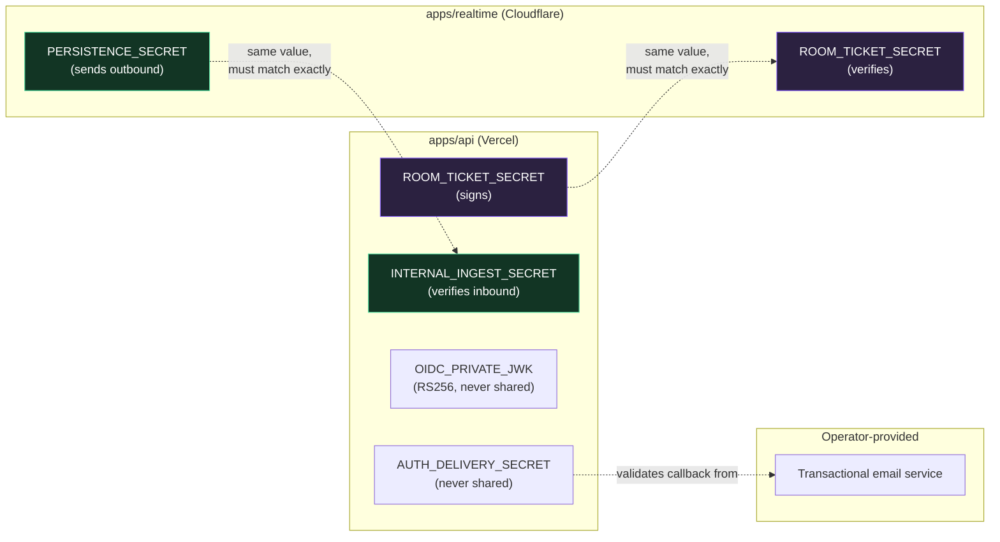
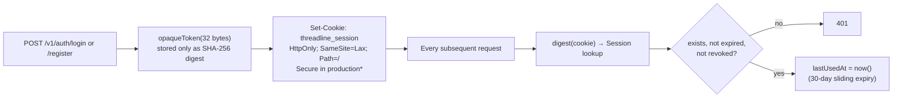
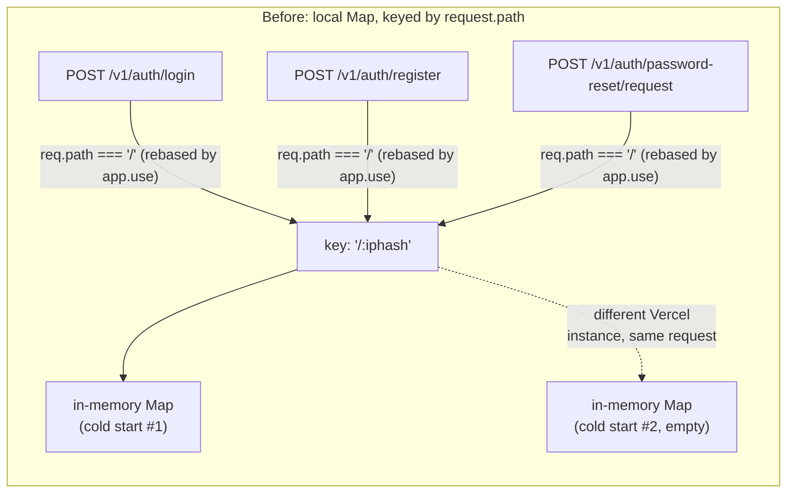
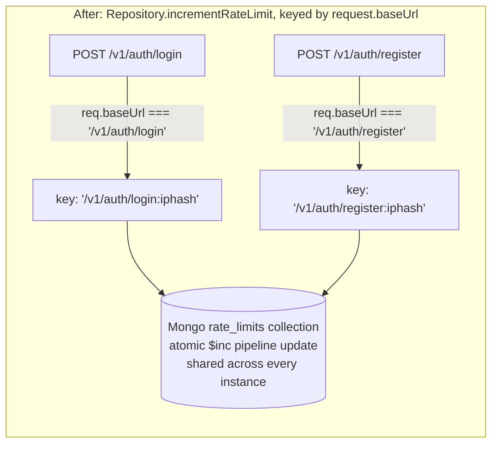
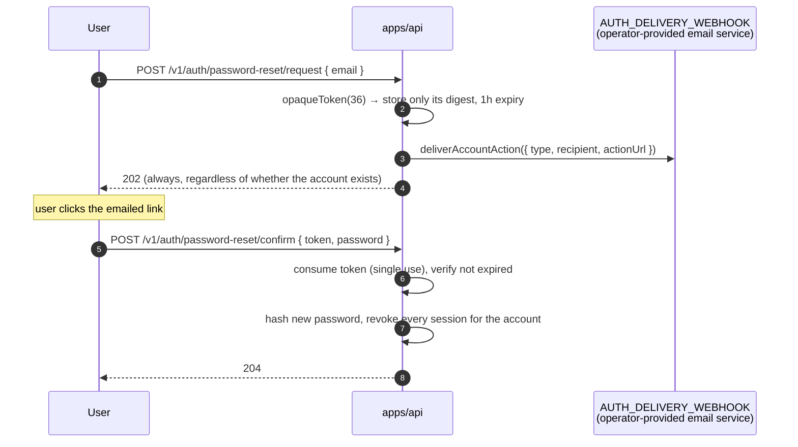

# Security Model

This is the trust model in one sentence: **every plane re-verifies authorization independently, secrets are single-purpose and never reused across planes, and nothing durable is written on the strength of a shared secret alone.** The sections below are the detail behind that sentence.

## Table of contents

- [Secrets inventory](#secrets-inventory)
- [Password & credential storage](#password--credential-storage)
- [Session cookies](#session-cookies)
- [Rate limits](#rate-limits)
- [Personal access tokens](#personal-access-tokens)
- [Room tickets](#room-tickets)
- [Realtime → API ingest secret](#realtime--api-ingest-secret)
- [First-party OIDC](#first-party-oidc)
- [Password reset & email verification tokens](#password-reset--email-verification-tokens)
- [Boot-time validation](#boot-time-validation)
- [Audit log](#audit-log)
- [Content Security Policy](#content-security-policy)
- [Reporting a vulnerability](#reporting-a-vulnerability)

## Secrets inventory

Every secret below is single-purpose — none of them can be substituted for another, and a leak of one does not compromise what the others protect. The two **shared** secrets are the only ones held by more than one plane, and each authorizes exactly one narrow thing:

Both shared secrets are **independently configured on two different platforms**, with nothing in the code enforcing they match — a value entered wrong on either side fails closed (every ticket rejected, or every ingest webhook rejected) rather than open, but it also fails _silently_: nothing crashes, the symptom is just "realtime doesn't work" or "events never persist," with no error visible unless someone specifically diagnoses it. This exact class of mismatch happened for real, twice, in this project's own deployment — see [`operations.md`](operations.md#incidents) for both.

## Password & credential storage

- Passwords are hashed with **Argon2id** (`memoryCost: 19456, timeCost: 2, parallelism: 1` — `apps/api/src/security.ts`), never stored or logged in plaintext.
- `Credential` is a table separate from `User`, so a user object can be returned/logged without any risk of leaking a hash alongside it.
- Password reset always responds `202 Accepted` whether or not the email exists — the API never reveals account existence through this endpoint.

## Session cookies

\* `Secure` is skipped only for an origin that is both explicitly listed in `ADDITIONAL_WEB_ORIGINS` **and** a loopback HTTP origin (`http://localhost`, `127.0.0.1`, `[::1]`) — the one carve-out for testing a locally-running client against an otherwise production-configured API. Every other origin gets a `Secure` cookie whenever `secureCookies` is on.

**CSRF defense** is a lightweight but effective origin check, not a token: any state-changing request (not `GET`/`HEAD`/`OPTIONS`) that carries the session cookie _and_ an `Origin` header not in the allow-list is rejected with `403 csrf_rejected` before it reaches any route handler. Combined with `SameSite=Lax` (which already stops the cookie from attaching to most cross-site requests), this closes the specific gap Lax alone doesn't cover — cross-site requests that don't count as a top-level navigation.

**Revocation is immediate and explicit.** Changing a password revokes every _other_ active session in the same request; completing a password reset revokes _all_ sessions for that account.

## Rate limits

| Endpoint                                   | Limit       | Keyed by                       |
| ------------------------------------------ | ----------- | ------------------------------ |
| `POST /v1/auth/login`                      | 12 / 15 min | `baseUrl + sha256(request.ip)` |
| `POST /v1/auth/register`                   | 8 / hour    | same                           |
| `POST /v1/auth/password-reset/request`     | 5 / hour    | same                           |
| `POST /v1/auth/email-verification/request` | 5 / hour    | same                           |

IPs are hashed (never stored raw) even in the rate-limit bucket key. Counters are stored via `Repository.incrementRateLimit` (an atomic, upsert-based Mongo aggregation-pipeline update in production, a plain `Map` in `MemoryRepository`) rather than process-local memory, so the limit is genuinely shared across every serverless instance handling that IP — a naive in-process `Map` gets a fresh, empty bucket per cold start on Vercel, which made the limit trivially bypassable (and, worse, inconsistently enforced for legitimate users) before this was fixed. The key uses `request.baseUrl`, not `request.path` — Express rebases `req.path` to be relative to an `app.use` mount point, so an exact-path mount like `app.use("/v1/auth/login", ...)` sees `req.path === "/"` for every request regardless of which of the four routes matched; `request.baseUrl` is the literal mounted path and is what actually distinguishes one rate-limited endpoint's bucket from another's. Getting this wrong doesn't error — it silently merges all four endpoints' budgets into one shared counter. See [`containers-and-kubernetes.md`](containers-and-kubernetes.md) for how the API is scaled in practice.

**Before, both bugs at once** — an in-memory counter that resets per serverless instance, keyed by a value that collides across all four endpoints:

Every rate-limited endpoint shared one bucket keyed only by IP, and that one bucket's count depended on which of many concurrent serverless instances happened to handle the request — hammering `/login` measurably ate into `/register`'s budget, and the _effective_ limit for a determined caller was closer to "however many cold instances Vercel spins up" than 12 or 8.

**After:**

Four independent, correctly-isolated buckets, consistent no matter which of Vercel's serverless instances happens to serve a given request. See [`operations.md`](operations.md#incident-rate-limiter-shared-one-bucket-across-every-endpoint) for how this was actually found.

## Personal access tokens

- Format: `tl_pat_<32 random bytes, base64url>`. Only the prefix (`tokenPrefix`, first 15 characters) is stored for display in Settings — the full secret is shown exactly once at creation and never again, and only its SHA-256 digest is persisted.
- Scoped: every PAT carries an explicit `scopes` array chosen at creation (see [`api.md`](api.md#scopes)); a route checks the required scope against that array (or `admin:*`) on every call.
- **Session-only routes reject PATs outright**, even one with `admin:*`: creating/listing/revoking PATs, listing browser sessions, listing OIDC clients. A PAT can operate on rooms and organizations; it can never mint more credentials or enumerate someone's logged-in browsers.

## Room tickets

A room ticket is a purpose-built, short-lived credential — not a general bearer token:

| Property    | Value                                                                                                           |
| ----------- | --------------------------------------------------------------------------------------------------------------- |
| Algorithm   | HS256, signed with `ROOM_TICKET_SECRET`                                                                         |
| Lifetime    | 120 seconds                                                                                                     |
| Claims      | `sub` (userId), `room_id`, `role` (effective role at issue time), `username`, `display_name`                    |
| Issued by   | `POST /v1/rooms/:roomId/ticket` (session-only; requires `canRoom(..., "join_live")`)                            |
| Verified by | `RoomDurableObject.verifyTicket()`, checking signature _and_ that `room_id` matches the room being connected to |
| Scope       | Authorizes exactly one WebSocket connection to exactly one room, for the identity encoded inside it             |

`ROOM_TICKET_SECRET` is shared between `apps/api` (signs) and `apps/realtime` (verifies) — it's the one secret both planes hold, and it authorizes nothing beyond "open this one WebSocket."

## Realtime → API ingest secret

`apps/realtime` forwards durable events to `POST /v1/internal/room-events` with a shared secret in `X-Threadline-Ingest` (API env: `INTERNAL_INGEST_SECRET`; Worker env: `PERSISTENCE_SECRET` — same value, different names on each side). This secret proves the _request_ came from the trusted Worker. It does **not** by itself authorize the _content_ — the API independently re-runs `canRoom(..., "write")` for `event.from` (the acting user embedded in the event) before persisting anything. A forged event naming a user without write access to that room is rejected with `403` even with a valid ingest secret.

## First-party OIDC

- Access tokens: RS256, 15-minute expiry, audience-bound to one client, signed with a stable RSA key (`OIDC_PRIVATE_JWK`, generated once via `npm run generate:oidc-key --workspace=@threadline/api` and never rotated casually — rotating it invalidates every token issued under the old key).
- Refresh tokens: 30-day expiry, rotated on every use (presenting one invalidates it; only the newly-returned token works), stored as a hash only.
- Authorization codes: 5-minute expiry, single-use, bound to a PKCE `code_challenge` verified with SHA-256 at exchange time. No implicit grant, no password grant — Authorization Code + PKCE only.
- Full flow diagram: [`api.md`](api.md#oidc-authorization-code--pkce-end-to-end).

## Password reset & email verification tokens

Email verification follows the identical shape via `/v1/auth/email-verification/request` and `/confirm`, except it doesn't revoke sessions. `AUTH_DELIVERY_WEBHOOK`/`AUTH_DELIVERY_SECRET` are required in production — the API fails fast at boot without them, rather than silently issuing tokens nobody can ever redeem.

## Boot-time validation

`apps/api/src/index.ts` refuses to start in production with an insecure or incomplete configuration. Every secret (`ROOM_TICKET_SECRET`, `INTERNAL_INGEST_SECRET`) must be at least 32 characters; `OIDC_ISSUER` and `WEB_ORIGIN` must be HTTPS; `OIDC_PRIVATE_JWK` and `MONGODB_URI` must be present. There is no "start anyway with defaults" path in production — every one of these has a development-only fallback that's explicitly disabled once `NODE_ENV=production` (Vercel Preview deployments are treated as pre-production for this check, since they still need to exercise Atlas and real secrets).

## Audit log

Every sensitive mutation writes an `AuditLog` row: `auth.register`, `auth.login`, `auth.password_change`, `auth.password_reset_requested`, `auth.password_reset_completed`, `auth.email_verified`, `room.create`, `org.member_add`, `pat.create`, `pat.revoke`, `oidc.authorize`, `calendar.create`. Each entry records the actor, the action, the target type/id, and relevant metadata (never secrets). There is currently no UI surface for reading the audit log back — it's written for future incident-response tooling, not yet exposed to end users.

## Content Security Policy

The Express app applies `helmet`'s defaults to every API response. The documentation pages (`/api-docs`, `/api-docs/redoc`) serve a separately-scoped, stricter CSP (`apps/api/src/api-docs.ts`) that only allow-lists the specific CDN origins Swagger UI/ReDoc need (`cdn.jsdelivr.net`, Google Fonts) — nothing else, and `object-src`/`base-uri` are locked to `'none'`.

## Reporting a vulnerability

There is no public bug-bounty program for this project. If you find a security issue, open a private report to the repository owner rather than a public issue.
