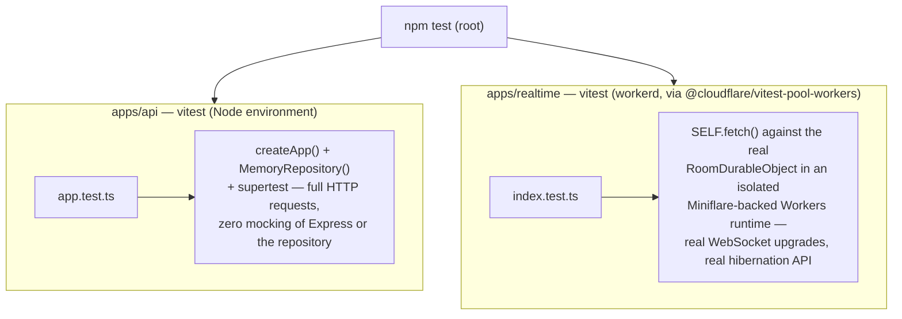
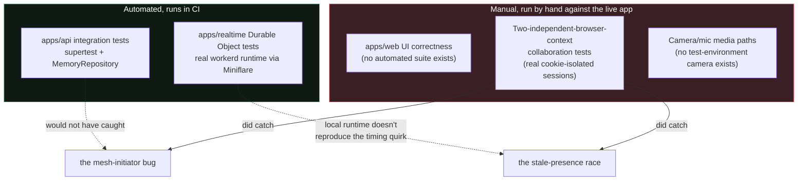
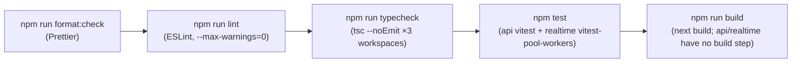

# Testing

Two real test suites exist today, each running against the actual runtime it targets rather than a mock of it — no suite for `apps/web` exists yet (see [Everything the automated suites don't cover](#everything-the-automated-suites-dont-cover)).



## Table of contents

- [API integration tests](#api-integration-tests)
- [Durable Object tests](#durable-object-tests)
- [Everything the automated suites don't cover](#everything-the-automated-suites-dont-cover)
- [Full local check (mirrors what should gate a merge)](#full-local-check-mirrors-what-should-gate-a-merge)

## API integration tests

Run: `npm test` (root) or `npm test --workspace=@threadline/api`.

Every test boots a fresh `createApp()` with a fresh `MemoryRepository()` and drives it with `supertest` — real Express middleware, real Zod validation, real ABAC checks, nothing mocked. That's only possible because `createApp()` is a pure function of its options (see [`architecture.md`](architecture.md#why-its-split-this-way)); the exact same code path runs in production against `MongoRepository`.

What's covered, concretely:

- API docs and the OpenAPI document are served correctly, and the documented path set matches what's actually mounted (a regression guard against `openapi.ts` drifting from `application.ts` — see the incident this caught in this repo's history: an added `emailVerified` field on `/v1/auth/me` that briefly went undocumented).
- CORS: an explicitly configured local origin is allowed, an unknown origin is rejected.
- Session cookies: `Secure` is present for a production-style origin and absent for the one allowed loopback proxy origin (see [`security.md`](security.md#session-cookies)).
- Full happy path: register → session → PAT creation → room creation → PAT-scoped room read/write (read allowed, write correctly `403`'d for a PAT without `rooms:write`) → room ticket issuance → realtime ingest of a `chat` event → durable event readback.
- Full OIDC Authorization Code + PKCE exchange, ending in a working `/oauth/userinfo` call.
- Password reset: token delivery capture, single-use confirmation, old password rejected afterward, new password accepted, and **every session invalidated** by the reset (asserted by checking a previously-valid session cookie now gets `401` from `/v1/auth/me`).
- Email verification: registration starts unverified, `/request` queues a new token, `/confirm` flips `emailVerified` to `true` on `/v1/auth/me`.
- ABAC enforcement end to end for a **restricted, confidential room**: a stranger to the org gets `403` on list/ticket/events; once added to the org as a plain member they still can't see or create the restricted room; once granted explicit room membership as `viewer` they can read and get a ticket but a _forged_ write event for them via the internal ingest endpoint is still rejected with `403`.
- **Rate limiting actually trips a limit and asserts `429`**: 12 failed logins in a row against the same route correctly get blocked on the 13th, and — the actual regression this test guards — a request to a _different_ rate-limited route (`/v1/auth/register`) immediately afterward still succeeds, proving the two routes have independent buckets rather than sharing one (see [`security.md`](security.md#rate-limits) for the bug this would have caught).

## Durable Object tests

Run: `npm test --workspace=@threadline/realtime`.

This uses [`@cloudflare/vitest-pool-workers`](https://developers.cloudflare.com/workers/testing/vitest-integration/) to run tests _inside_ an actual Workers runtime (via Miniflare), not Node — `RoomDurableObject`'s hibernatable WebSocket handlers, `DurableObjectState`, and SQLite storage all behave exactly as they do in production. Pinned to `0.12.21`, the newest release still compatible with this repo's vitest 3.x (later majors require vitest 4 — a larger, separate upgrade not taken on for this alone; see the version's `npm audit` note in the package's own history if you're auditing dependencies).

What's covered:

- A WebSocket upgrade without a valid room ticket is rejected (`401`).
- **Regression test for the broadcast/crash bug** described in [`architecture.md`](architecture.md#durable-event-hand-off): connects one real client over a real WebSocket, closes it, and asserts the room's durable event log still contains `participant.left` — proving `webSocketClose()` reaches its `record()` call even though `broadcast()` is invoked on a socket set that (per a documented Cloudflare hibernation-API quirk) still includes the very socket that just closed.
- Two independently-connected sockets: joining and leaving correctly broadcasts `presence` to the remaining participant, with the leaving participant removed from the payload.

Both are genuine regressions caught by _not_ mocking the runtime: the crash only reproduces against the real hibernatable WebSocket API, and would not have been caught by a test that stubbed `state.getWebSockets()`.

## Everything the automated suites don't cover



- **`apps/web` has no automated test suite.** UI correctness, the WebRTC mesh fix, the room-membership feature, the screen-share state machine, and the whiteboard off-tab-loss fix (see [`frontend.md`](frontend.md#the-whiteboard-had-to-stay-mounted-off-tab)) were all verified through live manual testing against the running app rather than an automated regression suite. This is the single biggest testing gap in the repo — real bugs (the WebRTC mesh initiator issue, the stale-presence-after-disconnect race, the off-tab whiteboard loss) shipped and were only caught by manual multi-session testing, exactly the kind of thing a Playwright-driven two-context suite would catch automatically going forward.
- **That manual testing does use genuinely independent browser contexts, just not in CI.** Two `BrowserContext`s (`browser.newContext()`), each with its own cookie jar, each authenticated as a different real registered user — not two tabs sharing one context's cookies (that shares the session and silently re-authenticates the "wrong" tab; see [`troubleshooting.md`](troubleshooting.md#testing-with-two-different-logged-in-accounts-in-one-browser-breaks-the-wrong-tab)), and not a single client asserting against raw WebSocket JSON. Both real browsers render the actual React UI; this is what caught the presence-race bug — the local Durable Object test suite's simulated hibernation runtime doesn't reproduce that timing quirk (see [Durable Object tests](#durable-object-tests) above), so only two real concurrent sessions against the _deployed_ Worker exposed it. The gap that remains is automation: this technique has never been wired into CI as a Playwright test, only run manually.
- **Camera/microphone media paths are unverified by any automated or sandboxed test.** `getUserMedia` has no real camera device to grant in any available test environment; the actual audio/video (as opposed to signaling and the data channel) has only ever been exercised against real hardware, not in CI.

## Full local check (mirrors what should gate a merge)



Run the whole chain before opening a PR:

```bash
npm run format:check && npm run lint && npm run typecheck && npm test && npm run build
```

`apps/api` and `apps/realtime` don't have a build step of their own — the API runs directly under `tsx`/Node, and the Worker is bundled at `wrangler deploy` time, not before.
