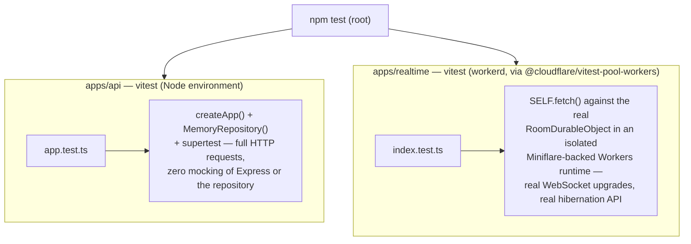
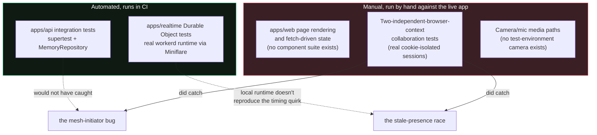
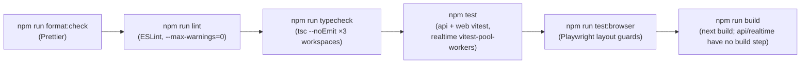

# Testing

Every automated suite here runs against the actual runtime it targets rather than a mock of it. `apps/web` has unit and layout coverage but no component- or page-level suite (see [Everything the automated suites don't cover](#everything-the-automated-suites-dont-cover)).



## Table of contents

- [API integration tests](#api-integration-tests)
- [Durable Object tests](#durable-object-tests)
- [Web unit and layout tests](#web-unit-and-layout-tests)
- [Everything the automated suites don't cover](#everything-the-automated-suites-dont-cover)
- [Full local check (mirrors what should gate a merge)](#full-local-check-mirrors-what-should-gate-a-merge)

## API integration tests

Run: `npm test` (root) or `npm test --workspace=@threadline/api`.

Every test boots a fresh `createApp()` with a fresh `MemoryRepository()` and drives it with `supertest` — real Express middleware, real Zod validation, real ABAC checks, nothing mocked. That's only possible because `createApp()` is a pure function of its options (see [`architecture.md`](architecture.md#why-its-split-this-way)); the exact same code path runs in production against `MongoRepository`.

What's covered, concretely:

- API docs and the OpenAPI document are served correctly, and the documented path set matches what's actually mounted (a regression guard against `openapi.ts` drifting from `application.ts` — see the incident this caught in this repo's history: an added field on `/v1/auth/me` that briefly went undocumented).
- CORS: an explicitly configured local origin is allowed, an unknown origin is rejected.
- Session cookies: `Secure` is present for a production-style origin and absent for the one allowed loopback proxy origin (see [`security.md`](security.md#session-cookies)).
- Full happy path: register → session → PAT creation → room creation → PAT-scoped room read/write (read allowed, write correctly `403`'d for a PAT without `rooms:write`) → room ticket issuance → realtime ingest of a `chat` event → durable event readback.
- Full OIDC Authorization Code + PKCE exchange, ending in a working `/oauth/userinfo` call.
- Password reset: token delivery capture, single-use confirmation, old password rejected afterward, new password accepted, and **every session invalidated** by the reset (asserted by checking a previously-valid session cookie now gets `401` from `/v1/auth/me`).
- **Email verification is absent, and a test asserts it stays absent**: registration issues no verification action, both former endpoints return `404`, and `emailVerified` reads `false`. The flow was removed because nothing could deliver its mail — see [`api.md`](api.md#email-delivery).
- **Profile updates** (`PATCH /v1/auth/me`): partial updates leave the untouched field alone, usernames are case-folded before the uniqueness check, re-submitting your own current username is not a self-collision, and a personal access token holding `admin:*` is still rejected with `401` — no automation scope may rename the account that issued it.
- **Account recovery, end to end**: registration issues eight distinct codes; redeeming one (typed back lower-case with spaces instead of dashes, to prove normalization) resets the password, invalidates the old session, rejects the old password, accepts the new one, and refuses the same code on replay.
- **Recovery is not an account-existence oracle**: a real account with a wrong code and an unregistered email produce byte-identical status and body — asserted by comparing the two responses to each other rather than to a hardcoded string, so the property survives any future rewording.
- **Regeneration invalidates the previous set**, and a code from before rotation stops working while a new one succeeds.
- **Recovery codes are never readable after issuance**: the status endpoint's whole serialized body is searched for each plaintext code and for `codeHash`.
- **Room history is bounded by the store, asserted at the repository rather than over HTTP.** The route fetches
  `limit + 1` to answer `hasMore` and trims, which means an unbounded store still produces a correct-looking response —
  removing the bound from `MemoryRepository` left the HTTP test passing. The guarantee is therefore asserted in
  `repository.test.ts`, where removing it fails three tests. A worthwhile habit: when a handler post-processes what a
  store returns, the handler's test cannot vouch for the store.
- **Username uniqueness is enforced by the repository, not just checked by a route**: `repository.test.ts` covers a duplicate create, a rename onto a taken name (asserting the rejected write did not partially apply), keeping your own name across an unrelated update, and reusing a name freed by its previous holder.
- **Registration derives a free username** when the client sends none, so two people sharing an email local part across domains both get accounts — the collision a client-side "email prefix + suffix" scheme would fail on, with no handle field in the sign-up form to resolve it.
- **The OpenAPI document is checked for internal consistency**: every `$ref` resolves, no schema is declared that nothing references (the usual residue of deleting an operation and forgetting its request body), and every operation has a unique `operationId`.
- ABAC enforcement end to end for a **restricted, confidential room**: a stranger to the org gets `403` on list/ticket/events; once added to the org as a plain member they still can't see or create the restricted room; once granted explicit room membership as `viewer` they can read and get a ticket but a _forged_ write event for them via the internal ingest endpoint is still rejected with `403`.
- **Rate limiting actually trips a limit and asserts `429`**: 12 failed logins in a row against the same route correctly get blocked on the 13th, and — the actual regression this test guards — a request to a _different_ rate-limited route (`/v1/auth/register`) immediately afterward still succeeds, proving the two routes have independent buckets rather than sharing one (see [`security.md`](security.md#rate-limits) for the bug this would have caught). A sibling test does the same for `POST /v1/join`'s own 10/15min bucket.
- **Registration creates no organization**, and every organization-scoped page correctly has nothing to show until the account explicitly creates or joins one (`GET /v1/auth/me` returns `organizations: []`, and an org-scoped room the account has no membership in returns `403`, not a silent empty list).
- **Workspace creation and join-by-code**, end to end: `POST /v1/orgs` never includes `joinCode` in its own response (asserted directly against the response body, not just inferred); `POST /v1/join` accepts a code case-insensitively and with incidental whitespace, rejects an unknown code with `404`, and rejects a code for a workspace the caller already belongs to with `409`.
- **Invite-code permission gating**: a plain member gets `403` from `GET /v1/orgs/:orgId/invite` until an owner/admin flips `allowMemberInvites` on via `PATCH /v1/orgs/:orgId/settings`, at which point the same member can read it; regenerating invalidates the previous code (asserted by then trying to join with the old one and getting `404`); and a caller with no membership at all gets the identical `403` for both a real organization they're not in and a nonexistent `orgId` — the regression test for the organization-existence oracle described in [`security.md`](security.md#workspace-invite-codes-and-role-changes).
- **Role management**: only an organization's owner can grant `admin` (a non-owner admin attempting to do so gets `403`); the owner's own role can never be changed through this endpoint (`400`); and the last-admin self-demotion guard is exercised from both directions — an admin demoting a _peer_ admin succeeds, but that same admin then self-demoting once they're the only one left is rejected (`400 last_admin`), while an _owner-directed_ demotion of that same last admin is allowed, confirming the guard is scoped to self-service demotion only.

## Durable Object tests

Run: `npm test --workspace=@threadline/realtime`.

This uses [`@cloudflare/vitest-pool-workers`](https://developers.cloudflare.com/workers/testing/vitest-integration/) to run tests _inside_ an actual Workers runtime (via Miniflare), not Node — `RoomDurableObject`'s hibernatable WebSocket handlers, `DurableObjectState`, and SQLite storage all behave exactly as they do in production. Pinned to `0.12.21`, the newest release still compatible with this repo's vitest 3.x (later majors require vitest 4 — a larger, separate upgrade not taken on for this alone; see the version's `npm audit` note in the package's own history if you're auditing dependencies).

What's covered:

- A WebSocket upgrade without a valid room ticket is rejected (`401`).
- **Regression test for the broadcast/crash bug** described in [`architecture.md`](architecture.md#durable-event-hand-off): connects one real client over a real WebSocket, closes it, and asserts the room's durable event log still contains `participant.left` — proving `webSocketClose()` reaches its `record()` call even though `broadcast()` is invoked on a socket set that (per a documented Cloudflare hibernation-API quirk) still includes the very socket that just closed.
- Two independently-connected sockets: joining and leaving correctly broadcasts `presence` to the remaining participant, with the leaving participant removed from the payload.

Both are genuine regressions caught by _not_ mocking the runtime: the crash only reproduces against the real hibernatable WebSocket API, and would not have been caught by a test that stubbed `state.getWebSockets()`.

## Web unit and layout tests

Run: `npx vitest run apps/web` for the unit tests, `npm run test:browser` for the layout ones. CI runs both.

`apps/web` has no component or page-level suite (see [the gap below](#everything-the-automated-suites-dont-cover)), but
two narrower kinds of coverage do exist:

**Unit (`vitest`, Node):**

- `lib/peer-mesh.test.ts` — WebRTC mesh negotiation against a fake `RTCPeerConnection`: who initiates, renegotiation
  ordering, ICE candidate buffering, and cleanup on disconnect.
- `lib/call-shortcuts.test.ts` — the call-control shortcut matcher. Asserts the two rules that make the feature safe
  rather than annoying: keystrokes aimed at an `INPUT`, `TEXTAREA`, `SELECT`, or `contenteditable` are ignored (the room
  shows a chat box and two editors next to the call controls, so typing "meeting" must not mute anyone), and modified
  keys are left to the browser so Cmd+S and Ctrl+V keep working. A final test asserts every action the matcher can
  return has a display key, so a binding cannot be added without the tooltip that makes it discoverable, and another
  asserts every catalog entry actually resolves through the matcher — the on-screen shortcut list is rendered from
  that same catalog, so a key that works but is not listed is impossible while it holds.
- `lib/sound.test.ts` — the sound engine against a fake `AudioContext` that records the node graph. Asserts that a muted
  client constructs **no** `AudioContext` at all (not merely a silent one), that every envelope is ramped rather than
  switched (a bare `setValueAtTime` to the peak is what puts a click on the front of a cue), that a burst of one cue
  collapses to a single play while a different cue still gets through, and that a context the browser suspended is
  resumed rather than replaced.
- `lib/workspace-preference.test.ts` — the last-used-workspace memory, including the two ways a browser refuses it:
  a `localStorage` property access that throws outright (site data blocked) and a `setItem` that throws on a full store.
  Neither may propagate, because every org-scoped page calls this during render — restoring the unguarded version fails
  the last two of its four tests.

**Layout (`Playwright`, real Chromium):** the real `globals.css` is loaded against minimal markup, and geometry is
measured rather than screenshotted — no image baselines to churn.

- `components/room-panel-resizer.spec.ts` — the resizer still receives pointer events where it overlaps the call stage.
- `components/control-centering.spec.ts` — measures how far a control's visible contents sit from the centre of its own
  content box and fails past half a pixel. Text is measured through a `Range`, not the element box, because the element
  box is exactly what stays centred when the text inside it does not. This is the check that catches the two bugs it was
  written for: a locked tab's status dot displacing its label, and a fixed-size icon button whose unreset user-agent
  padding shrinks the content box below the icon, at which point grid/flex `center` falls back to `start` per spec.

Worth stating about the second one: it was verified by restoring the old CSS and confirming the test **fails**. A layout
assertion that has never been seen to fail is indistinguishable from one that asserts nothing.

## Everything the automated suites don't cover



- **`apps/web` has no component or page-level test suite.** The unit and layout tests above mount nothing and assert no fetch-driven state. The room-membership feature, the screen-share state machine, and the whiteboard off-tab-loss fix (see [`frontend.md`](frontend.md#the-whiteboard-had-to-stay-mounted-off-tab)) were verified through live manual testing against the running app rather than an automated regression suite. The WebRTC mesh fix is the exception — `lib/peer-mesh.test.ts` does cover it. This is the single biggest testing gap in the repo — real bugs (the WebRTC mesh initiator issue, the stale-presence-after-disconnect race, the off-tab whiteboard loss) shipped and were only caught by manual multi-session testing, exactly the kind of thing a Playwright-driven two-context suite would catch automatically going forward.
- **That manual testing does use genuinely independent browser contexts, just not in CI.** Two `BrowserContext`s (`browser.newContext()`), each with its own cookie jar, each authenticated as a different real registered user — not two tabs sharing one context's cookies (that shares the session and silently re-authenticates the "wrong" tab; see [`troubleshooting.md`](troubleshooting.md#testing-with-two-different-logged-in-accounts-in-one-browser-breaks-the-wrong-tab)), and not a single client asserting against raw WebSocket JSON. Both real browsers render the actual React UI; this is what caught the presence-race bug — the local Durable Object test suite's simulated hibernation runtime doesn't reproduce that timing quirk (see [Durable Object tests](#durable-object-tests) above), so only two real concurrent sessions against the _deployed_ Worker exposed it. The gap that remains is automation: this technique has never been wired into CI as a Playwright test, only run manually.
- **Camera/microphone media paths are unverified by any automated or sandboxed test.** `getUserMedia` has no real camera device to grant in any available test environment; the actual audio/video (as opposed to signaling and the data channel) has only ever been exercised against real hardware, not in CI.
- **A network-delay harness verified the loading-skeleton fix**, using a technique worth naming for reuse: local network to both the dev server and the deployed API is normally fast enough that a "still loading" state never stays on screen long enough to actually look at, which makes "does this page show a skeleton while loading, or does it flash the wrong empty state" hard to verify by just clicking around. The fix was verified by opening a CDP session directly (`page.context().newCDPSession(page)`) and either calling `Network.emulateNetworkConditions` to add latency to every request, or intercepting one specific route (`page.route(...)`) and delaying just that response, then screenshotting at intervals through the artificially-widened loading window. This caught, live, exactly the bug being fixed: pages that initialize a list as an empty array render their "genuinely empty" copy (`No rooms yet`, `No members loaded`) before the first fetch ever resolves, because an empty array and a not-yet-loaded array are indistinguishable to a component that doesn't track loading state separately. Like the two-context technique above, this has never been wired into CI — it's a manual verification technique, not a regression suite.

## Full local check (mirrors what should gate a merge)



Run the whole chain before opening a PR:

```bash
npm run format:check && npm run lint && npm run typecheck && npm test && npm run test:browser && npm run build
```

`apps/api` and `apps/realtime` don't have a build step of their own — the API runs directly under `tsx`/Node, and the Worker is bundled at `wrangler deploy` time, not before.
