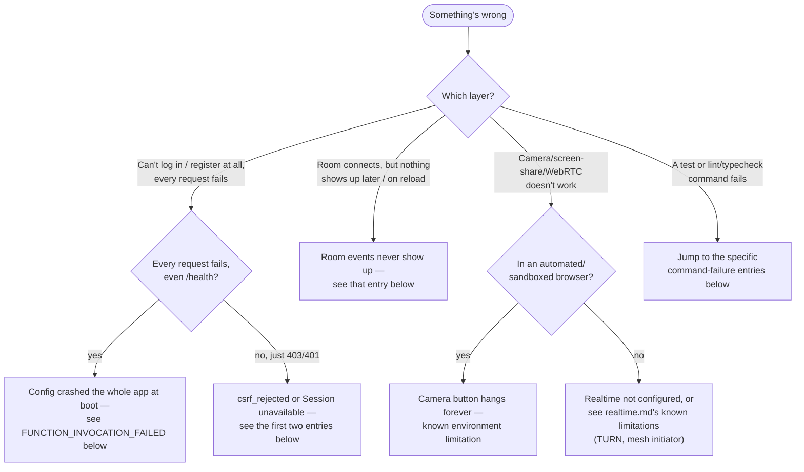

# Troubleshooting

Real problems hit while developing and testing this codebase, not a generic checklist. Each entry names the actual symptom first so it's greppable.

## Table of contents

- [Where to start](#where-to-start)
- ["This browser request did not originate from Threadline" / `csrf_rejected`](#this-browser-request-did-not-originate-from-threadline--csrf_rejected)
- [Every API request fails, even `/health` — `FUNCTION_INVOCATION_FAILED`](#every-api-request-fails-even-health--function_invocation_failed)
- ["Threadline API is not configured. Set NEXT_PUBLIC_API_ORIGIN before opening the workspace." (on a deployed site, not local dev)](#threadline-api-is-not-configured-set-next_public_api_origin-before-opening-the-workspace-on-a-deployed-site-not-local-dev)
- ["Realtime is not configured. Set both NEXT_PUBLIC_API_ORIGIN and NEXT_PUBLIC_REALTIME_ORIGIN."](#realtime-is-not-configured-set-both-next_public_api_origin-and-next_public_realtime_origin)
- [Camera/screen-share button does nothing, forever](#camerascreen-share-button-does-nothing-forever)
- [Sidebar/topbar say "Session unavailable" or the room says "Connection required"](#sidebartopbar-say-session-unavailable-or-the-room-says-connection-required)
- [Switched workspaces, but the URL still has no `?org=` and doesn't seem to update](#switched-workspaces-but-the-url-still-has-no-org-and-doesnt-seem-to-update)
- [Visiting `/onboarding` used to bounce straight back to `/app` — it doesn't anymore](#visiting-onboarding-used-to-bounce-straight-back-to-app--it-doesnt-anymore)
- [Local data (users, rooms, sessions) disappears after editing API code](#local-data-users-rooms-sessions-disappears-after-editing-api-code)
- [Room events (chat, joins, activity feed) never show up, even though the room connects fine](#room-events-chat-joins-activity-feed-never-show-up-even-though-the-room-connects-fine)
- [Testing with two different logged-in accounts in one browser breaks the "wrong" tab](#testing-with-two-different-logged-in-accounts-in-one-browser-breaks-the-wrong-tab)
- [`npm run typecheck` fails only in `apps/realtime`, complaining about `cloudflare:test`](#npm-run-typecheck-fails-only-in-appsrealtime-complaining-about-cloudflaretest)
- [`apps/realtime` tests fail with "Isolated storage failed" / a `.sqlite-shm` assertion error](#appsrealtime-tests-fail-with-isolated-storage-failed--a-sqlite-shm-assertion-error)
- [`npm run format:check` fails on files that look fine](#npm-run-formatcheck-fails-on-files-that-look-fine)
- [Wrangler prints a compatibility-date warning at every command](#wrangler-prints-a-compatibility-date-warning-at-every-command)

## Where to start



## "This browser request did not originate from Threadline" / `csrf_rejected`

**Cause:** The API's CSRF check rejects any state-changing request that carries the session cookie but whose `Origin` header isn't in the allow-list (`WEB_ORIGIN` + `ADDITIONAL_WEB_ORIGINS`). Usually means the web app is running on a different origin than the API was configured to trust — most commonly a port mismatch (`http://localhost:3001` vs. the API's configured `http://localhost:3000`) after something else was already using port 3000.

**Fix:** Make sure `WEB_ORIGIN` (API) matches exactly where the browser is actually loading the web app from — scheme, host, _and_ port. For a second local origin (e.g. testing a built export on a different port), add it to `ADDITIONAL_WEB_ORIGINS` rather than changing `WEB_ORIGIN`.

## Every API request fails, even `/health` — `FUNCTION_INVOCATION_FAILED`

**Cause:** `apps/api/src/index.ts` refuses to boot at all with an invalid production configuration (see [Boot-time validation](security.md#boot-time-validation)) — on Vercel, that crash surfaces as `FUNCTION_INVOCATION_FAILED` for **every** route, not just the one that's actually misconfigured, because the whole Express app fails to construct before any router even exists. The most common trigger: `OIDC_ISSUER` or `WEB_ORIGIN` set to a URL that includes a path (e.g. `https://host/api/identity`) — `parseOrigin()` round-trips the value through `new URL(value).origin` and throws if it doesn't match exactly. This happened for real fixing this exact class of config in this project's own deployment — see [`deployment.md`](deployment.md#production-checklist) and [`operations.md`](operations.md#incidents).

**Fix:** Check the platform's deployment/runtime logs for the actual thrown error (Vercel: `vercel inspect <deployment> --logs`) — it names the exact env var and the exact reason. `OIDC_ISSUER`/`WEB_ORIGIN` must be a bare origin, no path, no trailing slash. Redeploy after fixing; changing an env var alone does not retroactively fix an already-built serverless function.

## "Threadline API is not configured. Set NEXT_PUBLIC_API_ORIGIN before opening the workspace." (on a deployed site, not local dev)

**Cause:** This is the same error as the next entry below, but on a real deployment rather than local dev — meaning the Vercel project for `apps/web` has no `NEXT_PUBLIC_API_ORIGIN` (and usually no `NEXT_PUBLIC_REALTIME_ORIGIN`) configured at all. `NEXT_PUBLIC_*` variables are baked in at _build_ time, not read at runtime, so this can go unnoticed indefinitely: the build succeeds, the site returns `200`, the landing page renders fine — everything looks deployed and healthy right up until someone actually tries to register or log in, where the client-side check that would normally hit the API fails before a request is even sent. A `vercel ls` / `curl /health` on the _web_ project tells you nothing about this; it isn't an API problem.

**Fix:** `vercel env ls production` on the **web** project (not the API project) — if `NEXT_PUBLIC_API_ORIGIN` isn't listed, that's it. Add `THREADLINE_API_ORIGIN` (server-only, the real API origin), `NEXT_PUBLIC_API_ORIGIN` (`/api/identity` for the same-origin rewrite pattern), and `NEXT_PUBLIC_REALTIME_ORIGIN`, then redeploy — setting the env var alone does not update an already-built deployment.

## "Realtime is not configured. Set both NEXT_PUBLIC_API_ORIGIN and NEXT_PUBLIC_REALTIME_ORIGIN."

**Cause:** `apps/web` couldn't find one or both of those env vars at build/runtime. Shows up when clicking "Connect to room coordinator" or any camera/screen-share control, since both start by calling `connectRoom()`.

**Fix:** Check `apps/web/.env.local` against `apps/web/.env.example`. If you're running the full local stack via `npm run dev`, this is set for you automatically (`dev:web:local` injects both) — this only bites when running `apps/web` on its own with `npm run dev --workspace=@threadline/web`.

## Camera/screen-share button does nothing, forever

**Cause:** `getUserMedia`/`getDisplayMedia` in a browser context with no real camera and no permission decision available (headless CI, a sandboxed/automated browser without a fake-media-device flag) doesn't reject — it hangs indefinitely. There's no error, no timeout, just a control that silently stops responding. This is a real, confirmed browser behavior in some automated environments, not a Threadline bug — see [`testing.md`](testing.md#everything-the-automated-suites-dont-cover).

**Fix:** Test camera/mic against a real browser with a real (or OS-level fake) camera device. If you need to script this, launch Chromium with `--use-fake-device-for-media-stream --use-fake-ui-for-media-stream` so permission is auto-granted and a synthetic video stream is produced instead of hanging.

## Sidebar/topbar say "Session unavailable" or the room says "Connection required"

**Cause:** `/v1/auth/me` returned `401`. Either the session cookie expired/was revoked, or (in local dev specifically) the API process restarted and lost its in-memory session store — see the next entry.

**Fix:** Log in again. If this keeps happening every time you save a file during local dev, see below.

## Switched workspaces, but the URL still has no `?org=` and doesn't seem to update

**Cause:** This is expected, not a bug. Every org-scoped page (`dashboard.tsx`, `rooms-directory.tsx`, `calendar-view.tsx`, `activity-feed.tsx`, `workspace-sidebar.tsx`, `workspace-topbar.tsx`) resolves which organization to show via a fallback chain: the `?org=` query param if present, else the last-used workspace from `localStorage` (`apps/web/lib/workspace-preference.ts`, key `threadline-last-org`), else the first organization the account belongs to — and it writes back whichever one it lands on as the new "last used" value. Switching workspaces through the sidebar dropdown does put `?org=<id>` in the URL for that navigation, but visiting `/app` fresh afterward (a new tab, a bookmark, clicking the logo) intentionally omits it and relies on the remembered preference instead, so seeing a bare `/app` URL still showing the right workspace is the fallback chain working correctly, not the switch failing to persist.

**Fix:** Nothing to fix if the correct workspace is showing — check `localStorage.getItem("threadline-last-org")` in devtools if you want to confirm the stored value directly. If the _wrong_ workspace is showing, that's the actual bug to chase: confirm the account still has a membership in whatever org is stored there (a since-removed membership falls back to the first organization returned by `GET /v1/auth/me`, which has no guaranteed ordering).

## Visiting `/onboarding` used to bounce straight back to `/app` — it doesn't anymore

**Cause:** Not a bug report, a behavior change worth knowing about if you're working from older notes or a cached mental model of this codebase. `/onboarding` originally redirected away immediately (`router.replace`) if the account already had at least one organization, on the assumption that the page only existed for the mandatory first-workspace step right after registration. That made the sidebar's "create or join another workspace" entry point useless — clicking it just flashed and bounced back to `/app`. The page now has two modes instead of one redirect: **mandatory** (an account with zero organizations, reached via registration or `WorkspaceGate`'s safety-net redirect — no way to back out, since there's nowhere to go back to) and **optional** (an account that already has a workspace, reached from the sidebar switcher's "create or join a workspace" entry — shows a close button back to the current workspace, and the copy says "Add a workspace" instead of "One more step").

**Fix:** Nothing to fix — if you're seeing the page render instead of bounce, that's current, correct behavior. If you're trying to reproduce the old auto-redirect for some reason, it no longer exists anywhere in `apps/web/components/onboarding-flow.tsx`.

## Local data (users, rooms, sessions) disappears after editing API code

**Cause:** Without `MONGODB_URI` set, `apps/api` uses `MemoryRepository` — a plain in-process `Map`. `tsx watch` restarts the whole process on every source change, which wipes it. This is intentional (zero-setup local dev, see [`architecture.md`](architecture.md#why-its-split-this-way)), not a bug, but it's easy to mistake for one mid-session: you'll be logged out and every room you created is gone the moment you save a file in `apps/api`.

**Fix:** For a session that needs to survive edits, either point `MONGODB_URI` at a real (even local) MongoDB instance, or use `npm run docker:up` (real MongoDB in Compose) instead of `npm run dev`.

## Room events (chat, joins, activity feed) never show up, even though the room connects fine

**Cause:** The Durable Object's hand-off to the API (`PERSISTENCE_WEBHOOK` → `POST /v1/internal/room-events`) is failing, and it fails silent-to-the-user either way — the room itself works fine over the live WebSocket (chat, presence, whiteboard all broadcast correctly to whoever's connected right now), so nothing _looks_ wrong until someone reloads the page or checks the timeline/activity feed later and finds it's simply empty except for `room.created` (which the API writes directly when the room is made, not through this webhook — so its presence proves nothing about whether the webhook works). This has two distinct root causes, in order of likelihood:

1. **`PERSISTENCE_WEBHOOK` isn't set on the Worker at all**, or `PERSISTENCE_SECRET` (Worker) doesn't match `INTERNAL_INGEST_SECRET` (API) — `record()` in `apps/realtime/src/index.ts` only attempts delivery `if (this.env.PERSISTENCE_WEBHOOK && this.env.PERSISTENCE_SECRET)`, so a missing var doesn't error, it just quietly never tries. This is a real production misconfiguration that has actually happened in this project's own deployment (`wrangler.toml` had no `[vars]` block at all), not a hypothetical — `wrangler secret list` only shows secret _names_, never values, so a missing/wrong `PERSISTENCE_WEBHOOK`/`PERSISTENCE_SECRET` is invisible until you specifically test end-to-end delivery. Same failure class as a `ROOM_TICKET_SECRET` mismatch (see [`security.md`](security.md)), just on the DO→API leg instead of the API→DO leg.
2. **Local `wrangler dev` loopback quirk** — the ingest endpoint is reachable perfectly fine with a direct `curl`, but the Worker's own `fetch()` to `http://127.0.0.1:4000` from inside the local runtime doesn't land. This one really is local-dev-only.

**Fix, in order:**

1. Prove delivery end-to-end against the real deployed URLs: connect a client, send a chat message, wait a few seconds, then `GET /v1/rooms/:roomId/events` with a fresh request (not the same page — you want to rule out live-WebSocket messages masking a persistence failure). If you see only `room.created`, delivery is broken.
2. Check `wrangler.toml` has a `[vars]` block with `PERSISTENCE_WEBHOOK = "<api-origin>/v1/internal/room-events"`, and that it was actually included in the last `wrangler deploy` (the CLI's "Your Worker has access to the following bindings" output lists it if so).
3. Confirm the Worker's `PERSISTENCE_SECRET` and the API's `INTERNAL_INGEST_SECRET` are the same value — they're independently set on two different platforms with nothing enforcing they match.
4. Only if 2–3 check out and you're specifically in local `wrangler dev`: confirm the endpoint actually works with a direct `curl -X POST http://127.0.0.1:4000/v1/internal/room-events -H "x-threadline-ingest: <your PERSISTENCE_SECRET>" -H "content-type: application/json" -d '{...}'`, check the `wrangler dev` terminal for `Room event delivery failed for <roomId>, retrying in 30s.` (see [`realtime.md`](realtime.md#one-crash-that-looked-like-a-persistence-bug) for a related, now-fixed silent-failure bug in the same object), and try `PERSISTENCE_WEBHOOK=http://localhost:4000/...` instead of `127.0.0.1` (or vice versa) in `.dev.vars`.

## Testing with two different logged-in accounts in one browser breaks the "wrong" tab

**Cause:** Session cookies belong to the browser _context_, not the tab. If you log in as a second user in a new tab, the _first_ tab's cookie is now also the second user's — any _new_ authenticated request from the first tab (a reload, a fresh fetch) will silently authenticate as the second user.

**Fix (this is the actual technique used to verify the two-peer WebRTC mesh fix in this repo's history):** Establish the first tab's WebSocket connection (or whatever needs the first identity) _before_ logging in as the second user elsewhere — an already-open WebSocket keeps the identity it authenticated with, since ticket verification only happens once, at connect time. Don't reload or re-fetch on the first tab after switching. For true concurrent independent sessions, use two separate browser profiles/contexts instead.

## `npm run typecheck` fails only in `apps/realtime`, complaining about `cloudflare:test`

**Cause:** `apps/realtime/tsconfig.json` needs an explicit `"types": ["@cloudflare/vitest-pool-workers"]` entry for `src/index.test.ts` to resolve the `cloudflare:test` module's ambient types. Easy to reintroduce if the tsconfig is regenerated or merged carelessly.

**Fix:** Confirm `apps/realtime/tsconfig.json` still has that `types` array. See [`testing.md`](testing.md#durable-object-tests).

## `apps/realtime` tests fail with "Isolated storage failed" / a `.sqlite-shm` assertion error

**Cause:** `@cloudflare/vitest-pool-workers`'s per-test storage isolation can get confused if a test doesn't fully consume an HTTP response body it doesn't otherwise care about (e.g. only checking `.status` on a `401` and never reading the body).

**Fix:** `await response.text()` (or `.json()`) on every `SELF.fetch()` result in a test, even ones where you only assert the status code.

## `npm run format:check` fails on files that look fine

**Cause:** New files added outside an editor with format-on-save (or edited via a script) don't get Prettier's formatting automatically. `npm run lint` (ESLint) and `npm run format:check` (Prettier) are separate checks — passing one doesn't imply the other.

**Fix:** `npx prettier --write <files>` before committing, or just run `npm run format` at the repo root.

## Wrangler prints a compatibility-date warning at every command

```
The latest compatibility date supported by the installed Cloudflare Workers Runtime is "…",
but you've requested "…". Falling back to "…"...
```

**Cause:** The locally cached Workers runtime (bundled with `wrangler`/`@cloudflare/vitest-pool-workers`) is older than `compatibility_date` in `wrangler.toml`. Harmless for local dev/test — it falls back to the newest date it actually has.

**Fix:** Not required. If it bothers you, update the `wrangler`/`@cloudflare/vitest-pool-workers` dependency versions; production deploys always use Cloudflare's real, current runtime regardless of what's cached locally.
